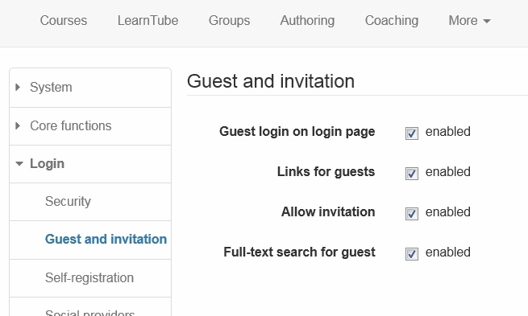

#  [Gast und Einladung](Gast+und+Einladung.html)

Im Bereich "Gast und Einladung" in der Login Konfiguration wird definiert ob
ein Gastlogin möglich ist, sowie weitere Detaileinstellungen in diesem
Kontext.

  * **"Gastlogin auf Login Seite":**   
bedeutet, dass der Gastzugang auf der Login-Seite ausgewählt werden kann

  *  **"Links für Gast":**   
In der Zugangskonfiguration können so Kurse auch an Gäste freigegeben werden.

  *  **"Einladung erlauben":**   
Im Portfolio können externe Benutzer in der Freigabe hinzugefügt werden.

  *  **"Volltextsuche für Gast":**   
Ermöglicht es Gästen die Kurse, die für Gäste frei geschaltet sind systemweit,
zu durchsuchen.

  

