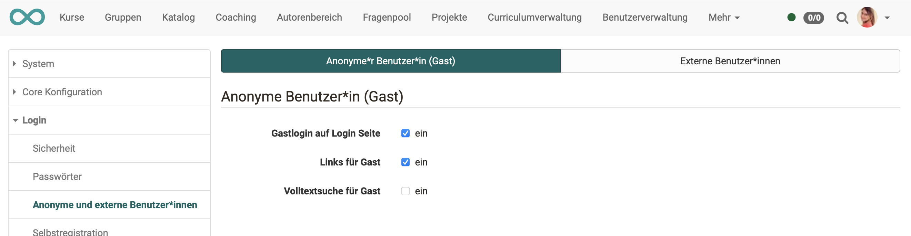
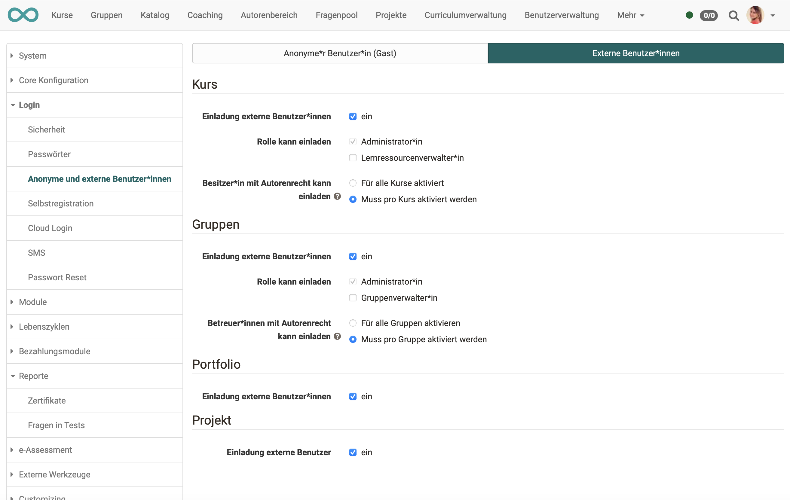

# Anonyme Gäste und externe Benutzer:innen {: #guests_and_externals}

OpenOlat kann neben registrierten Benutzer:innen auch genutzt werden von

* **Gästen** (anonym, können nur die für Gäste frei gegebenen Angebote nutzen)
* **externen Benutzer:innen** (sind mindestens mit Mail bekannt, sind per Mail nur in einzelne, ganz bestimmte Kurse/Gruppen/Portfolios/Projekte eingeladen, maximale Nutzungsdauer: Voreinstellung 180 Tage)

Administrator:innen können festlegen, ob und in welchem Umfang OpenOlat so genutzt werden kann. Die Einstellungen dazu finden Sie in der System-Administration unter: 
`Administration > Login > Anonyme und externe Benutzer:innen`

## Anonyme Gäste {: #guests}

{ class="shadow lightbox" }

* **"Gastlogin auf Login Seite":** 
Bedeutet, dass der Gastzugang auf der Login-Seite ausgewählt werden kann.

* **"Links für Gast":** 
In der Zugangskonfiguration können so Kurse auch an Gäste freigegeben werden.

* **"Volltextsuche für Gast":** 
Ermöglicht es Gästen, für sie freigeschaltete Kurse systemweit zu durchsuchen.

[Zum Seitenanfang ^](#guests_and_externals)

---

## Externe Benutzer:innen {: #externals}

{ class="shadow lightbox" }

### Kurs

**"Einladung externe Benutzer:innen":** 
Hier wird aktiviert, ob externe Benutzer:innen grundsätzlich für Kurse zugelassen sind und eingeladen werden können.

**Rolle kann einladen** 
Hier wird bestimmt, von welchen Rollen externe Benutzer:innen in Kurse eingeladen werden dürfen: 
- von Administrator:innen 
- von Lernressourcenverwalter:innen

**Besitzer:in mit Autorenrecht kann einladen** 
- **Für alle Kurse aktiviert:** Bedeutet, dass Kursbesitzer:innen externe Benutzer:innen jederzeit einladen können. 
- **Muss pro Kurs aktiviert werden:** Bedeutet, dass eine Administrator:in oder Lernressourcenverwalter:in die Funktion in den Kurseinstellungen zuerst aktivieren muss, bevor Kursbesitzer:innen externe Benutzer:innen in einen Kurs einladen können.

### Gruppen

**"Einladung externe Benutzer:innen":** 
Hier wird aktiviert, ob externe Benutzer:innen grundsätzlich im Bereich "Gruppen" zugelassen sind und eingeladen werden können.

**Rolle kann einladen** 
Hier wird bestimmt, von welchen Rollen externe Benutzer:innen in Gruppen eingeladen werden dürfen: 
- von Administrator:innen 
- von Gruppenverwalter:innen

**Betreuer:innen mit Autorenrecht kann einladen** 
- **Für alle Gruppen aktivieren:** Bedeutet, dass Gruppenbetreuer:innen externe Benutzer:innen jederzeit einladen können. 
- **Muss pro Gruppe aktiviert werden:** Bedeutet, dass eine Administrator:in oder Gruppenverwalter:in die Funktion in der Gruppenadministration zuerst aktivieren muss, bevor Gruppenbetreuer:innen mit Autorenrechten externe Benutzer:innen in eine Gruppe einladen können.

### Portfolio

**"Einladung externe Benutzer:innen":** 
Hier wird aktiviert, ob externe Benutzer:innen grundsätzlich im Bereich "Portfolio" zugelassen sind und eingeladen werden können.

### Projekt

**"Einladung externe Benutzer:innen":** 
Hier wird aktiviert, ob externe Benutzer:innen grundsätzlich in Projekten zugelassen sind und eingeladen werden können.

!!! tip "Tipp"

    In der Benutzerverwaltung unter `Kontotypen > Externe Konten` erhalten Sie einen Überblick über alle externen Benutzer:innen.

[Zum Seitenanfang ^](#guests_and_externals)

