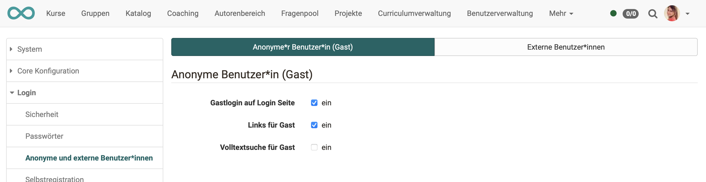
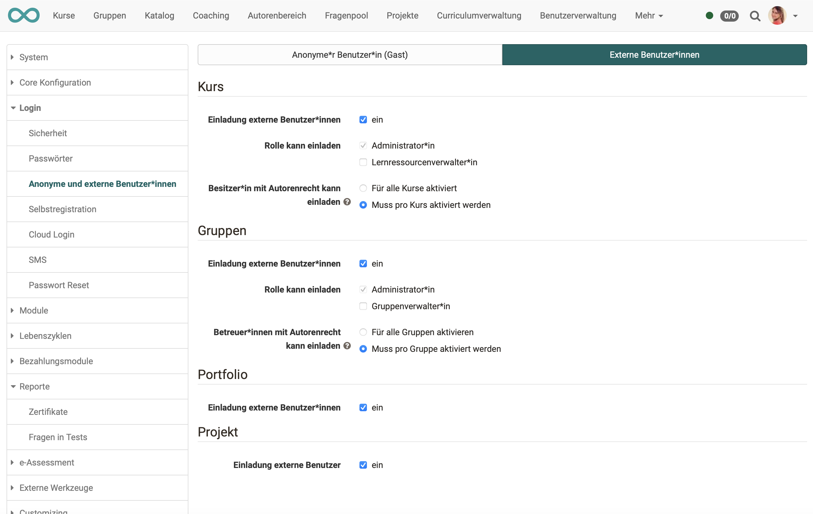

# Anonymous guests and external users

In addition to registered users, OpenOlat can also be used by

* **Guests** (anonymous, can only use the offers available to guests)
* **External users** (at least known by email, are only invited by email to a very specific course/group/portfolio/project, maximum usage period 180 days)

Administrators can determine whether and to what extent OpenOlat can be used in this way.

## Anonymous guests {: #guests}

{ class="shadow lightbox" }

*  **"Guest login on login page":**
Means that the guest access can be chosen on the login page.

*  **"Links for guests":**
In the access configuration access of courses can be given to guests.

*  **"Full-text search for guests":**
Allows guests to search system-wide for courses that are available to them.

[To the top of the page ^](#guests_and_externals)

---

## External users {: #externals}

{ class="shadow lightbox" }

### Course

**"Invitation of External Users":**   
This setting determines whether external users are generally allowed to enroll in courses and can be invited to them. 

**Role can invite** 
This setting determines which roles external users can be invited to join courses: 
- by administrators  
- by learning resource managers

**Owners with author rights can invite others** 
- **Enable for all courses:** This means that course owners can invite external users at any time. 
- **Must be enabled per course:** This means that an administrator or learning resources manager must first enable the feature in the course settings before course owners can invite external users to a course.

### Groups

**"Inviting External Users":**   
This setting determines whether external users are generally allowed in the "Groups" section and can be invited. 

**Roles can invite** 
This setting determines which roles external users can be invited to join in groups:  
- by administrators  
- by group managers

**A coach with authoring rights can invite others** 
- **Enable for all groups:** This means that group administrators can invite external users at any time. 
- **Must be enabled per group:** This means that an administrator or group manager must first enable the feature in the group administration settings before group moderators with author privileges can invite external users to a course.

### Portfolio

**"Inviting External Users":**   
This setting determines whether external users are generally allowed access to the "Portfolio" section and can be invited. 

### Project

**"Inviting External Users":**   
This setting determines whether external users are generally allowed to participate in projects and can be invited. 

!!! tip "Hint"

    In User Management, under **Account Type > External Accounts**, you can view an overview of all external users.  

[To the top of the page ^](#guests_and_externals)
