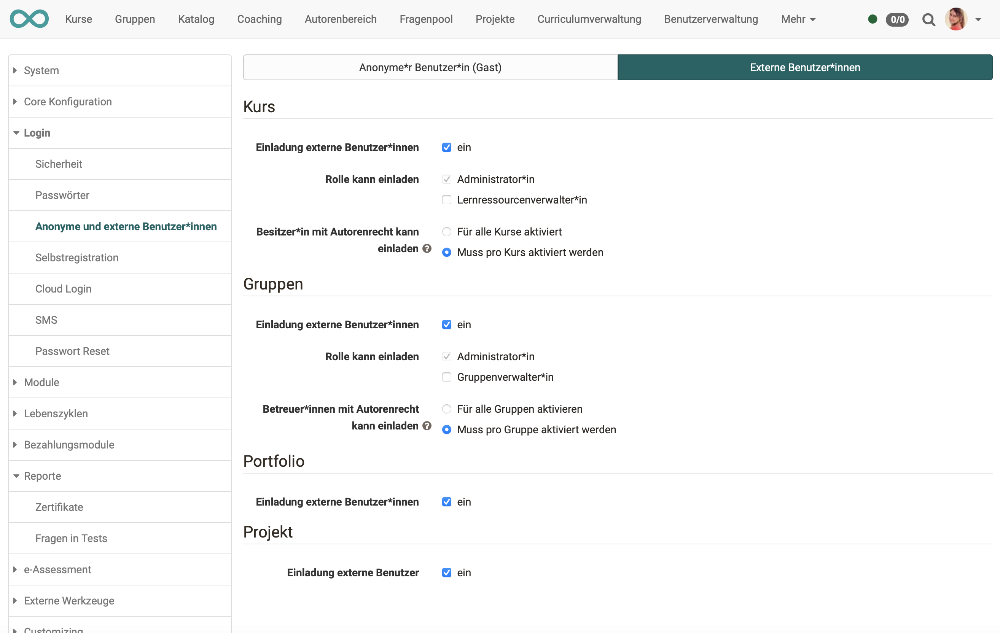

# Anonymous guests and external users

In addition to registered users, OpenOlat can also be used by

* **Guests** (anonymous, can only use the offers available to guests)
* **External users** (at least known by e-mail, are only invited by e-mail to a very specific course/group/portfolio/project)

Administrators can determine whether and to what extent OpenOlat can be used in this way.

{ class="shadow lightbox" }

*  **Guest login on login page:**
Means that the guest access can be chosen on the login page.

*  **Links for guests:**
In the access configuration access of courses can be given to guests.

*  **Allow invitation:**
In the access right of the portfolio external users can be added.

 

{ class="shadow lightbox" }

*  **Full-text search for guests:**
Enables the full-text search also for guests. All courses with the access for guests are searched.

