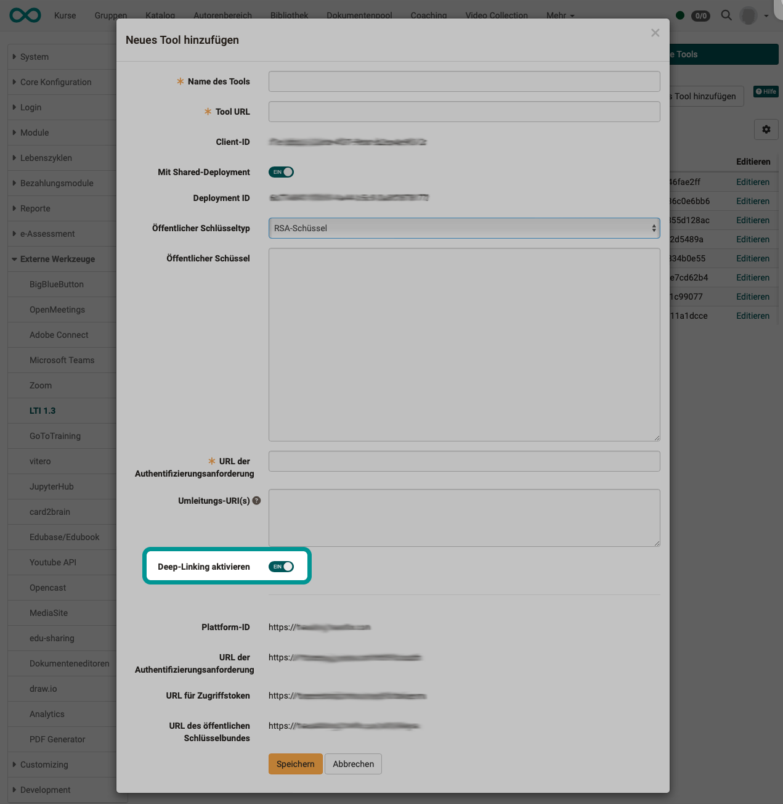
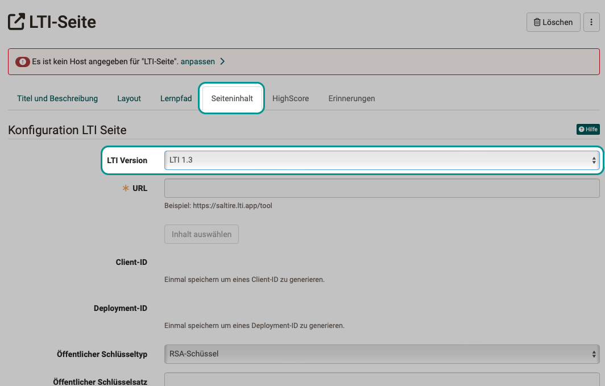
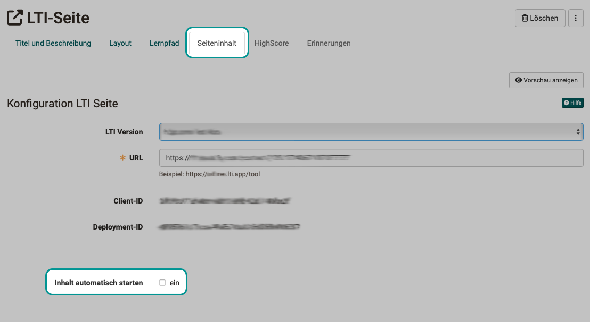

# LTI - Deep Linking

!!! warning "Achtung"

    Dieser Artikel ist noch in Bearbeitung.

OpenOlat unterstützt Deep Linking entsprechend dem [LTI 1.3 Deep-Linking Protokoll](https://www.imsglobal.org/spec/lti-dl/v2p0).

## Funktionsbeschreibung

Deep Linking ist ein Service des LTI 1.3, der es Autor:innen ermöglicht, in den externen Inhalten, die via LTI eingebunden werden, die Kursteilnehmer:innen direkt an eine bestimmte Stelle zu führen.  

**Beispiel:** 
Statt im Kursbaustein einen Link zu einem Buch anzugeben und die Lernenden ein empfohlenes Kapitel selbst suchen zu lassen (Scrollen), kann direkt ein bestimmtes Kapitel angezeigt werden.

Damit die OpenOlat-Autor:innen die Deep Links zum externen Tool in den Kursbausteinen ermöglichen können, ohne immer wieder Angaben zu Anmeldung und Parameterübergabe machen zu müssen, kann die Deep Linking Funktion von den Administrator:innen der OpenOlat-Instanz aktiviert werden. Dies vereinfacht die Arbeit der Autor:innen bei der Konfiguration eines LTI-Kursbausteins.

## Verfügbare Features

Zwischen OpenOlat und dem eingebundenen Tool können verschiedene Informationen zu Kurs und Kursteilnehmer:in ausgetauscht werden. In OpenOlat umfasst dies:

* Content Types
* ResourceLink
* Link
* Image
* File
* HTML
* Properties
* type
* url
* title
* text
* thumbnail
* window
* iframe

## Konfiguration 

### Globale Konfiguration 

Wenn von Administrator:innen auf globaler Ebene ein LTI-Tool eingerichtet wird, kann dabei auch eine Option für Deep Links aktiviert werden.
Die Aktivierung bewirkt, dass alle gemachten Einstellungen für das Tool (Ermöglichung der Nutzung ohne erneute separate Anmeldung) auch für Deep Links gelten, die Kursautor:innen im LTI-Kursbaustein angeben. 

**Administration > Externe Werkzeuge > LTI 1.3 > Tab "Externe Tools" > Button "Editieren" > Toggle-Button "Deep Linking aktivieren"**

{ class=" shadow lightbox" }  

### Konfiguration im Kurs 

Wurde Deep Linking für Autor:innen gestattet, können sie bei der Konfiguration des LTI-Kursbausteins vorkonfigurierte Links unter "LTI Versionen" auswählen. 

Wird eine der Vorkonfigurationen ausgewählt, wird die benötigte URL gleich eingetragen und als Autor:in muss man sich nicht mehr darum kümmern. 

{ class=" shadow lightbox" }  

{ class=" shadow lightbox" }  

Anschliessend können die dabei erzeugten Parameter Client-ID und Deployment ID verwendet werden, um damit auf Seite des eingebundenen Tools den Abschluss vorzunehmen.

!!! note "Hinweis"

    Damit die Deployment-ID erzeugt wird, muss eine Änderung im Tab Seiteninhalt zuerst gespeichert werden. (Insbesondere wenn eine Auswahl eines vorkonfigurierten Links unter "LTI Versionen" getroffen wurde.)

### Seitenaufruf

Wenn im Kursbaustein "LTI-Seite" der externe Inhalt sofort gestartet werden soll, muss im Kurseditor im Tab "Seiteninhalt" die Option "Inhalt automatisch starten" angewählt sein. Andernfalls erscheint ein Button, mit dem von den Lernenden explizit die eingebundene Seite gestartet werden muss.

{ class=" shadow lightbox" } 

## Links

IMS Global Learning Consortium: [Learning Tools Interoperability Core Specification](http://www.imsglobal.org/spec/lti/v1p3/)

IMS Global Learning Consortium: [LTI 1.3 Deep-Linking protocol](https://www.imsglobal.org/spec/lti-dl/v2p0)

Administrationshandbuch: [LTI 1.3 Integration](http://docs.openolat.org/de/manual_admin/administration/LTI_Integrations/)

Administrationshandbuch: [LTI - Externe Werkzeuge](http://docs.openolat.org/de/manual_admin/administration/LTI_External_tools/)

Benutzerhandbuch: [LTI-Zugang zu einem Kurs konfigurieren](https://docs.openolat.org/de/manual_user/learningresources/LTI_Share_courses/?h=lti)

Benutzerhandbuch: [Kursbaustein "LTI-Seite“](http://docs.openolat.org/de/manual_user/learningresources/Course_Element_LTI_Page/)

Benutzerhandbuch: [LTI-Zugang zu einer Gruppe konfigurieren](https://docs.openolat.org/de/manual_user/groups/LTI_Share_groups/)
