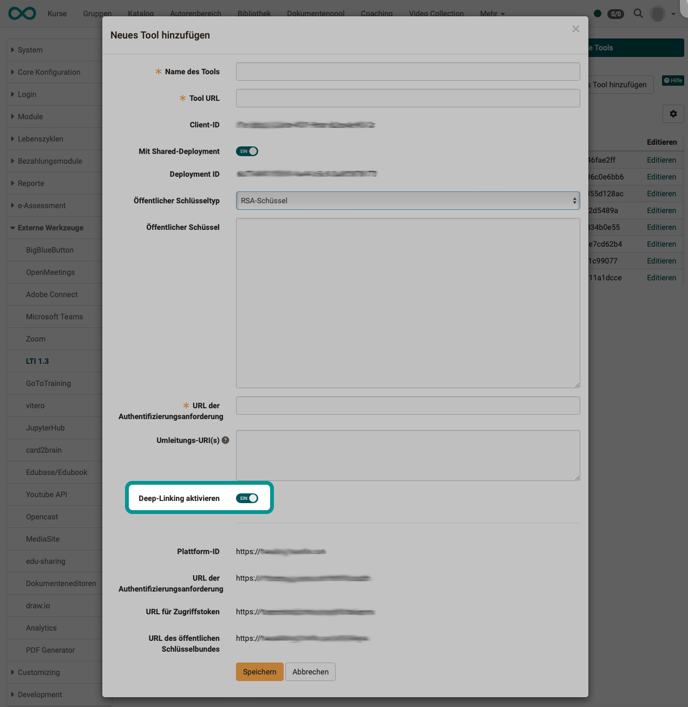
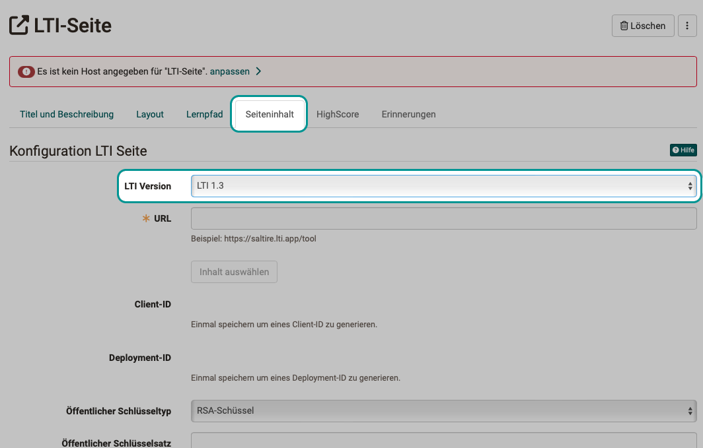
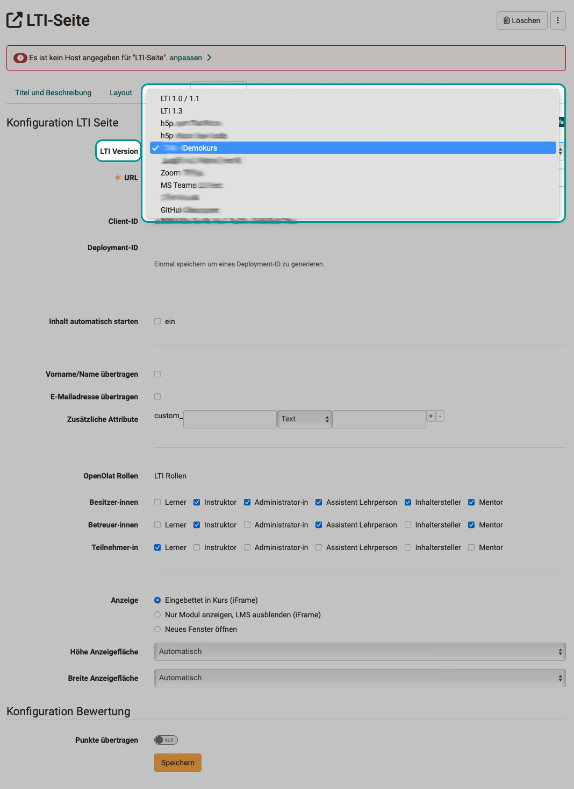
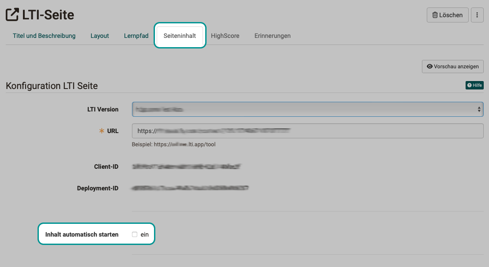

# LTI - Deep Linking {: #LTI_deeplinking}

OpenOlat supports deep linking according to the [LTI 1.3 Deep Linking Protocol](https://www.imsglobal.org/spec/lti-dl/v2p0).

## Functional description {: #functional_description}

Deep linking is an LTI 1.3 service that enables authors to guide course participants directly to a specific point in external content that is integrated via LTI.

**Example:** 
Instead of providing a link to a book in the course element and letting learners search for a recommended chapter themselves (scrolling), a specific chapter can be displayed directly.

The deep linking function can be activated by the administrator of the OpenOlat instance so that the OpenOlat authors can enable the deep links to the external tool in the course elements without having to repeatedly provide information on registration and parameter transfer. This simplifies the work of the authors when configuring an LTI course element.

## Available features {: #available_features}

Various information about the course and course participants can be exchanged between OpenOlat and the integrated tool. In OpenOlat this includes:

* Content Types
    * ResourceLink
    * Link
    * Image
    * File
    * HTML
* Properties
    * type
    * url
    * title
    * text
    * thumbnail
    * window
    * iframe

## Configuration {: #configuration}

### Global configuration

If an LTI tool is set up by administrators at a global level, an option for Deep Links can also be activated. Activation means that all settings made for the tool (enabling use without having to log in again separately) also apply to deep links that course authors specify in the LTI course element.

You find the toggle button "Activate Deep-Linking" in the system administration under: 
`Administration > External tools > LTI > Tab "External tools" > Button "Edit"`

{ class="shadow lightbox" }

### Configuration in courses

If deep linking has been permitted for authors, they can select preconfigured links under "LTI Version" when configuring the LTI course element: 
`Course > Course editor > Course element "LTI page" > Tab "Page content"`

If one of the pre-configurations is selected, the required URL is entered immediately and the author no longer has to worry about it.

{ class="shadow lightbox" }

{ class="shadow lightbox" }

The Client ID and Deployment ID parameters generated in the process can then be used to complete the process on the integrated tool side.

!!! tip "Tip"

    In order for the Deployment ID to be generated, a change in the tab "Page content" must first be saved. This applies in particular when a preconfigured link has been selected under "LTI Version".

The button "Select content" only appears if deep linking is activated for the external tool. It becomes usable as soon as the Client ID and the Deployment ID are available. It opens the content selection of the external tool. The content selected there then appears in the field "Resources". [:octicons-tag-16:{ title="from Release 18.1 (OO-7173)" }](https://track.frentix.com/issue/OO-7173)

### Page view

If the external content is to be started immediately in the course element "LTI page", the option "Skip launch page" must be selected in the tab "Page content" in the course editor. Otherwise, a button appears with which the learner must explicitly start the integrated page.

{ class="shadow lightbox" }

## Further information {: #further_information}

**Mentioned on this page**
IMS Global Learning Consortium: [LTI 1.3 Deep-Linking protocol](https://www.imsglobal.org/spec/lti-dl/v2p0)

**Further reading**
IMS Global Learning Consortium: [Learning Tools Interoperability Core Specification](http://www.imsglobal.org/spec/lti/v1p3/) 
Admin manual: [LTI 1.3 Integrations](../administration/LTI_Integrations.md) 
Admin manual: [LTI - External tools](../administration/LTI_External_tools.md) 
Admin manual: [LTI - External Platforms](../administration/LTI_External_platforms.md) 
Admin manual: [LTI - Role mapping](../administration/LTI_Role_Mapping.md) 
User manual: [Configure LTI access to a course](../../manual_user/learningresources/LTI_Share_courses.md) 
User manual: [Course Element "LTI Page"](../../manual_user/learningresources/Course_Element_LTI_Page.md) 
User manual: [Configure LTI access to a group](../../manual_user/groups/LTI_Share_groups.md)

[To the top of the page ^](#LTI_deeplinking)
