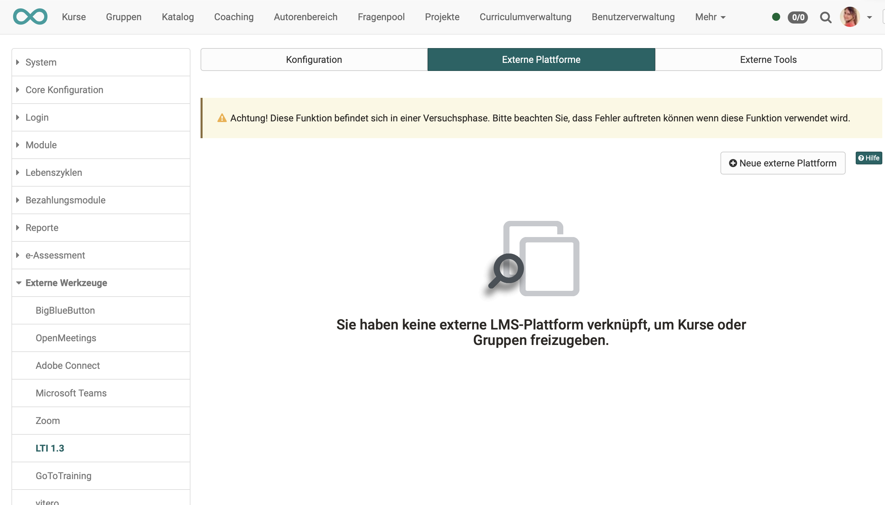

# LTI - Externe Plattformen

:octicons-tag-24: Release 15.5

## Grundlagen

Wichtige Begriffe in der LTI-Terminologie:

**Platform**: 	(entspricht Client) LMS, in das der externe Inhalt eingebunden wird 
**Tool**:		(entspricht Host) LMS oder andere Applikation, das einen Inhalt anderen zur Verfügung stellt

{ class="lightbox" }

## OpenOlat als "Tool"

Wird OpenOlat im Sinn der LTI-Terminologie als "Tool" eingesetzt, werden in OpenOlat vorhandene Kurse auf einem anderen LMS dargestellt. Seitens OpenOlat müssen für die reibungslose Kommunikation der beiden Systeme Angaben zur empfangenden Plattform (consumer) gemacht werden. 

Im Tab "Externe Plattformen" wird das Zusammenspiel mit den anderen Plattformen (auch "platform" im Sinn der LTI-Terminologie) konfiguriert. OpenOlat ist dann das **Tool**, in das der Kurs von den hier definierten Platfformen eingebunden wird.

{ class="shadow lightbox" }

Für jede externe Plattform muss eine eigene Konfiguration eingerichtet werden. Verwenden Sie den Button "Neue externe Plattform" um die Verbindung zu einer neuen Plattform anzulegen.

!!! info "Hinweis"

    Werden mehrere verschiedene OpenOlat-Kurse von der gleichen externen Plattform genutzt, genügt es, auf Administratorenebene die externe Plattform nur einmal zu konfigurieren. Die weiteren Konfiguration pro Kurs werden dann in den Einstellungen des jeweiligen Kurses durch die Kursbesitzer:innen vorgenommen  (Kursadministration > Einstellungen > Tab Seiteninhalt).

## Konfiguration

Ein Muster einer gesamten Konfiguration finden Sie unter [LTI-Zugang zu einem Kurs konfigurieren](https://docs.openolat.org/de/manual_user/learningresources/LTI_Share_courses/?h=lti).

In OpenOlat werden unter “Externe Plattform” die folgenden Parameter der externen Partner-Instanz erfasst:

| Feld					| Bemerkung |
| --------------------- | ---------------------------------------------- |
| Tool name				| Frei definierbar |
| Plattform-ID / Issuer	| URL zur externen Instanz |
| Client-ID				| Client ID aus dem Dialog «Tool configuration details» in der externen Plattform |
| Öffentlicher Schlüsseltyp | RSA-Schlüssel -> dieser Schlüssel wird anschliessend in der Tool-Konfiguration der externen Plattform ergänzt |
| Authorization	 		| Aus der externen Instanz: Authentication request URL |
| URL für Zugriffstoken	| Aus der externen Instanz: Access token URL |
| URL des öffentlichen Schlüsselbundes | Aus der externen Instanz: Public Keyset URL |

Tragen Sie nach Abschluss des Formulars den Öffentlichen Schlüssel auf der externen Instanz in der dortigen Tool-Konfiguration ein.

{ class="lightbox" }

## Links

IMS Global Learning Consortium: [Learning Tools Interoperability Core Specification](http://www.imsglobal.org/spec/lti/v1p3/)

Administrationshandbuch: [LTI 1.3 Integration](http://docs.openolat.org/de/manual_admin/administration/LTI_Integrations/)

Administrationshandbuch: [LTI - Externe Werkzeuge](http://docs.openolat.org/de/manual_admin/administration/LTI_External_tools/)

Benutzerhandbuch: [LTI-Zugang zu einem Kurs konfigurieren](https://docs.openolat.org/de/manual_user/learningresources/LTI_Share_courses/?h=lti)

Benutzerhandbuch: [Kursbaustein "LTI-Seite“](http://docs.openolat.org/de/manual_user/learningresources/Course_Element_LTI_Page/)

Benutzerhandbuch: [LTI-Zugang zu einer Gruppe konfigurieren](https://docs.openolat.org/de/manual_user/groups/LTI_Share_groups/)
