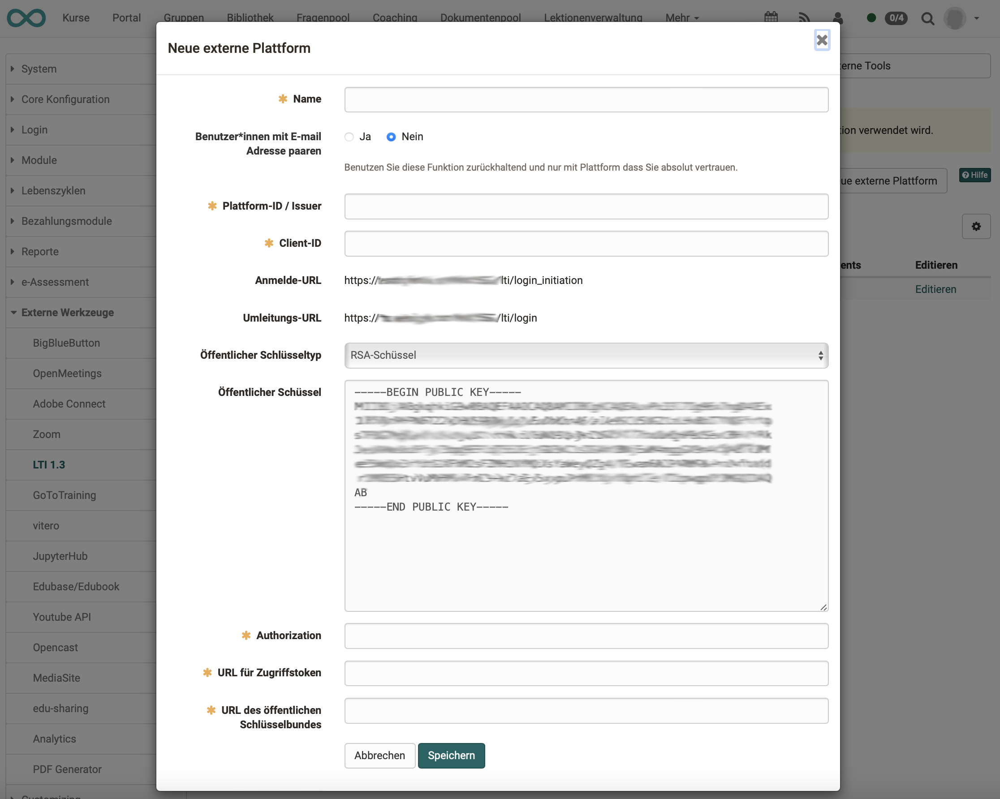

# LTI - External Platforms

:octicons-tag-24: Release 15.5

## OpenOlat as "Tool"

If OpenOlat is used as a "tool" in the sense of the LTI terminology, existing courses in OpenOlat are displayed on another LMS. OpenOlat must provide information on the receiving platform (consumer) to ensure smooth communication between the two systems.

The interaction with the other platforms (also "platform" in the sense of LTI terminology) is configured in the "External platforms" tab. OpenOlat is then the **tool** into which the course from the platforms defined here is integrated.

{ class="shadow lightbox" }

A separate configuration must be set up for each external platform. Use the "New external platform" button to create the connection to a new platform.

!!! info "Note"

	If several different OpenOlat courses are used from the same external platform, it is sufficient to configure the external platform only once at administrator level. The further configuration per course is then carried out by the course owner in the settings of the respective course 
	(Course administration > Settings > Tab page content).

## Configuration

You can find a sample of an entire configuration under [Configuring LTI access to a course](../../manual_user/learningresources/LTI_Share_courses.md).

In OpenOlat, the following parameters of the external partner instance are recorded under "External platform":

| Field					| Comment |
| --------------------- | ---------------------------------------------- |
| Tool name				| Freely definable |
| Plattform-ID / Issuer	| URL to the external instance |
| Client-ID				| Client ID from the "Tool configuration details" dialog in the external platform |
| Public key type | RSA key -> This key is then added to the tool configuration of the external platform |
| Authorization	 		| From the external instance: Authentication request URL |
| URL for access tokens	| From the external instance: Access token URL |
| URL of the public keyring | From the external instance: Public Keyset URL |

After completing the form, enter the public key on the external instance in the tool configuration there.

{ class="lightbox" }

## Links

IMS Global Learning Consortium: [Learning Tools Interoperability Core Specification](http://www.imsglobal.org/spec/lti/v1p3/)

Admin manual: [LTI 1.3 Integrations](../administration/LTI_Integrations.md)

Admin manual: [LTI - External tools](../administration/LTI_External_tools.md)

User manual: [Configure LTI access to course](../../manual_user/learningresources/LTI_Share_courses.md)

User manual: [Course element "LTI Page"](../../manual_user/learningresources/Course_Element_LTI_Page.md)

User manual: [Configure LTI access to a group](../../manual_user/groups/LTI_Share_groups.md)

User manual: [LTI Deep Linking](../administration/LTI_Deeplinking.de.md)

