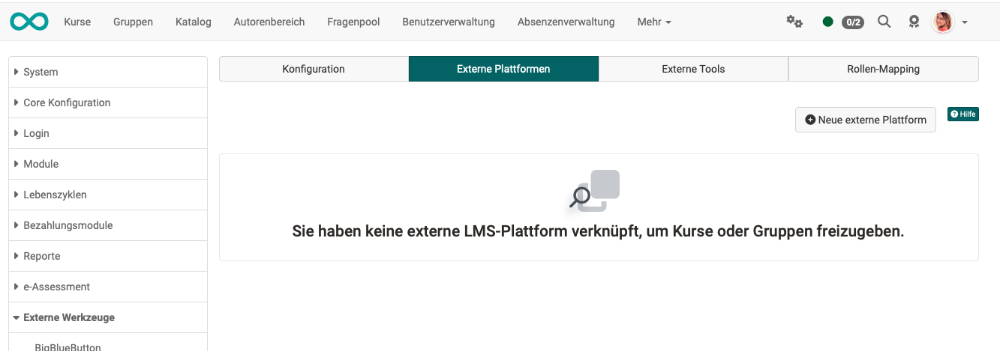
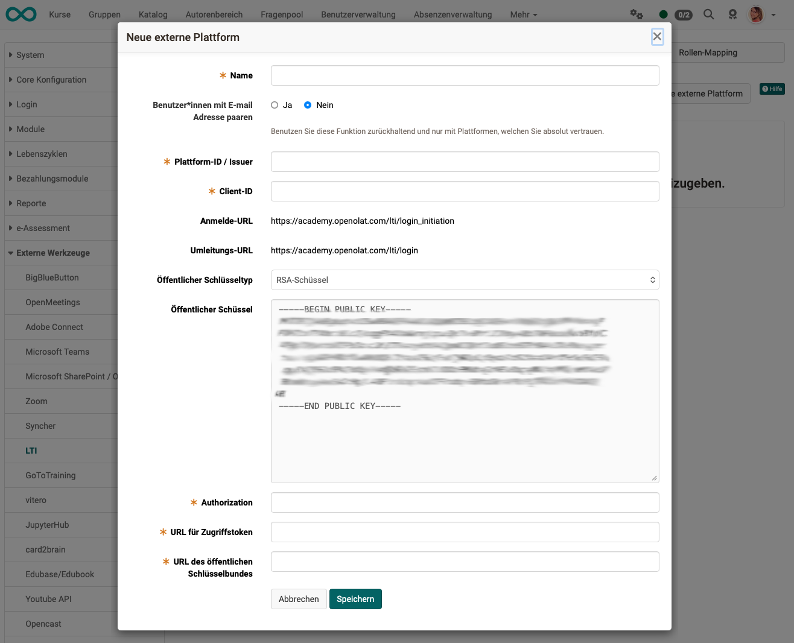

# LTI - External Platforms [:octicons-tag-16:{ title="from Release 15.5 (OO-5205)" }](https://track.frentix.com/issue/OO-5205) {: #LTI_external_platforms}

## OpenOlat as "Tool" {: #openolat_tool}

If OpenOlat is used as a "tool" in the sense of the LTI terminology, existing courses in OpenOlat are displayed on another LMS. OpenOlat must provide information on the receiving platform (consumer) to ensure smooth communication between the two systems.

Administrators configure the interaction with the other platforms (also "platform" in the sense of LTI terminology) in the system administration under: `Administration > External tools > LTI`, tab "External platforms". OpenOlat is then the **tool** into which the course from the platforms defined here is integrated.

{ class="shadow lightbox" }

A separate configuration must be set up for each external platform. Use the "Add external platform" button to create the connection to a new platform.

!!! info "Important"

    If several different OpenOlat courses are used from the same external platform, it is sufficient to configure the external platform only once in the system administration. The course owners carry out the further configuration per course in the settings of the respective course: `Course > Administration > Settings > Share`, section "LTI 1.3 access configuration". The same applies to groups in the "Share" tab of the group.

## Configuration {: #config}

You can find a sample of an entire configuration under [Configure LTI access to a course](../../manual_user/learningresources/LTI_Share_courses.md).

In OpenOlat, the following parameters of the external partner instance are recorded in the "Add external platform" dialog:

| Field | Comment |
| --------------------- | ---------------------------------------------- |
| Name | Freely definable. Mandatory field |
| Match users by E-mail | Default "No". With "Yes", OpenOlat links a person who accesses from the external platform for the first time to the existing OpenOlat account that carries the same e-mail address, instead of creating a new LTI account. This only works if e-mail addresses must be unique in the system and exactly one account with this address exists. Enable the option only for platforms you trust |
| Platform ID / Issuer | URL to the external instance. Mandatory field |
| Client ID | Client ID from the "Tool configuration details" dialog in the external platform. Mandatory field |
| Initiate login URL | Provided by OpenOlat, read-only. Enter this URL in the external platform as the initiate login URL |
| Redirection URL | Provided by OpenOlat, read-only. Enter this URL in the external platform as the redirection URL |
| Public Key Type | "Public Key" (default) or "URL". The selection determines whether OpenOlat shows the public key or the public key URL below |
| Public Key / Public Key URL | Generated by OpenOlat, read-only. You then enter this key or this URL in the tool configuration of the external platform |
| Authorization | From the external instance: Authentication request URL. Mandatory field |
| Token URI | From the external instance: Access token URL. Mandatory field |
| JWK-Set URI | From the external instance: Public Keyset URL. Mandatory field |

After completing the form, enter the public key on the external instance in the tool configuration there.

{ class="lightbox" }

## Further information {: #further_information}

**Mentioned on this page** 
[Configure LTI access to a course >](../../manual_user/learningresources/LTI_Share_courses.md)

**Further reading** 
[Learning Tools Interoperability Core Specification (IMS Global Learning Consortium) >](http://www.imsglobal.org/spec/lti/v1p3/) 
[LTI 1.3 Integrations >](../administration/LTI_Integrations.md) 
[LTI - External tools >](../administration/LTI_External_tools.md) 
[LTI - Deep Linking >](../administration/LTI_Deeplinking.md) 
[LTI - Role mapping >](../administration/LTI_Role_Mapping.md) 
[Course element "LTI Page" >](../../manual_user/learningresources/Course_Element_LTI_Page.md) 
[Configure LTI access to a group >](../../manual_user/groups/LTI_Share_groups.md)

[To the top of the page ^](#LTI_external_platforms)
