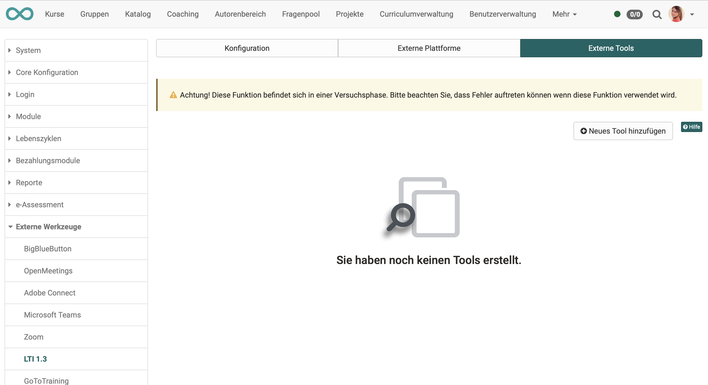
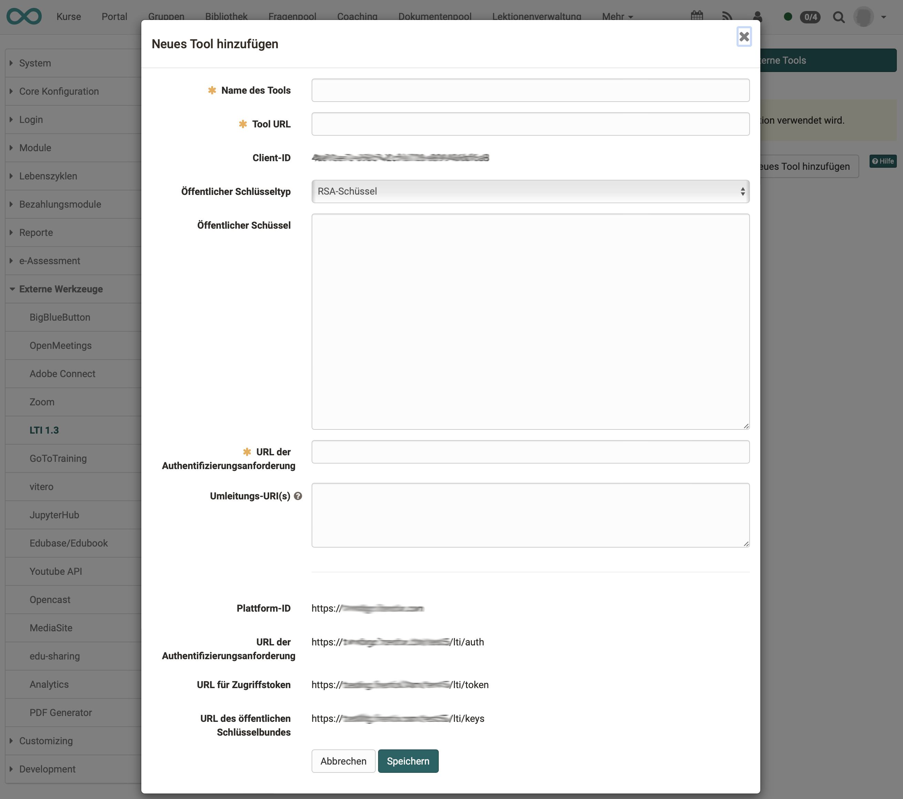

# LTI - Externe Werkzeuge

:octicons-tag-24: Release 15.5 

## OpenOlat als "Platform"

Wird OpenOlat im Sinn der LTI-Terminologie als "Platform" eingesetzt, werden Kurse von anderen LMS oder andere Applikationen (Tools) auf OpenOlat dargestellt. Typischerweise kann dazu in OpenOlat der Kursbaustein LTI verwendet werden.

Von Administrator:innen muss die Einbindung der externen Tools grundsätzlich ermöglicht (aktiviert) werden (Tab "Konfiguration").

Anschliessend muss dann durch die Konfiguration im Tab "Externe Tools" die Kommunikation und sichere Verbindung zu diesem Tool eingerichtet werden.

{ class="shadow lightbox" }

**Beispiele für externe Tools:**

* Online-Kurse von anderen Anbietern
* Simulationen, wie z.B. ...
* Lernkarteien, wie z.B. ...
* Apps, wie z.B. ...
* Interaktive Übungen, wie z.B. ...
* Games, wie z.B. ...

Für jedes externe Tool muss eine eigene Konfiguration eingerichtet werden. Verwenden Sie den Button "Neues Tool hinzufügen" um die Verbindung zu einem neuen Tool anzulegen.

!!! info "Hinweis"

    Wird ein externes Tool in mehreren verschiedenen OpenOlat-Kursen genutzt, genügt es, auf Administratorenebene das externe Tool nur einmal zu konfigurieren. Die weiteren Konfiguration pro Kurs werden dann in den Einstellungen des jeweiligen Kurses durch die Kursbesitzer:innen vorgenommen  (Kursadministration > Einstellungen > Tab Seiteninhalt).

## Konfiguration

Ein Muster einer gesamten Konfiguration finden Sie unter [LTI-Zugang zu einem Kurs konfigurieren](../../manual_user/learningresources/LTI_Share_courses.de.md) 

In OpenOlat werden unter “Neues Tool hinzufügen” die folgenden Parameter des externen Partner-Instanz erfasst:

| Feld					| Bemerkung |
| --------------------- | ---------------------------------------------- |
| Name des Tools		| Frei definierbar |
| Tool URL				| URL zum externen Tool |
| Client-ID				| Client ID aus dem Dialog «Platform configuration details» des externen Tools |
| Öffentlicher Schlüsseltyp | RSA-Schlüssel |
| Öffentlicher Schlüssel |  |
| URL der Authentifizierungsanforderung	| Aus der externen Instanz |
| Umleitungs-URL(s) 	|  |

{ class="lightbox" }

## Links

IMS Global Learning Consortium: [Learning Tools Interoperability Core Specification](http://www.imsglobal.org/spec/lti/v1p3/)

Administrationshandbuch: [LTI 1.3 Integration](../administration/LTI_Integrations.de.md)

Administrationshandbuch: [LTI - Externe Plattformen](../administration/LTI_External_platforms.de.md)

Benutzerhandbuch: [LTI-Zugang zu einem Kurs konfigurieren](../../manual_user/learningresources/LTI_Share_courses.de.md)

Benutzerhandbuch: [Kursbaustein "LTI-Seite“](../../manual_user/learningresources/Course_Element_LTI_Page.de.md)

Benutzerhandbuch: [LTI-Zugang zu einer Gruppe konfigurieren](../../manual_user/groups/LTI_Share_groups.de.md)

Benutzerhandbuch: [LTI Deep Linking](../administration/LTI_Deeplinking.de.md)

