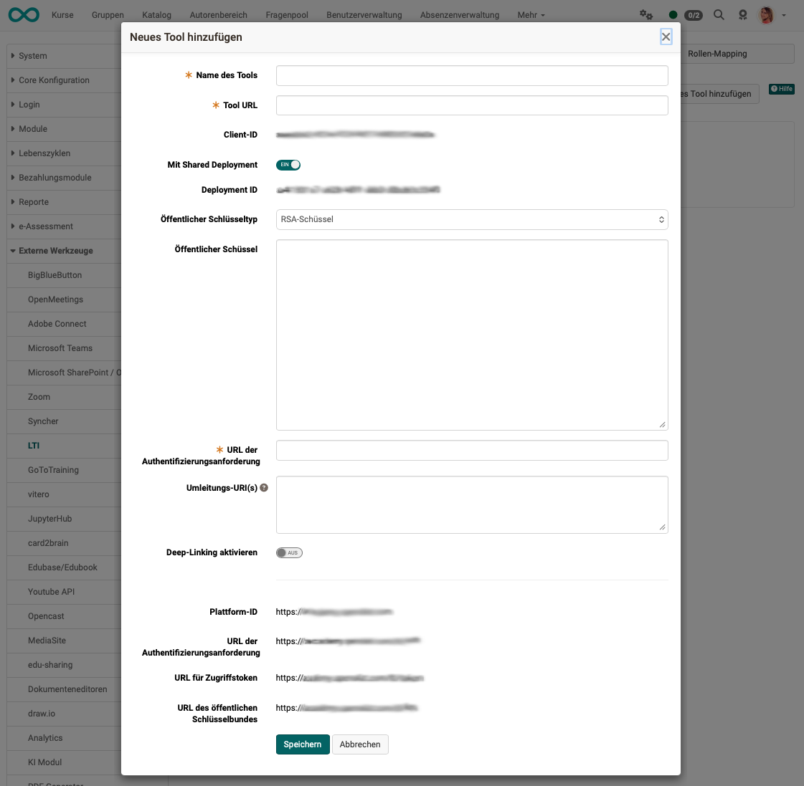

# LTI - Externe Werkzeuge  {: #LTI_external_tools}

:octicons-tag-24: Release 15.5 

## OpenOlat als "Platform" {: #openolat_platform}

Wird OpenOlat im Sinn der LTI-Terminologie als "Platform" eingesetzt, werden Kurse von anderen LMS oder andere Applikationen (Tools) auf OpenOlat dargestellt. Typischerweise kann dazu in OpenOlat der Kursbaustein LTI verwendet werden.

Von Administrator:innen muss die Einbindung der externen Tools grundsätzlich ermöglicht (aktiviert) werden (Tab "Konfiguration").

Anschliessend muss dann durch die Konfiguration im Tab "Externe Tools" die Kommunikation und sichere Verbindung zu diesem Tool eingerichtet werden.

{ class="shadow lightbox" }

**Beispiele für externe Tools:**

* Online-Kurse von anderen Anbietern
* Simulationen
* Lernkarteien
* Apps
* Interaktive Übungen
* Games

Für jedes externe Tool muss eine eigene Konfiguration eingerichtet werden. Verwenden Sie den Button "Neues Tool hinzufügen" um die Verbindung zu einem neuen Tool anzulegen.

!!! info "Hinweis"

    Wird ein externes Tool in mehreren verschiedenen OpenOlat-Kursen genutzt, genügt es, auf Administratorenebene das externe Tool nur einmal zu konfigurieren. Die weiteren Konfiguration pro Kurs werden dann in den Einstellungen des jeweiligen Kurses durch die Kursbesitzer:innen vorgenommen: `Kursadministration > Einstellungen > Tab Seiteninhalt`

## Konfiguration {: #config}

Ein Muster einer gesamten Konfiguration finden Sie unter [LTI-Zugang zu einem Kurs konfigurieren](../../manual_user/learningresources/LTI_Share_courses.de.md) 

In OpenOlat werden unter “Neues Tool hinzufügen” die folgenden Parameter des externen Partner-Instanz erfasst:

| Feld					| Bemerkung |
| --------------------- | ---------------------------------------------- |
| Name des Tools		| Frei definierbar |
| Tool URL				| URL zum externen Tool |
| Client-ID				| Client ID aus dem Dialog «Platform configuration details» des externen Tools |
| Mit Shared Deployment | Bestimmt, ob das Tool als globales oder lokales Deployment eingebunden wird (siehe Erklärung unterhalb der Tabelle). Ist die Option aktiviert, wird eine Deployment ID generiert, mit der das Tool identifiziert wird. |
| Deployment ID         | Einige LTI Tools verwenden eine Deployment ID, andere nicht.  |
| Öffentlicher Schlüsseltyp | RSA-Schlüssel |
| Öffentlicher Schlüssel |  |
| URL der Authentifizierungsanforderung	| Aus der externen Instanz |
| Umleitungs-URL(s) 	| Die Umleitungs-URL ist dazu da, bei erfolgreicher Authentisierung auf die eigentliche URL des Tools umzuleiten. OpenOlat ruft dazu diese URL in einem iFrame, separaten Browser-Window oder Tab auf. Diese URL wird dann mit einem HTTP 302 oder ähnlich weiterleiten zu einer anderen URL. Und dort wird am Ende das LTI Tool angezeigt. |
| Deep Linking aktivieren | Deep Linking ist ein LTI Feature. Es erlaubt die bessere Integration von externen Lerninhalten von einem externen LTI tool in OpenOlat. |
| Plattform-ID | Plattform-ID ist ein von OpenOlat generierte URL, die OpenOlat selber identifiziert.  |
| URL der Authentifizierungsanforderung | Die URL der Authentifizierungsaufforderung ist Teil der OAuth Authentifizierung. Dazu macht das Tool einen Aufruf auf OpenOlat (also eine Art Callback). |
| URL für Zugriffstoken | Die URL für das Zugriffstoken ist auch Teil der OAuth Authentifizierung. Damit kann das Tool von OpenOlat einen JWT Web Token anfordern. Es wird als 2. Schritt der OAuth Authentifizierung gebraucht.  |
| URL des öffentlichen Schlüsselbundes | OAuth braucht Private Public Key Verschlüsselung. An diese URL liefert OpenOlat den Public Key, der oben definiert wurde, aus.  |

{ class="lightbox" }

### Globales oder lokales Deployment {: #deployment_scope}

Über die Option "Mit Shared Deployment" legen Sie fest, wie das externe Tool eingebunden wird:

* **Aktiviert (globales Deployment):** OpenOlat erzeugt eine gemeinsame Deployment ID. Dasselbe Tool kann damit in mehreren Kursen wiederverwendet werden, ohne es pro Kurs neu konfigurieren zu müssen.
* **Deaktiviert (lokales Deployment):** Für jeden Kurs wird ein eigenes Deployment angelegt. Das Tool ist dann nur im jeweiligen Kurs verfügbar.

Die Deployment-Art wird beim Anlegen des Tools festgelegt und kann nachträglich nicht mehr geändert werden.

## Weiterführende Informationen {: #further_information}

IMS Global Learning Consortium: [Learning Tools Interoperability Core Specification](http://www.imsglobal.org/spec/lti/v1p3/)

Administrationshandbuch: [LTI 1.3 Integration](../administration/LTI_Integrations.de.md)

Administrationshandbuch: [LTI - Externe Plattformen](../administration/LTI_External_platforms.de.md)

Administrationshandbuch: [LTI - Deep Linking](../administration/LTI_Deeplinking.de.md)

Administrationshandbuch: [LTI - Rollen-Mapping](../administration/LTI_Role_Mapping.de.md)

Benutzerhandbuch: [LTI-Zugang zu einem Kurs konfigurieren](../../manual_user/learningresources/LTI_Share_courses.de.md)

Benutzerhandbuch: [Kursbaustein "LTI-Seite“](../../manual_user/learningresources/Course_Element_LTI_Page.de.md)

Benutzerhandbuch: [LTI-Zugang zu einer Gruppe konfigurieren](../../manual_user/groups/LTI_Share_groups.de.md)

