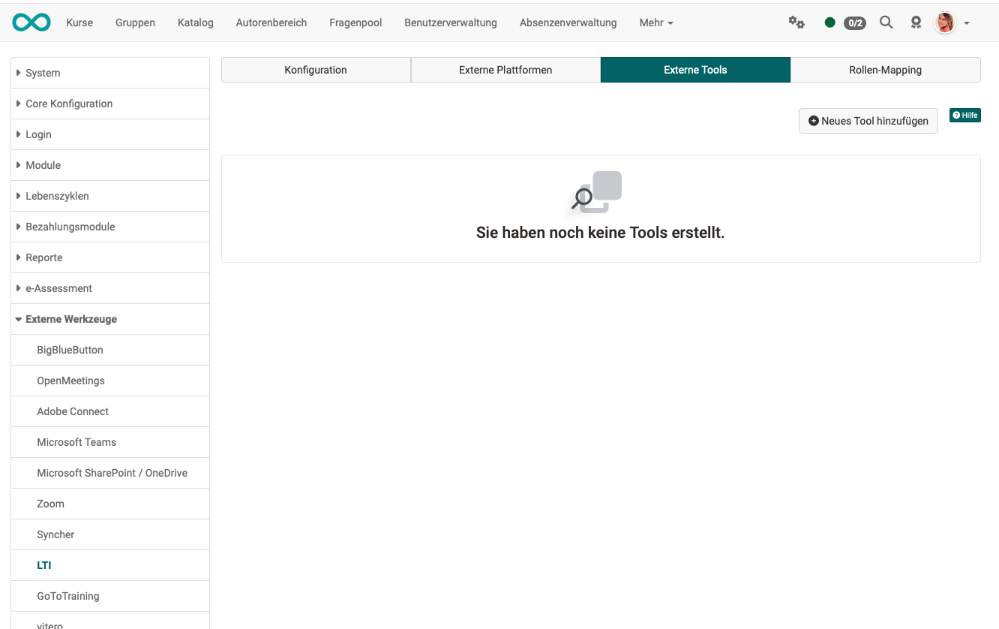
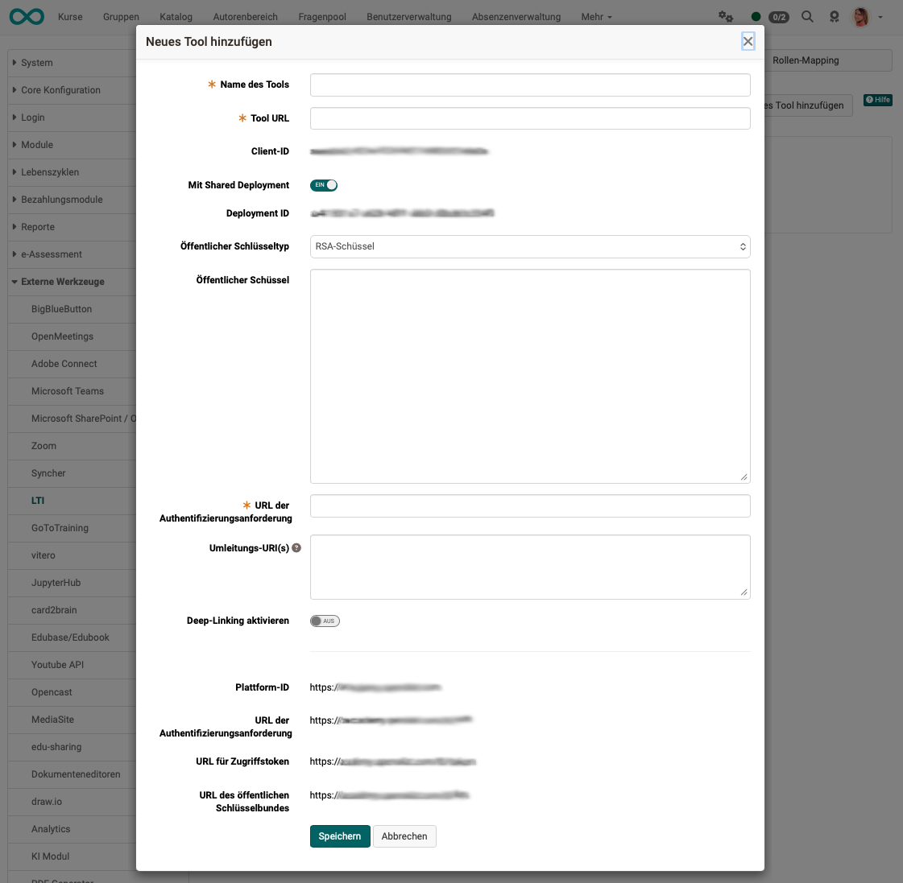

# LTI - Externe Werkzeuge [:octicons-tag-16:{ title="ab Release 15.5 (OO-5205)" }](https://track.frentix.com/issue/OO-5205) {: #LTI_external_tools}

## OpenOlat als "Platform" {: #openolat_platform}

Wird OpenOlat im Sinn der LTI-Terminologie als "Platform" eingesetzt, stellt OpenOlat Kurse anderer LMS oder andere Applikationen (Tools) dar. Dazu dient in OpenOlat der Kursbaustein "LTI-Seite".

Administrator:innen aktivieren die Einbindung externer Tools in der System-Administration unter `Administration > Externe Werkzeuge > LTI`, Tab "Konfiguration". Anschliessend richten sie im Tab "Externe Tools" die Kommunikation und die sichere Verbindung zu jedem Tool ein.

{ class="shadow lightbox" }

**Beispiele für externe Tools:**

* Online-Kurse von anderen Anbietern
* Simulationen
* Lernkarteien
* Apps
* Interaktive Übungen
* Games

Für jedes externe Tool wird eine eigene Konfiguration angelegt. Verwenden Sie den Button "Neues Tool hinzufügen", um die Verbindung zu einem neuen Tool anzulegen.

!!! info "Wichtig"

    Wird ein externes Tool in mehreren OpenOlat-Kursen genutzt, genügt es, das Tool in der System-Administration einmal zu konfigurieren. Die weitere Konfiguration pro Kurs nehmen die Kursbesitzer:innen im Kurseditor vor, im [Kursbaustein "LTI-Seite"](../../manual_user/learningresources/Course_Element_LTI_Page.de.md), Tab "Seiteninhalt".

## Konfiguration {: #config}

Ein vollständig durchgespieltes Beispiel, in dem OpenOlat die Gegenrolle als Tool in einem Moodle-Kurs übernimmt, finden Sie unter [LTI-Zugang zu einem Kurs konfigurieren](../../manual_user/learningresources/LTI_Share_courses.de.md).

Unter "Neues Tool hinzufügen" erfassen Sie die folgenden Parameter des externen Tools:

| Feld | Bemerkung |
|---|---|
| Name des Tools | Frei definierbar |
| Tool URL | URL zum externen Tool |
| Client-ID | Wird von OpenOlat generiert. Übertragen Sie den Wert in die Konfiguration des externen Tools. |
| Mit Shared Deployment | Bestimmt, ob das Tool als globales oder lokales Deployment eingebunden wird (siehe Erklärung unterhalb der Tabelle). Ist die Option aktiviert, generiert OpenOlat eine Deployment ID, mit der das Tool identifiziert wird. |
| Deployment ID | Wird nur bei aktiviertem Shared Deployment angezeigt. Einige LTI Tools verwenden eine Deployment ID, andere nicht. |
| Öffentlicher Schlüsseltyp | Auswahl "RSA-Schlüssel" oder "Schlüsselsatz-URL" |
| Öffentlicher Schlüssel | Der öffentliche Schlüssel des externen Tools. Beim Schlüsseltyp "Schlüsselsatz-URL" heisst das Feld "Öffentlicher Schlüsselsatz" und nimmt die URL des Schlüsselsatzes auf. |
| URL der Authentifizierungsanforderung | Aus der Konfiguration des externen Tools |
| Umleitungs-URI(s) | Eine URI pro Zeile. Nach erfolgreicher Authentifizierung leitet OpenOlat auf diese URI um. OpenOlat ruft sie in einem iFrame, in einem separaten Browserfenster oder in einem Tab auf. Das Tool leitet von dort mit HTTP 302 oder ähnlich weiter, und am Ende wird das LTI Tool angezeigt. |
| Deep-Linking aktivieren | Deep Linking ist eine LTI-Funktion. Sie erlaubt eine bessere Integration von Lerninhalten aus einem externen LTI Tool in OpenOlat, siehe [LTI - Deep Linking](../administration/LTI_Deeplinking.de.md). |
| Plattform-ID | Eine von OpenOlat generierte URL, die OpenOlat selbst identifiziert. |
| URL der Authentifizierungsanforderung | Teil der OAuth-Authentifizierung. Das Tool ruft damit OpenOlat auf (Callback). |
| URL für Zugriffstoken | Ebenfalls Teil der OAuth-Authentifizierung. Das Tool fordert damit von OpenOlat ein JWT (JSON Web Token) an. Das ist der zweite Schritt der OAuth-Authentifizierung. |
| URL des öffentlichen Schlüsselbundes | OAuth arbeitet mit einem Schlüsselpaar aus privatem und öffentlichem Schlüssel. Unter dieser URL liefert OpenOlat seinen öffentlichen Schlüssel aus. |

Die letzten vier Werte generiert OpenOlat. Der Dialog zeigt sie nur an. Übertragen Sie sie zusammen mit der Client-ID in die Konfiguration des externen Tools.

{ class="shadow lightbox" }

### Globales oder lokales Deployment {: #deployment_scope}

Über die Option "Mit Shared Deployment" legen Sie fest, wie das externe Tool eingebunden wird:

* **Aktiviert (globales Deployment):** OpenOlat erzeugt eine gemeinsame Deployment ID. Dasselbe Tool kann damit in mehreren Kursen wiederverwendet werden, ohne es pro Kurs neu konfigurieren zu müssen.
* **Deaktiviert (lokales Deployment):** Für jeden Kurs wird ein eigenes Deployment angelegt. Das Tool ist dann nur im jeweiligen Kurs verfügbar.

Die Deployment-Art wird beim Anlegen des Tools festgelegt und kann nachträglich nicht mehr geändert werden.

## Weiterführende Informationen {: #further_information}

**Auf dieser Seite erwähnt** 
[Kursbaustein "LTI-Seite" >](../../manual_user/learningresources/Course_Element_LTI_Page.de.md) 
[LTI-Zugang zu einem Kurs konfigurieren >](../../manual_user/learningresources/LTI_Share_courses.de.md) 
[LTI - Deep Linking >](../administration/LTI_Deeplinking.de.md)

**Weiterführend** 
[Learning Tools Interoperability Core Specification (IMS Global Learning Consortium) >](http://www.imsglobal.org/spec/lti/v1p3/) 
[LTI 1.3 Integrationen >](../administration/LTI_Integrations.de.md) 
[LTI - Externe Plattformen >](../administration/LTI_External_platforms.de.md) 
[LTI - Rollen-Mapping >](../administration/LTI_Role_Mapping.de.md) 
[LTI-Zugang zu einer Gruppe konfigurieren >](../../manual_user/groups/LTI_Share_groups.de.md)

[Zum Seitenanfang ^](#LTI_external_tools)
