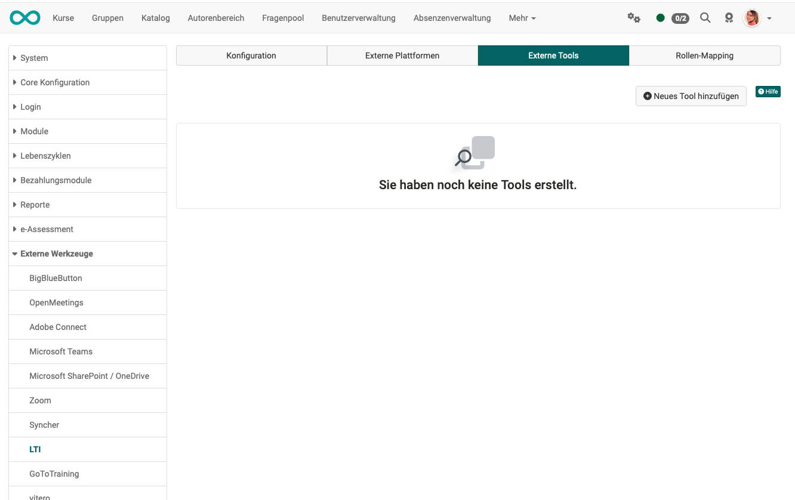
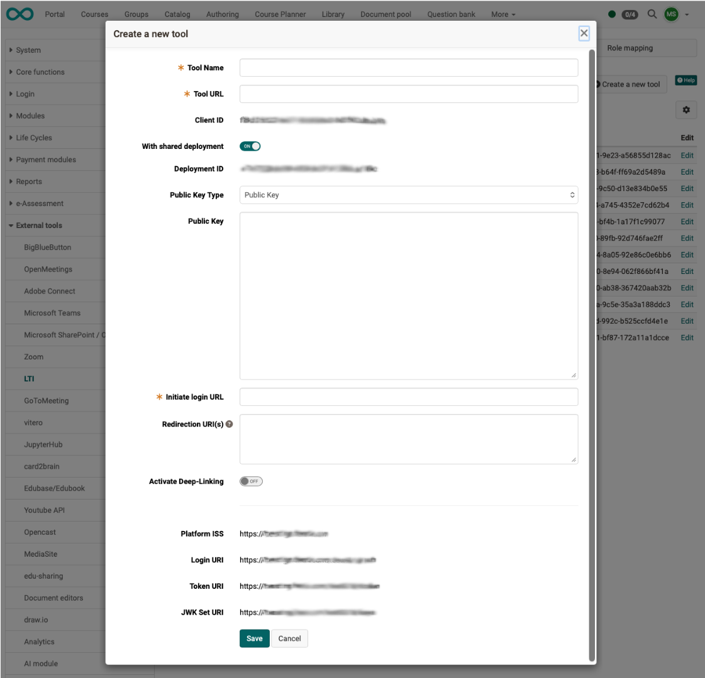

# LTI - External tools {: #LTI_external_tools}

:octicons-tag-24: Release 15.5

## OpenOlat as a platform {: #openolat_platform}

If OpenOlat is used as a "platform" in the sense of LTI terminology, courses from other LMSs or other applications (tools) are displayed on OpenOlat. Typically, the LTI course element can be used in OpenOlat for this purpose.

Administrators must always enable (activate) the integration of external tools ("Configuration" tab).

The communication and secure connection to this tool must then be set up via the configuration in the "External tools" tab.

{ class="shadow lightbox" }

**Examples for external Tools:**

* Online courses from different providers
* Simulations
* Flashcards
* Apps, e.g. ...
* Interactive practice
* Games

A separate configuration must be set up for each external tool. Use the "Add new tool" button to create the connection to a new tool.

!!! info "Note"

	If an external tool is used in several different OpenOlat courses, it is sufficient to configure the external tool only once at administrator level. The further configuration per course is then carried out by the course owner in the settings of the respective course   (Course administration > Settings > Tab page content)

## Configuration {: #config}

You can find a sample of an entire configuration under [Configuring LTI access to a course](../../manual_user/learningresources/LTI_Share_courses.md)

In OpenOlat, the following parameters of the external partner instance are entered under "Add new tool":

| Field					| Comment |
| --------------------- | ---------------------------------------------- |
| Tool Name		| Freely definable |
| Tool URL				| URL to external tool |
| Client-ID				| Client ID from the "Platform configuration details" dialog of the external tool |
| With shared deployment | When enabled, a deployment ID is generated that can be used to identify the tool. |
| Deployment ID         |  Some LTI tools use a deployment ID, others do not. |
| Public Key Type | Public key |
| Public Key |  |
| Initiate login URI | From the external instance |
| Redirection URL(s) 	| The redirect URL is used to redirect to the actual URL of the tool after successful authentication. OpenOlat calls this URL in an iFrame, separate browser window, or tab. This URL is then forwarded to another URL with an HTTP 302 or similar. The LTI tool is then displayed there. |
| Activate deep linking | Deep linking is an LTI feature. It allows for better integration of external learning content from an external LTI tool into OpenOlat. |
| Platform ISS | Platform ID is a URL generated by OpenOlat that identifies OpenOlat itself.  |
| Login URI | The URL of the authentication request is part of the OAuth authentication. To do this, the tool makes a call to OpenOlat (i.e., a kind of callback).  |
| Token URI | The URL for the access token is also part of the OAuth authentication. This allows the OpenOlat tool to request a JWT web token. It is used as the second step of the OAuth authentication.   |
| JWK Set URI | OAuth requires private public key encryption. OpenOlat delivers the public key defined above to this URL.  |

{ class="lightbox" }

## Further information {: #further_information}

IMS Global Learning Consortium: [Learning Tools Interoperability Core Specification](http://www.imsglobal.org/spec/lti/v1p3/)

Admin manual: [LTI 1.3 Integrations](../administration/LTI_Integrations.md)

Admin manual: [LTI - External platforms](../administration/LTI_External_platforms.md)

Admin manual: [LTI - Deep Linking](../administration/LTI_Deeplinking.md)

Admin manual: [LTI - Role mapping](../administration/LTI_Role_Mapping.md)

User manual: [Configure LTI access to course](../../manual_user/learningresources/LTI_Share_courses.md)

User manual: [Course element "LTI Page"](../../manual_user/learningresources/Course_Element_LTI_Page.md)

User manual: [Configure LTI access to a group](../../manual_user/groups/LTI_Share_groups.md)

