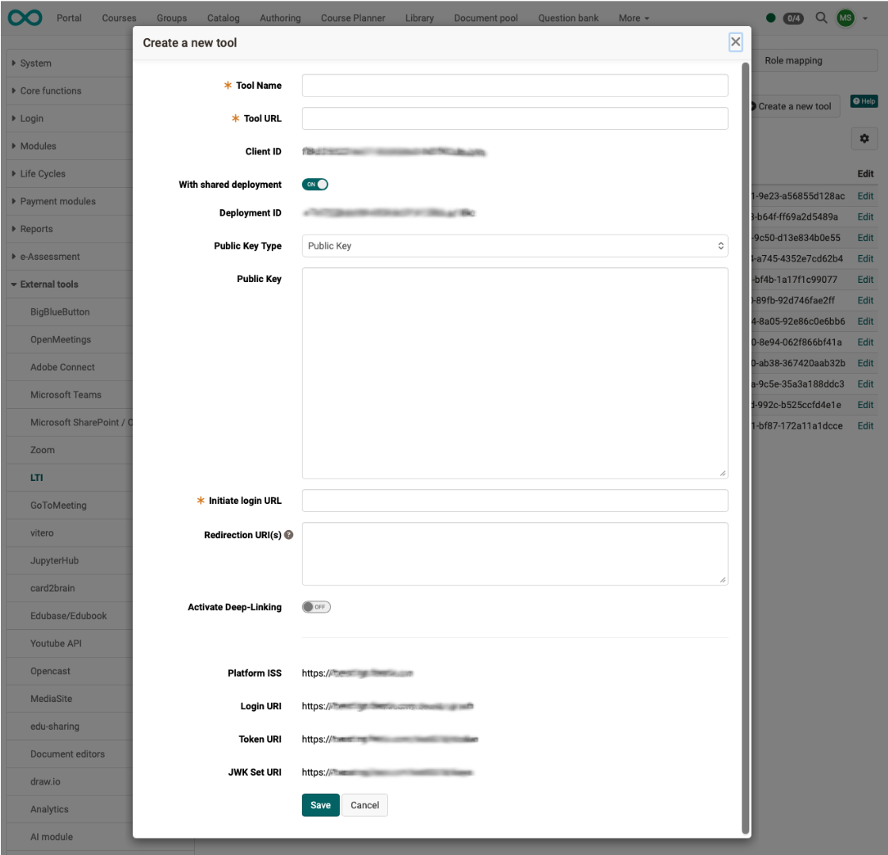

# LTI - External tools [:octicons-tag-16:{ title="from Release 15.5 (OO-5205)" }](https://track.frentix.com/issue/OO-5205) {: #LTI_external_tools}

## OpenOlat as a "platform" {: #openolat_platform}

If OpenOlat is used as a "platform" in the sense of LTI terminology, OpenOlat displays courses from other LMSs or other applications (tools). The course element "LTI page" serves this purpose in OpenOlat.

Administrators enable the integration of external tools in the system administration under `Administration > External tools > LTI`, tab "Configuration". They then set up the communication and the secure connection to each tool in the "External tools" tab.

{ class="shadow lightbox" }

**Examples of external tools:**

* Online courses from other providers
* Simulations
* Flashcards
* Apps
* Interactive exercises
* Games

A separate configuration is created for each external tool. Use the "Create a new tool" button to create the connection to a new tool.

!!! info "Important"

    If an external tool is used in several OpenOlat courses, it is sufficient to configure the tool once in the system administration. Course owners carry out the further configuration per course in the course editor, in the [course element "LTI page"](../../manual_user/learningresources/Course_Element_LTI_Page.md), tab "Page content".

## Configuration {: #config}

A complete worked example in which OpenOlat takes the opposite role as a tool in a Moodle course can be found under [Configure LTI access to a course](../../manual_user/learningresources/LTI_Share_courses.md).

Under "Create a new tool" you enter the following parameters of the external tool:

| Field | Comment |
|---|---|
| Tool Name | Freely definable |
| Tool URL | URL to the external tool |
| Client ID | Generated by OpenOlat. Transfer the value to the configuration of the external tool. |
| With shared deployment | Determines whether the tool is embedded as a global or local deployment (see the explanation below the table). When the option is enabled, OpenOlat generates a deployment ID that identifies the tool. |
| Deployment ID | Only displayed when shared deployment is enabled. Some LTI tools use a deployment ID, others do not. |
| Public Key Type | Selection "Public Key" or "URL" |
| Public Key | The public key of the external tool. With the key type "URL" the field is called "Public Key URL" and takes the URL of the key set. |
| Initiate login URL | From the configuration of the external tool |
| Redirection URI(s) | One URI per line. After successful authentication OpenOlat redirects to this URI. OpenOlat calls it in an iFrame, in a separate browser window or in a tab. From there the tool forwards with HTTP 302 or similar, and finally the LTI tool is displayed. |
| Activate Deep-Linking | Deep Linking is an LTI feature. It allows a better integration of learning content from an external LTI tool into OpenOlat, see [LTI - Deep Linking](../administration/LTI_Deeplinking.md). |
| Platform ISS | A URL generated by OpenOlat that identifies OpenOlat itself. |
| Login URI | Part of the OAuth authentication. The tool uses it to call OpenOlat (callback). |
| Token URI | Also part of the OAuth authentication. The tool uses it to request a JWT (JSON Web Token) from OpenOlat. This is the second step of the OAuth authentication. |
| JWK Set URI | OAuth works with a key pair of a private and a public key. At this URL OpenOlat delivers its public key. |

OpenOlat generates the last four values. The dialog only displays them. Transfer them together with the Client ID to the configuration of the external tool.

{ class="shadow lightbox" }

### Global or local deployment {: #deployment_scope}

The "With shared deployment" option determines how the external tool is embedded:

* **Enabled (global deployment):** OpenOlat generates a shared deployment ID. The same tool can then be reused in several courses without configuring it separately for each course.
* **Disabled (local deployment):** A separate deployment is created for each course. The tool is then only available in the respective course.

The deployment type is set when the tool is created and cannot be changed afterwards.

## Further information {: #further_information}

**Mentioned on this page** 
[Course Element "LTI Page" >](../../manual_user/learningresources/Course_Element_LTI_Page.md) 
[Configure LTI access to a course >](../../manual_user/learningresources/LTI_Share_courses.md) 
[LTI - Deep Linking >](../administration/LTI_Deeplinking.md)

**Further reading** 
[Learning Tools Interoperability Core Specification (IMS Global Learning Consortium) >](http://www.imsglobal.org/spec/lti/v1p3/) 
[LTI 1.3 Integrations >](../administration/LTI_Integrations.md) 
[LTI - External Platforms >](../administration/LTI_External_platforms.md) 
[LTI - Role mapping >](../administration/LTI_Role_Mapping.md) 
[Configure LTI access to a group >](../../manual_user/groups/LTI_Share_groups.md)

[To the top of the page ^](#LTI_external_tools)
