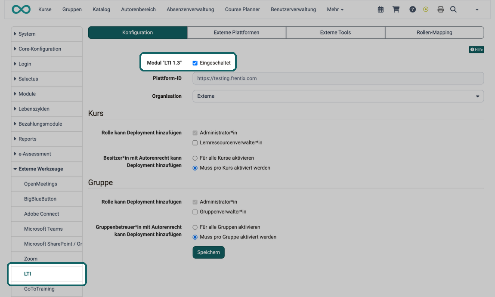
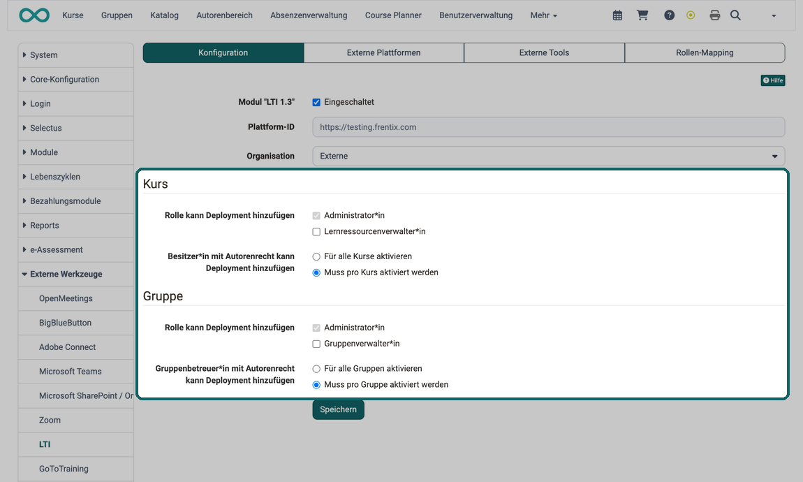

# LTI 1.3 Integrationen [:octicons-tag-16:{ title="ab Release 15.5 (OO-5205)" }](https://track.frentix.com/issue/OO-5205) {: #LTI_integrations}

## Grundlagen {: #basics}

Wichtige Begriffe in der LTI-Terminologie:

* **Platform** (entspricht Client): das LMS, in das der externe Inhalt eingebunden wird.
* **Tool** (entspricht Host): das LMS oder die Applikation, die einen Inhalt anderen zur Verfügung stellt.

OpenOlat kann beide Rollen einnehmen: Als Tool stellt OpenOlat einen Kurs oder eine Gruppe für ein anderes LMS bereit. Als Platform zeigt OpenOlat den Inhalt eines externen Tools im Kurs an, über den Kursbaustein "LTI-Seite".

{ class="lightbox" title="Rollen Tool und Platform zwischen zwei Systemen" }

## LTI aktivieren {: #activate_lti}

Administrator:innen aktivieren LTI in der System-Administration unter `Administration > Externe Werkzeuge > LTI`, Tab "Konfiguration". Die Checkbox "Eingeschaltet" beim Feld Modul "LTI 1.3" steht an oberster Stelle. Erst danach lassen sich LTI-Verbindungen einrichten.

{ class="shadow lightbox" title="Tab Konfiguration der Seite LTI in der System-Administration · 2026.10.07" }

Nach dem Einschalten zeigt der Tab zwei weitere Felder:

| Feld | Bemerkung |
|---|---|
| Plattform-ID | Die URL, mit der sich OpenOlat gegenüber externen Systemen identifiziert. Von OpenOlat vorgegeben, nur lesbar. Standard ist die Domain der Instanz. |
| Organisation | Die Organisation, der OpenOlat die Benutzerkonten zuordnet, die beim Zugriff aus einer externen Plattform neu angelegt werden. Ohne Auswahl gilt die Standard-Organisation. |

Die Seite LTI hat vier Tabs: "Konfiguration" für die Grundeinstellungen auf dieser Seite, "Externe Plattformen" für OpenOlat als Tool, "Externe Tools" für OpenOlat als Platform und "Rollen-Mapping" für die Zuordnung der OpenOlat-Rollen zu den LTI-Rollen. Die Detailseiten dazu sind unten verlinkt.

## Deployments {: #deployments}

**Was ist ein Deployment?**

Auf der Seite der Platform bestimmt das Deployment eines Tools, in welchem Umfang die Platform das Tool zur Verfügung stellt:

* Einsatz in einem einzelnen Kurs
* Einsatz im gesamten System
* Einsatz nur für den aktuellen Kontext
* Einsatz generell ermöglicht (auch für zukünftige Kontexte)

Auf der Seite des Tools heisst das Gegenstück LTI-Freigabe: Ist OpenOlat das Tool, gibt eine LTI-Freigabe genau einen Kurs oder eine Gruppe für eine externe Plattform frei. In der Oberfläche heisst sie Deployment, etwa beim Button "Neues Deployment hinzufügen".

**Gilt eine Deployment-ID für mehrere Kurse?** [:octicons-tag-16:{ title="ab Release 21.1 (OO-9092)" }](https://track.frentix.com/issue/OO-9092)

Ja, wenn OpenOlat das Tool ist. Eine externe Plattform sendet oft für mehrere Kurse dieselbe Deployment-ID, nämlich wenn sie das Tool als gemeinsames Deployment führt. OpenOlat selbst tut das als Platform mit der Option "Mit Shared Deployment" und beim Kopieren eines Kursbausteins "LTI-Seite", siehe [Globales oder lokales Deployment](LTI_External_tools.de.md#deployment_scope). Diese Deployment-ID tragen Sie in der LTI-Freigabe jedes Kurses und jeder Gruppe ein, die die Plattform erreichen soll. Eindeutig sein muss sie nur je Plattform und Kurs beziehungsweise je Plattform und Gruppe. Welchen Kurs OpenOlat beim Aufruf öffnet, erkennt OpenOlat an der Adresse, die die Plattform mitschickt: [Eine Deployment-ID für mehrere Kurse](../../manual_user/learningresources/LTI_Share_courses.de.md#deployment_id_several_courses)

**Wer kann Deployments hinzufügen?** [:octicons-tag-16:{ title="ab Release 17.0 (OO-6300)" }](https://track.frentix.com/issue/OO-6300)

Administrator:innen bestimmen im Tab "Konfiguration" unter `Administration > Externe Werkzeuge > LTI`, wer Deployments hinzufügen darf. Die Einstellung gibt es getrennt für Kurse und für Gruppen.

**Kurs**

* "Rolle kann Deployment hinzufügen": Administrator:innen dürfen es immer. Zusätzlich lassen sich Lernressourcenverwalter:innen freischalten.
* "Besitzer:in mit Autorenrecht kann Deployment hinzufügen": "Für alle Kurse aktivieren" oder "Muss pro Kurs aktiviert werden".

**Gruppe**

* "Rolle kann Deployment hinzufügen": Administrator:innen dürfen es immer. Zusätzlich lassen sich Gruppenverwalter:innen freischalten.
* "Gruppenbetreuer:in mit Autorenrecht kann Deployment hinzufügen": "Für alle Gruppen aktivieren" oder "Muss pro Gruppe aktiviert werden".

{ class="shadow lightbox" title="Tab Konfiguration der Seite LTI · 2026.10.07" }

## Weiterführende Informationen {: #further_information}

**Auf dieser Seite erwähnt** 
[LTI - Externe Werkzeuge >](../administration/LTI_External_tools.de.md) 
[LTI-Zugang zu einem Kurs konfigurieren >](../../manual_user/learningresources/LTI_Share_courses.de.md)

**Weiterführend** 
[Learning Tools Interoperability Core Specification (IMS Global Learning Consortium) >](http://www.imsglobal.org/spec/lti/v1p3/) 
[LTI - Externe Plattformen >](../administration/LTI_External_platforms.de.md) 
[LTI - Deep Linking >](../administration/LTI_Deeplinking.de.md) 
[LTI - Rollen-Mapping >](../administration/LTI_Role_Mapping.de.md) 
[Kursbaustein "LTI-Seite" >](../../manual_user/learningresources/Course_Element_LTI_Page.de.md) 
[LTI-Zugang zu einer Gruppe konfigurieren >](../../manual_user/groups/LTI_Share_groups.de.md)

[Zum Seitenanfang ^](#LTI_integrations)
