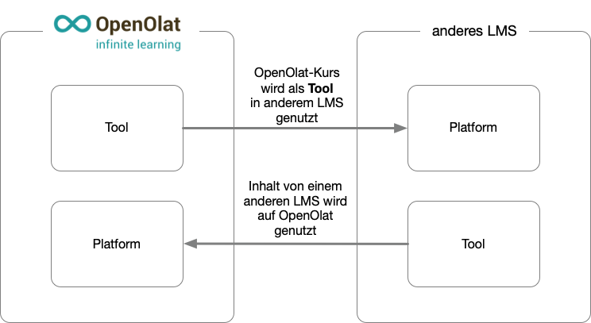
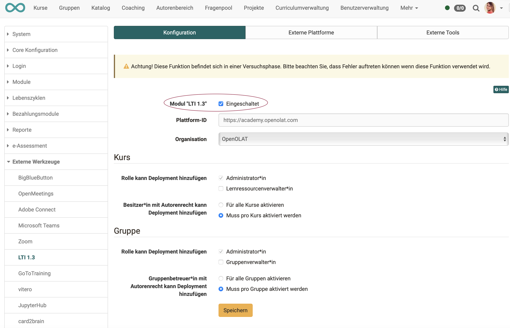

# LTI 1.3 Integrations

:octicons-tag-24: Release 15.5

## Basics

Important terms in LTI terminology:

**Platform**: (corresponds to client) LMS in which the external content is integrated  
**Tool**: (corresponds to host) LMS or other application that makes content available to others

{ class="lightbox" }

## Activate LTI

Before the LTI connection can be set up, LTI must first be activated. The checkbox for this is located at the top of the "Configuration" tab.

{ class="shadow lightbox" }

## Deployments

**What's a deployment?**

The deployment of a tool determines the extent to which the tool is made available:

* Deployment in a single course
* Deployment in entire system
* Deployment only for current context
* Deployment generally possible (also in future contexts)

**Who can add deployments?**

Under **Administration > External tools > LTI 1.3 > Tab "Configuration"** administrators can determine who can add deployments.

{ class="shadow lightbox" }

## Links

IMS Global Learning Consortium: [Learning Tools Interoperability Core Specification](http://www.imsglobal.org/spec/lti/v1p3/)

Admin manual: [LTI - External tools](../administration/LTI_External_tools.md)

Admin manual: [LTI - External platforms](../administration/LTI_External_platforms.md)

User manual: [Configure LTI access to course](../../manual_user/learningresources/LTI_Share_courses.md)

User manual: [Course element "LTI Page"](../../manual_user/learningresources/Course_Element_LTI_Page.md)

User manual: [Configure LTI access to a group](../../manual_user/groups/LTI_Share_groups.md)

User manual: [LTI Deep Linking](../../manual_user/groups/LTI_Deeplinking.md)

