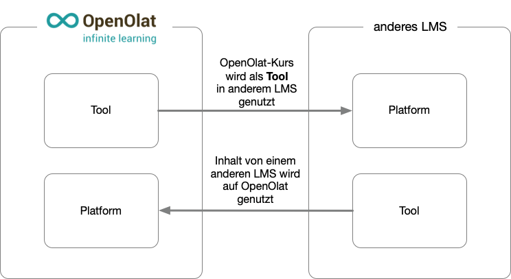
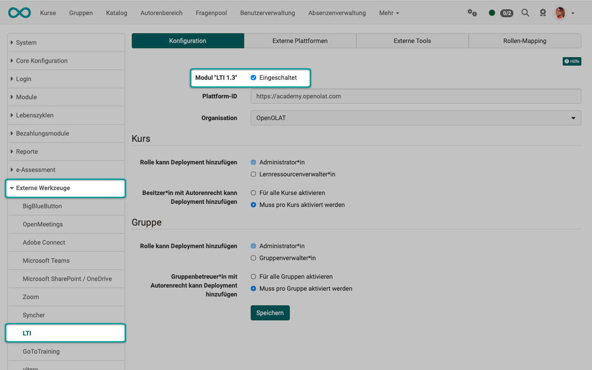
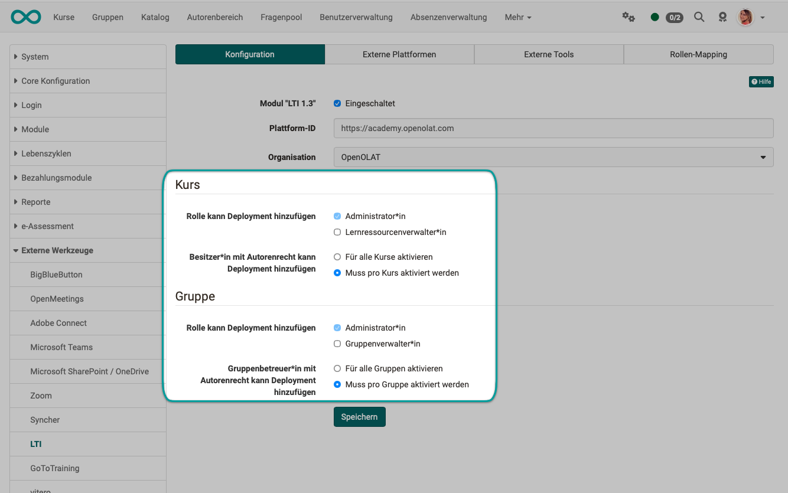

# LTI 1.3 Integrations [:octicons-tag-16:{ title="from Release 15.5 (OO-5205)" }](https://track.frentix.com/issue/OO-5205) {: #LTI_integrations}

## Basics {: #basics}

Important terms in LTI terminology:

* **Platform** (corresponds to client): the LMS into which the external content is integrated.
* **Tool** (corresponds to host): the LMS or application that makes content available to others.

OpenOlat can take on both roles: As a tool, OpenOlat provides a course or a group to another LMS. As a platform, OpenOlat displays the content of an external tool in the course, through the course element "LTI Page".

{ class="lightbox" }

## Activate LTI {: #activate_lti}

Administrators activate LTI in the system administration under `Administration > External tools > LTI`, tab "Configuration". The checkbox "Enabled" next to the field Module "LTI 1.3" is at the very top. Only then can LTI connections be set up.

{ class="shadow lightbox" }

Once enabled, the tab shows two further fields:

| Field | Note |
|---|---|
| Platform ISS | The URL with which OpenOlat identifies itself to external systems. Provided by OpenOlat, read-only. The default is the domain of the instance. |
| Organisation | The organisation to which OpenOlat assigns the user accounts that are newly created on access from an external platform. Without a selection, the default organisation applies. |

The page LTI has four tabs: "Configuration" for the basic settings on this page, "External platforms" for OpenOlat as tool, "External tools" for OpenOlat as platform and "Role mapping" for the assignment of OpenOlat roles to LTI roles. The detail pages are linked below.

## Deployments {: #deployments}

**What is a deployment?**

The deployment of a tool determines the extent to which the tool is made available:

* Use in a single course
* Use in the entire system
* Use only for the current context
* Use generally enabled (also for future contexts)

**Who can add deployments?**

Administrators determine in the tab "Configuration" under `Administration > External tools > LTI` who is allowed to add deployments. The setting exists separately for courses and for groups.

**Course**

* "Role can add deployment": Administrators are always allowed to. In addition, learning resource managers can be enabled.
* "Owner with author role can add deployment": "Activate for all courses" or "Must be activated per course".

**Group**

* "Role can add deployment": Administrators are always allowed to. In addition, group managers can be enabled.
* "Group coach with author role can add deployment": "Activate for all groups" or "Must be activated per group".

{ class="shadow lightbox" }

## Further information {: #further_information}

**Further reading** 
[Learning Tools Interoperability Core Specification (IMS Global Learning Consortium) >](http://www.imsglobal.org/spec/lti/v1p3/) 
[LTI - External tools >](../administration/LTI_External_tools.md) 
[LTI - External platforms >](../administration/LTI_External_platforms.md) 
[LTI - Deep Linking >](../administration/LTI_Deeplinking.md) 
[LTI - Role mapping >](../administration/LTI_Role_Mapping.md) 
[Configure LTI access to a course >](../../manual_user/learningresources/LTI_Share_courses.md) 
[Course element "LTI Page" >](../../manual_user/learningresources/Course_Element_LTI_Page.md) 
[Configure LTI access to a group >](../../manual_user/groups/LTI_Share_groups.md)

[To the top of the page ^](#LTI_integrations)
