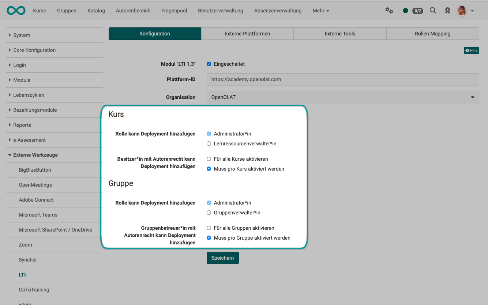

# LTI 1.3 Integrations [:octicons-tag-16:{ title="from Release 15.5 (OO-5205)" }](https://track.frentix.com/issue/OO-5205) {: #LTI_integrations}

## Basics {: #basics}

Important terms in LTI terminology:

* **Platform** (corresponds to client): the LMS into which the external content is integrated.
* **Tool** (corresponds to host): the LMS or application that makes content available to others.

OpenOlat can take on both roles: As a tool, OpenOlat provides a course or a group to another LMS. As a platform, OpenOlat displays the content of an external tool in the course, through the course element "LTI Page".

{ class="lightbox" title="Tool and platform roles between two systems" }

## Activate LTI {: #activate_lti}

Administrators activate LTI in the system administration under `Administration > External tools > LTI`, tab "Configuration". The checkbox "Enabled" next to the field Module "LTI 1.3" is at the very top. Only then can LTI connections be set up.

{ class="shadow lightbox" title="Tab Configuration of the page LTI in the system administration" }

Once enabled, the tab shows two further fields:

| Field | Note |
|---|---|
| Platform ISS | The URL with which OpenOlat identifies itself to external systems. Provided by OpenOlat, read-only. The default is the domain of the instance. |
| Organisation | The organisation to which OpenOlat assigns the user accounts that are newly created on access from an external platform. Without a selection, the default organisation applies. |

The page LTI has four tabs: "Configuration" for the basic settings on this page, "External platforms" for OpenOlat as tool, "External tools" for OpenOlat as platform and "Role mapping" for the assignment of OpenOlat roles to LTI roles. The detail pages are linked below.

## Deployments {: #deployments}

**What is a deployment?**

On the platform side, the deployment of a tool determines the extent to which the platform makes the tool available:

* Use in a single course
* Use in the entire system
* Use only for the current context
* Use generally enabled (also for future contexts)

On the tool side, the counterpart is called LTI share: if OpenOlat is the tool, an LTI share releases exactly one course or one group for an external platform. In the user interface it is called deployment, for example in the button "Add deployment".

**Does one deployment ID apply to several courses?** [:octicons-tag-16:{ title="from Release 21.1 (OO-9092)" }](https://track.frentix.com/issue/OO-9092)

Yes, if OpenOlat is the tool. An external platform often sends the same deployment ID for several courses, namely when it runs the tool as a shared deployment. OpenOlat itself does this as a platform with the option "With shared deployment" and when an "LTI page" course element is copied, see [Global or local deployment](LTI_External_tools.md#deployment_scope). Enter this deployment ID in the LTI share of every course and every group the platform should reach. It only has to be unique per platform and course, or per platform and group. OpenOlat recognizes which course to open from the address the platform sends with the call: [One deployment ID for several courses](../../manual_user/learningresources/LTI_Share_courses.md#deployment_id_several_courses)

**Who can add deployments?**

Administrators determine in the tab "Configuration" under `Administration > External tools > LTI` who is allowed to add deployments. The setting exists separately for courses and for groups.

**Course**

* "Role can add deployment": Administrators are always allowed to. In addition, learning resource managers can be enabled.
* "Owner with author role can add deployment": "Activate for all courses" or "Must be activated per course".

**Group**

* "Role can add deployment": Administrators are always allowed to. In addition, group managers can be enabled.
* "Group coach with author role can add deployment": "Activate for all groups" or "Must be activated per group".

{ class="shadow lightbox" title="Tab Configuration of the page LTI" }

## Further information {: #further_information}

**Mentioned on this page** 
[LTI - External tools >](../administration/LTI_External_tools.md) 
[Configure LTI access to a course >](../../manual_user/learningresources/LTI_Share_courses.md)

**Further reading** 
[Learning Tools Interoperability Core Specification (IMS Global Learning Consortium) >](http://www.imsglobal.org/spec/lti/v1p3/) 
[LTI - External Platforms >](../administration/LTI_External_platforms.md) 
[LTI - Deep Linking >](../administration/LTI_Deeplinking.md) 
[LTI - Role mapping >](../administration/LTI_Role_Mapping.md) 
[Course element "LTI Page" >](../../manual_user/learningresources/Course_Element_LTI_Page.md) 
[Configure LTI access to a group >](../../manual_user/groups/LTI_Share_groups.md)

[To the top of the page ^](#LTI_integrations)
