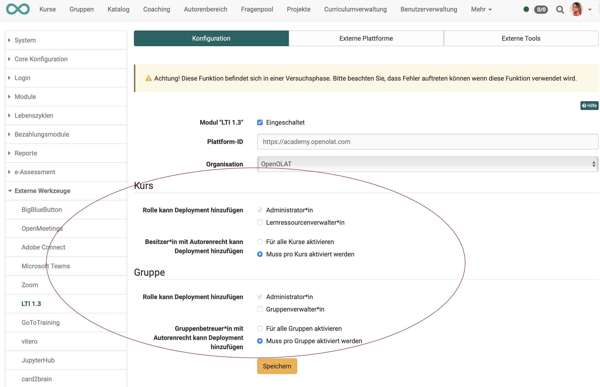

# LTI 1.3 Integrations

:octicons-tag-24: Release 15.5

## Basics

Important terms in LTI terminology:

**Platform**: (corresponds to client) LMS in which the external content is integrated  
**Tool**: (corresponds to host) LMS or other application that makes content available to others

{ class="lightbox" }

## Activate LTI

Before the LTI connection can be set up, LTI must first be activated. The checkbox for this is located at the top of the "Configuration" tab.

{ class="shadow lightbox" }

## Deployments

**What's a deployment?**

The deployment of a tool determines the extent to which the tool is made available:

* Deployment in a single course
* Deployment in entire system
* Deployment only for current context
* Deployment generally possible (also in future contexts)

**Who can add deployments?**

Under **Administration > External tools > LTI 1.3 > Tab "Configuration"** administrators can determine who can add deployments.

{ class="shadow lightbox" }

## Links

IMS Global Learning Consortium: [Learning Tools Interoperability Core Specification](http://www.imsglobal.org/spec/lti/v1p3/)

Admin manual: [LTI - Externe Werkzeuge](http://docs.openolat.org/manual_admin/administration/LTI_External_tools/)

Admin manual: [LTI - Externe Plattformen](http://docs.openolat.org/manual_admin/administration/LTI_External_platforms/)

User manual: [LTI-Zugang zu einem Kurs konfigurieren](https://docs.openolat.org/manual_user/learningresources/LTI_Share_courses/?h=lti)

User manual: [Kursbaustein "LTI-Seite“](http://docs.openolat.org/manual_user/learningresources/Course_Element_LTI_Page/)

User manual: [LTI-Zugang zu einer Gruppe konfigurieren](https://docs.openolat.org/manual_user/groups/LTI_Share_groups/)