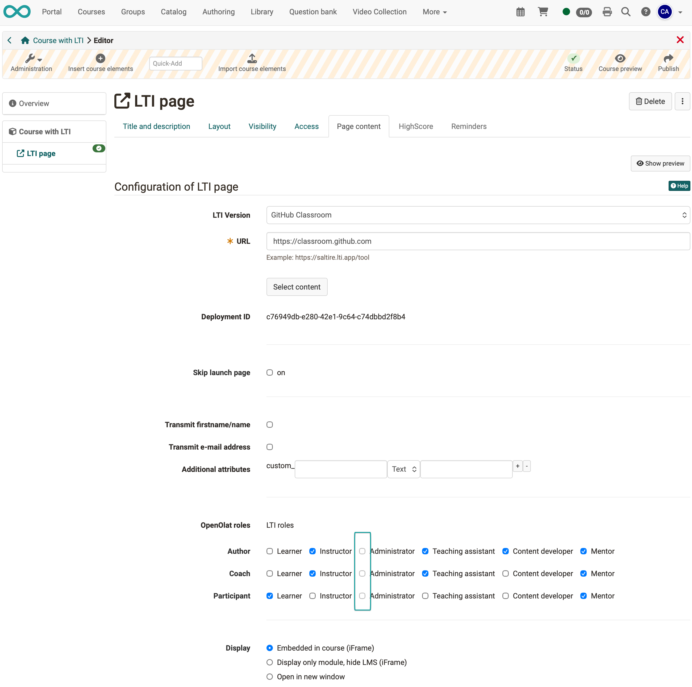

# LTI - Rollen-Mapping {: #LTI_role_mapping}

:octicons-tag-24: Release 20.2

Bei der Konfiguration eines LTI-Kursbausteins im Kurseditor kann der Autor festlegen, welche LTI-Rollen einem Benutzer 
automatisch aufgrund seiner Rolle im Kurs zugewiesen werden. In der Regel gibt es bestimmte Einschränkungen 
hinsichtlich der LTI-Rollen, die bestimmten Kursrollen zugewiesen werden können.


Im folgenden Beispiel ist die Zuweisung der LTI-Rolle "Administrator" an einen Kursbenutzer mit den Rollen
"Autor", "Betreuer" oder "Teilnehmer" deaktiviert:

{ class="shadow lightbox" }

Wenn OpenOlat beim Ausführen des Kurses die Verbindung zum LTI Tool herstellt, sendet OpenOlat automatisch die 
LTI-Rollen zusammen mit der E-Mail-Adresse des Benutzers, der Deployment ID und anderen Attributen an das LTI Tool.

Die Registerkarte "Rollen-Mapping" in der LTI-Verwaltung legt fest, welche LTI-Rollen Kursbesitzer:innen im Kurseditor den drei Kursrollen "Besitzer:in", "Betreuer:in" und "Teilnehmer:in" zuweisen darf:

{ class="shadow lightbox" }

Das System verwendet Standardwerte, die denen in den obigen Screenshots ähneln. Diese Standardwerte sind in der Datei
olat.properties gespeichert und müssen nicht geändert werden, es sei denn, Sie möchten andere Einschränkungen anwenden. 
Die Standardwerte in olat.properties sind:

```
# LTI roles (capitalized) that can be assigned to users based on their OpenOlat roles in the course editor by the course owner.
lti13.roles.configurable.by.course.owner=LEARNER,INSTRUCTOR,TEACHING_ASSISTANT,CONTENT_DEVELOPER,MENTOR

# The following is an exhaustive list of possible values for the field above:
lti13.roles.configurable.by.course.owner.values=LEARNER,INSTRUCTOR,ADMINISTRATOR,TEACHING_ASSISTANT,CONTENT_DEVELOPER,MENTOR

# Default LTI roles for given OpenOlat roles in courses:
lti13.default.role.settings.for.owners=INSTRUCTOR,ADMINISTRATOR,TEACHING_ASSISTANT,CONTENT_DEVELOPER,MENTOR
lti13.default.role.settings.for.coaches=INSTRUCTOR,TEACHING_ASSISTANT,MENTOR
lti13.default.role.settings.for.participants=LEARNER

# The following is an exhaustive list of possible values for the fields above:
lti13.default.role.settings.for.xxx.values=LEARNER,INSTRUCTOR,ADMINISTRATOR,TEACHING_ASSISTANT,CONTENT_DEVELOPER,MENTOR
```

Wenn Sie die Werte in olat.properties überschreiben möchten, können Sie dies tun, indem Sie die entsprechenden Eigenschaften in der Datei olat.local.properties bearbeiten.

Die Einstellungen in der Datei olat.local.properties übersteuern die Standardeinstellungen in olat.properties, und die Einstellungen in der OpenOlat Administration übersteuern die Einstellungen in olat.local.properties.


## Weiterführende Informationen {: #further_information}

IMS Global Learning Consortium: [Learning Tools Interoperability Core Specification](http://www.imsglobal.org/spec/lti/v1p3/)

Administrationshandbuch: [LTI 1.3 Integration](../administration/LTI_Integrations.de.md)

Administrationshandbuch: [LTI - Externe Werkzeuge](../administration/LTI_External_tools.de.md)

Administrationshandbuch: [LTI - Externe Plattformen](../administration/LTI_External_platforms.de.md)

Administrationshandbuch: [LTI - Deep Linking](../administration/LTI_Deeplinking.de.md)

Benutzerhandbuch: [LTI-Zugang zu einem Kurs konfigurieren](../../manual_user/learningresources/LTI_Share_courses.de.md)

Benutzerhandbuch: [Kursbaustein "LTI-Seite“](../../manual_user/learningresources/Course_Element_LTI_Page.de.md)

Benutzerhandbuch: [LTI-Zugang zu einer Gruppe konfigurieren](../../manual_user/groups/LTI_Share_groups.de.md)

