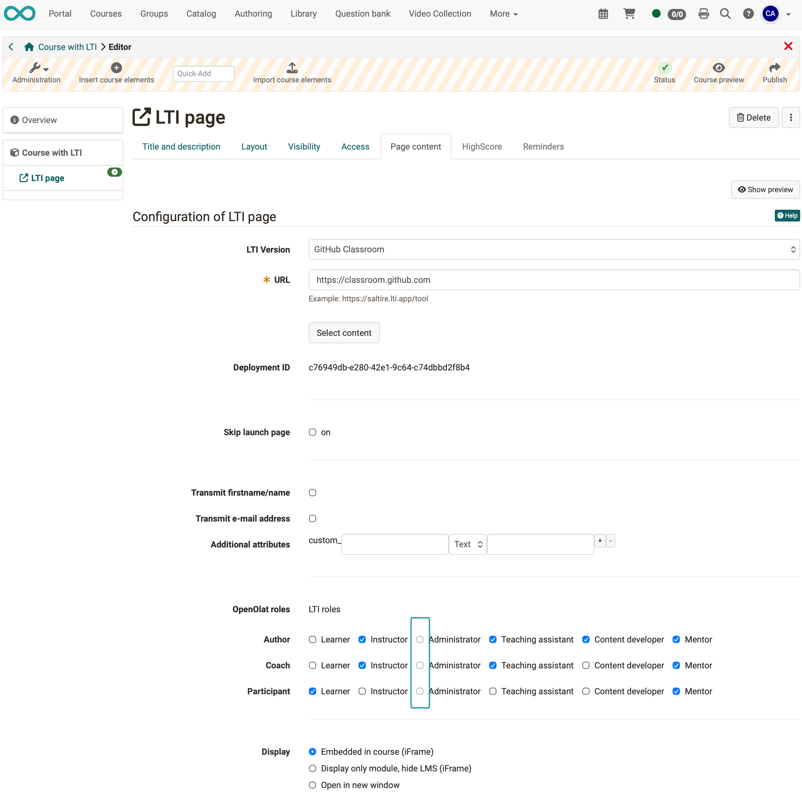
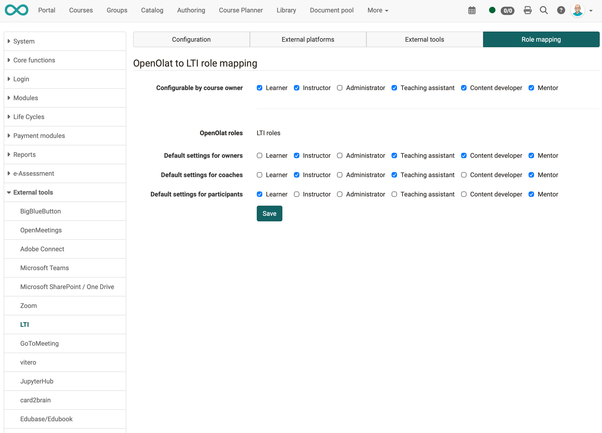

# LTI - Role mapping [:octicons-tag-16:{ title="from Release 20.2 (OO-9003)" }](https://track.frentix.com/issue/OO-9003) {: #LTI_role_mapping}

When an external tool is launched, OpenOlat sends the LTI roles of the launching person along. Which LTI roles a person receives depends on their course role. Course owners define this mapping in the course editor, in the [course element "LTI Page"](../../manual_user/learningresources/Course_Element_LTI_Page.md), tab "Page content". Administrators limit in the system administration which LTI roles course owners can choose from, and set the default values for new course elements.

## Mapping in the course editor {: #course_editor}

In the tab "Page content", course owners assign one or more of the six LTI roles to each of the three course roles "Author", "Coach" and "Participant": "Learner", "Instructor", "Administrator", "Teaching assistant", "Content developer" and "Mentor". A newly created course element takes over the default values from the system administration. When a course element or a course is copied, the existing mapping is retained.

LTI roles that the system administration has not released are greyed out for course owners. Administrators and learning resource managers of the organisation to which the course is assigned can assign all LTI roles. In the following example, the LTI role "Administrator" is locked for all three course roles:

{ class="shadow lightbox" }

When the course element is launched, OpenOlat sends the LTI roles to the tool together with the deployment ID and the other configured attributes, for example the e-mail address.

## Settings in the system administration {: #administration}

Administrators define the limits and default values in the system administration under `Administration > External tools > LTI`, tab "Role mapping":

| Field | Note |
|---|---|
| Configurable by course owner | The LTI roles that course owners may assign in the course editor. LTI roles not selected here are greyed out in the course editor. |
| Default settings for owners | The LTI roles that a new course element "LTI Page" preselects for the course role owner. |
| Default settings for coaches | The preselection for the course role coach. |
| Default settings for participants | The preselection for the course role participant. |

{ class="shadow lightbox" }

The default values are stored in the file `olat.properties`:

```
# LTI roles (capitalized) that can be assigned to users based on their OpenOlat roles in the course editor by the course owner.
lti13.roles.configurable.by.course.owner=LEARNER,INSTRUCTOR,TEACHING_ASSISTANT,CONTENT_DEVELOPER,MENTOR

# The following is an exhaustive list of possible values for the field above:
lti13.roles.configurable.by.course.owner.values=LEARNER,INSTRUCTOR,ADMINISTRATOR,TEACHING_ASSISTANT,CONTENT_DEVELOPER,MENTOR

# Default LTI roles for given OpenOlat roles in courses:
lti13.default.role.settings.for.owners=INSTRUCTOR,ADMINISTRATOR,TEACHING_ASSISTANT,CONTENT_DEVELOPER,MENTOR
lti13.default.role.settings.for.coaches=INSTRUCTOR,TEACHING_ASSISTANT,MENTOR
lti13.default.role.settings.for.participants=LEARNER

# The following is an exhaustive list of possible values for the fields above:
lti13.default.role.settings.for.xxx.values=LEARNER,INSTRUCTOR,ADMINISTRATOR,TEACHING_ASSISTANT,CONTENT_DEVELOPER,MENTOR
```

To change the default values, enter the corresponding properties in the file `olat.local.properties` or adjust the values directly in the tab "Role mapping". The values in `olat.local.properties` override `olat.properties`, and the settings in the tab "Role mapping" override `olat.local.properties`.

## Further information {: #further_information}

**Mentioned on this page**<br>
[Course element "LTI Page" >](../../manual_user/learningresources/Course_Element_LTI_Page.md)

**Further reading**<br>
[Learning Tools Interoperability Core Specification (IMS Global Learning Consortium) >](http://www.imsglobal.org/spec/lti/v1p3/)<br>
[LTI 1.3 Integrations >](../administration/LTI_Integrations.md)<br>
[LTI - External tools >](../administration/LTI_External_tools.md)<br>
[LTI - External platforms >](../administration/LTI_External_platforms.md)<br>
[LTI - Deep Linking >](../administration/LTI_Deeplinking.md)<br>
[Configure LTI access to a course >](../../manual_user/learningresources/LTI_Share_courses.md)<br>
[Configure LTI access to a group >](../../manual_user/groups/LTI_Share_groups.md)

[To the top of the page ^](#LTI_role_mapping)
