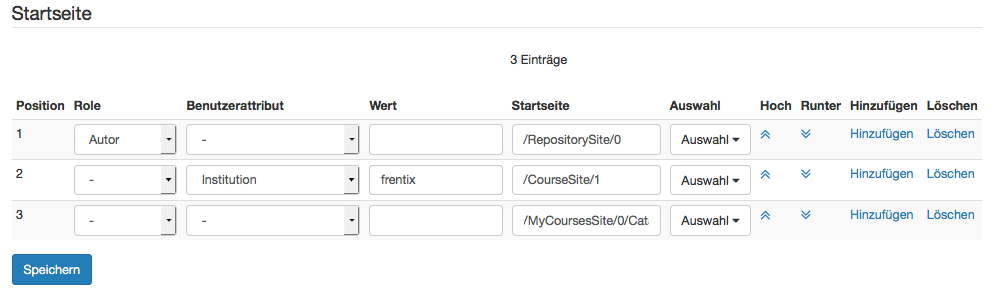
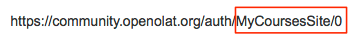

# Startseite

Hier legen Sie feingranular fest, welche Benutzergruppen welche Startseite
angezeigt bekommen, wenn sie sich in OpenOlat einloggen. Sie definieren
entweder anhand der Rolle und / oder eines Benutzerattributes die spezifische
Benutzergruppe, und weisen dieser dann mittels Startseite und Auswahl die
entsprechende Startseite zu. Es können so viele Regeln wie benötigt erstellt
werden, bitte beachten Sie jedoch, dass immer die zuerst zutreffende Regel
angewandt wird. Die Regeln sind unabhängig von einander und müssen nicht alle
zutreffen, lediglich die Reihenfolge ist relevant.

Die benutzerspezifische Startseite, die der Benutzer im persönlichen Menü
unter [Einstellungen/System/Spezielle
Systemeinstellungen](Konfiguration.html#Konfiguration-_specifics) für sich
persönlich festlegt, überschreibt die systemweite Startseite.

  

  

Die **Position** legt fest in welcher Reihenfolge die Regeln abgefragt werden:
die Regel die zuerst zutrifft, deren Seite wird für die betreffende
Benutzergruppe angezeigt. Die Position ändern Sie über die Spalten **Hoch** /
**Runter**. Weitere Regeln addieren oder löschen Sie über die Spalten
**Hinzufügen** / **Löschen**.

Über **Rolle** legen Sie fest, ob Sie für Benutzern mit einer bestimmten Rolle
(z.B. Autor oder Poolverwalter) eine spezifische Startseite festlegen wollen,
z.B. die Seite "Autorenbereich" für alle Autoren. Wird keine Rolle ausgewählt,
gelten eventuelle nachfolgende Einschränkungen für alle registrierten
Benutzer, unabhängig von der Rolle.

Über das **Benutzerattribut** wird die zuvor festgelegte Benutzergruppe
(entweder alle Systembenutzer, oder Benutzer mit einer bestimmten Rolle)
weiter spezifiziert. Das Benutzerattribut (z.B. Geschlecht, Land oder
Studienfach) wird dann über die Spalte **Wert** definiert. So sind beim
Attribut "Geschlecht" die Ausprägungen _männlich/weiblich_ möglich, beim Land
z.B _Schweiz, Deutschland_ etc, oder für Studienfach _Informatik, Theologie_
etc. Welche Ausprägungen in der Spalte Werte eingetragen werden können ist von
ihrer Organisation abhängig und wie diese Ausprägungen in ihrer OpenOlat
Instanz verfügbar sind. Benutzerattribute können sich des weiteren abhängig
von zuvor vorgenommenen Einstellungen ändern. Eventuell wurden Attribute
umbenannt, oder die Liste der verfügbaren Attribute wurde unter
Administration/Customizing/Benutzerattribute angepasst.

Welche Seite oder welcher Kurs geöffnet werden soll legen Sie fest indem Sie
entweder in der Spalte **Auswahl** einen der voreingestellten Seiten (z.B.
Katalog im Kursbereich, Gruppenbereich, Meine Abonnements oder Infokurs 1)
auswählen, oder indem Sie in der Spalte **Startseite** einen aus OpenOlat
kopierten Link, z.B. auf einen Kurs, eintragen. Bitte beachten Sie jedoch,
dass der Link folgendes Format haben muss:

    
    
    /MyCoursesSite/0

für einen Kurs sieht das folgendermassen aus:  

    
    
    /RepositoryEntry/292192256/

Wenn Sie also einen Link aus der Adresszeile des Browsers verwenden, müssen
Sie immer die URL nach dem entsprechenden Schema kürzen:

  

Es können zwei Kurse festgelegt werden, die zusätzlich zu den bekannten
Bereich nach Wunsch in die Navigation aufgenommen werden können. Dies sind die
Infokurse 1 + 2. Welche Kurse als Infokurs 1 oder 2 angezeigt werden, und
damit hier zur Auswahl stehen, legen Sie im Bereich Customizing/Sites in den
Tabs Infoseite n°1 / n°2 fest

