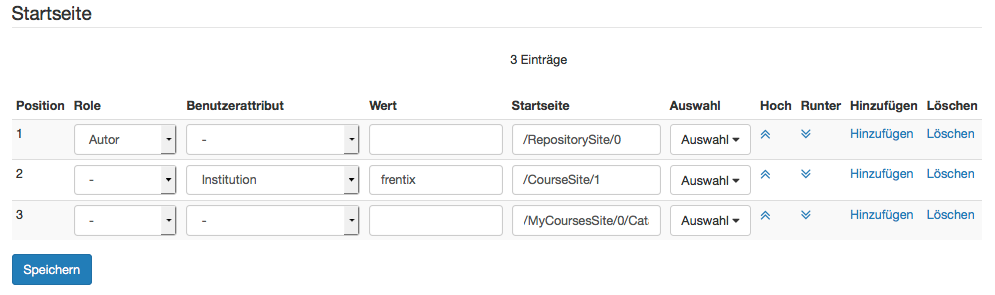

# Startseite {: #landing_pages}

Administrator:innen legen hier feingranular fest, welche Benutzergruppen welche Startseite angezeigt bekommen, wenn sie sich in OpenOlat einloggen. Sie finden die Einstellung in der System-Administration unter: 
`Administration > Core Konfiguration > Startseite`

Sie definieren entweder anhand der Rolle und / oder eines Benutzerattributes die spezifische Benutzergruppe, und weisen dieser dann mittels Startseite und Auswahl die entsprechende Startseite zu. Es können so viele Regeln wie benötigt erstellt werden, bitte beachten Sie jedoch, dass immer die zuerst zutreffende Regel angewandt wird. Die Regeln sind voneinander unabhängig und müssen nicht alle zutreffen, lediglich die Reihenfolge ist relevant.

!!! info "Wichtig"

    Die benutzerspezifische Startseite, die Benutzer:innen im persönlichen Menü unter [`Einstellungen > System > Spezielle Systemeinstellungen`](../../manual_user/personal_menu/Settings.de.md#special) für sich persönlich festlegen, überschreibt die systemweite Startseite.

{ class="shadow lightbox" }

Die **Position** legt fest, in welcher Reihenfolge die Regeln abgefragt werden: die Regel, die zuerst zutrifft, bestimmt die Seite für die betreffende Benutzergruppe. Die Position ändern Sie über die Spalten **Hoch** / **Runter**. Weitere Regeln fügen Sie über die Spalte **Hinzufügen** hinzu, über **Löschen** entfernen Sie eine Regel. Mit **Speichern** übernehmen Sie die Regeln.

Über **Rolle** legen Sie fest, ob Sie für Benutzer:innen mit einer bestimmten Rolle (z.B. Kursautor:innen oder Poolverwalter:innen) eine spezifische Startseite festlegen wollen, z.B. die Seite "Autorenbereich" für alle Autor:innen. Wird keine Rolle ausgewählt, gelten eventuelle nachfolgende Einschränkungen für alle registrierten Benutzer:innen, unabhängig von der Rolle.

Über das **Benutzer:innen-Attribut** wird die zuvor festgelegte Benutzergruppe (entweder alle Benutzer:innen des Systems oder Benutzer:innen mit einer bestimmten Rolle) weiter spezifiziert. Das Benutzerattribut (z.B. Geschlecht, Land oder Studienfach) wird dann über die Spalte **Wert** definiert. So sind beim Attribut "Geschlecht" die Ausprägungen _männlich/weiblich_ möglich, beim Land z.B. _Schweiz, Deutschland_ etc., oder für Studienfach _Informatik, Theologie_ etc. Welche Ausprägungen in der Spalte Wert eingetragen werden können, ist von Ihrer Organisation abhängig und davon, wie diese Ausprägungen in Ihrer OpenOlat-Instanz verfügbar sind. Benutzerattribute können sich des Weiteren abhängig von zuvor vorgenommenen Einstellungen ändern. Eventuell wurden Attribute umbenannt, oder die Liste der verfügbaren Attribute wurde angepasst. Beide Einstellungen finden Sie in der System-Administration unter: 
`Administration > Customizing > Benutzer:innen-Attribute`

Welche Seite oder welcher Kurs geöffnet werden soll, legen Sie fest, indem Sie entweder in der Spalte **Auswahl** eine der voreingestellten Seiten (z.B. Katalog im Kursbereich, Gruppenbereich, Meine Abonnements oder Infokurs 1) auswählen, oder indem Sie in der Spalte **Startseite** einen aus OpenOlat kopierten Link, z.B. auf einen Kurs, eintragen. Der Link muss folgendes Format haben:

    /MyCoursesSite/0

Für einen Kurs sieht das folgendermassen aus:

    /RepositoryEntry/292192256/

Wenn Sie also einen Link aus der Adresszeile des Browsers verwenden, müssen Sie die URL immer nach dem entsprechenden Schema kürzen:

{ class="shadow lightbox" }

!!! info "Wichtig"

    Es können zwei Kurse festgelegt werden, die zusätzlich zu den bekannten Bereichen nach Wunsch in die Navigation aufgenommen werden: die Infokurse 1 und 2. Welche Kurse als Infokurs 1 oder 2 angezeigt werden, und damit hier zur Auswahl stehen, legen Sie in den Tabs Infoseite n°1 / n°2 fest, in der System-Administration unter: 
    `Administration > Customizing > Sites`

## Weiterführende Informationen {: #further_information}

**Auf dieser Seite erwähnt** 
[Persönliche Konfiguration: Einstellungen >](../../manual_user/personal_menu/Settings.de.md)

**Weiterführend** 
[Core Konfiguration: Übersicht >](../administration/Core_functions.de.md) 
[Customizing: Übersicht >](../administration/Customizing.de.md) 
[Rollen und Rechte: Welche Rollen gibt es? >](../../manual_user/basic_concepts/Roles.de.md)

[Zum Seitenanfang ^](#landing_pages)
