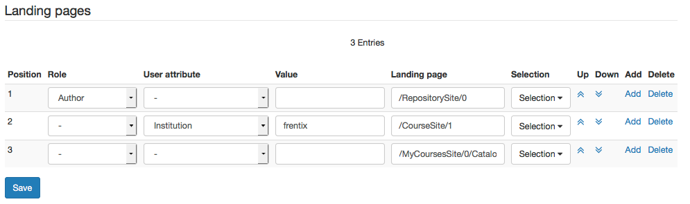
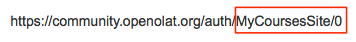

# Landing pages {: #landing_pages}

Administrators specify here in fine-grained detail which user groups are presented with which landing page when they log in to OpenOlat. You find the setting in the system administration under: 
`Administration > Core functions > Landing pages`

You define the specific user group either by role and / or by a user attribute, and then assign the corresponding landing page to this group by means of Landing page and Selection. You can create as many rules as necessary, but please note that it is always the first matching rule that is applied. The rules are independent of each other and do not all have to match; only the order is relevant.

!!! info "Important"

    The user-specific landing page that users set for themselves in the personal menu under [`Settings > System > Specific system settings`](../../manual_user/personal_menu/Settings.md#special) overrides the system-wide landing page.

{ class="shadow lightbox" }

The **Position** defines the order in which the rules are checked: the first rule that matches determines the page for the user group concerned. You change the position via the columns **Up** / **Down**. You add further rules via the column **Add** and remove a rule via **Delete**. Click **Save** to apply the rules.

Via **Role** you define whether you want to set a specific landing page for users with a specific role (e.g. Course authors or Pool managers), for example the "Authoring" site for all authors. If no role is selected, any subsequent restrictions apply to all registered users, independent of their role.

Via the **User attribute** the previously defined user group (either all users of the system or users with a specific role) is further specified. The user attribute (e.g. gender, country or field of study) is then defined via the column **Value**. For the attribute "Gender" the values _male/female_ are possible, for country e.g. _Switzerland, Germany_ etc., or for field of study _Informatics, Theology_ etc. Which values can be entered in the Value column depends on your organisation and on how these values are available in your OpenOlat instance. User attributes can also change depending on previously made settings. Attributes may have been renamed, or the list of available attributes may have been adjusted. You find both settings in the system administration under: 
`Administration > Customizing > User Properties`

Which page or which course is opened, you define either by selecting one of the preset pages in the **Selection** column (e.g. Catalog in course area, Group area, My subscriptions or Infocours 1) or by entering a link copied from OpenOlat, e.g. to a course, in the **Landing page** column. The link must have the following format:

    /MyCoursesSite/0

For a course this looks as follows:

    /RepositoryEntry/292192256/

So if you use a link from the browser address bar, you always have to shorten the URL according to this pattern:

{ class="shadow lightbox" }

!!! info "Important"

    Two courses can be defined that are added to the navigation in addition to the known areas as desired: the Info courses 1 and 2. Which courses are displayed as Info course 1 or 2, and are thus available for selection here, you define in the tabs Info page n°1 / n°2 in the system administration under: 
    `Administration > Customizing > Sites`

## Further information {: #further_information}

**Mentioned on this page** 
[Personal Configuration: Settings >](../../manual_user/personal_menu/Settings.md)

**Further reading** 
[Core functions: Overview >](../administration/Core_functions.md) 
[Customizing >](../administration/Customizing.md) 
[Roles and Rights: Which roles are available? >](../../manual_user/basic_concepts/Roles.md)

[To the top of the page ^](#landing_pages)
