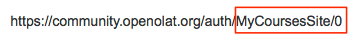

# Landing pages

Specify exactly who is presented with which landing page by defining finely-
grained rule sets depending on user role and user attribute. Landing pages are
assigned to each user group / rule separately. You can create as many rules as
necessary, but please note that rules are independent of each other and must
not necessarily be all true, and that it's always the first matching rule
that's applied. Because of that, you might want to give the order of the rules
some consideration.

Each user can choose his or her preferred landing page in the personal menu in
[System Settings/System/Specific System
Settings](../../manual_user/personal/Configuration.md#Configuration-_specifics). However, this
overrides the system default.

The **position** defines the order in which the rules are applied: the first
rule to match with a user role or an attribute, is applied, and the
corresponding landing page is displayed. You can change the order by moving
rules **up** or **down**. You can always **add** new rules or **delete**
existing ones.

Adding a **role** allows you to set a landing page for users with a specific
role (e.g. Author or Question bank manager), such as the setting the
"Authoring" site for authors. If no role is selected, subsequent restrictions
apply to all system users, independent of their role.

You can further specify the previously selected user group (either all system
users, or just users with a specific role) by adding a **user attribute**. The
user attribute (e.g. gender, country or field of studies) is then further
defined / specified via the **value** column. This means you could use the
values _male/female_ for the attribute "Gender", _Switzerland, Germany_ or
other countries for "Country", or e.g. _Informatics, Theology_ for "Field of
studies". The values that can be used in the value column depend on your
organisation and how the attributes are used in your OpenOlat installation.
User attributes also depend on other administrative settings - user attributes
can be renamed, or the complete list of available attributes can be changed in
Administration/Customizing/User attributes.

The exact landing page is defined by either selecting one of the preset sites
in the **Selection** column (such as the catalog in the the course area, the
group area, the subscriptions or the Infocourse 1) or pasting a custom link
from OpenOlat, e.g. from a specific course element, in the **Landing page**
column. Please note that the link needs to look like the following example:

    
    
    /MyCoursesSite/0

which would look for a course accordingly:  

    
    
    /RepositoryEntry/292192256/

If you are planning to use a custom link from the browser address bar, the URL
always needs to be shortened according to the following pattern:  

You can predefine two courses that will be displayed in the top navigation in
addition to the default sites. These are the Info courses 1 & 2\. Which
courses will be displayed as info course 1 or 2 and are thus available for
selection in this form, is determined in Administration/Customizing/Sites in
the Info page n°1 / n°2 tabs.

