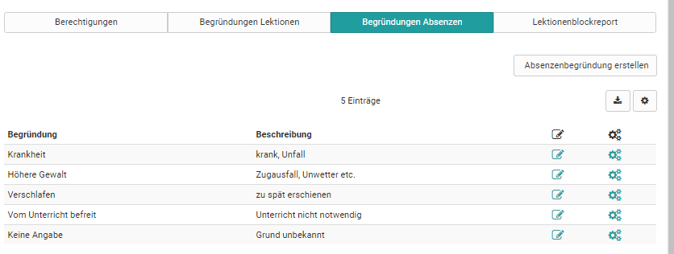

# Lecture and roll call management

Before the lectures and absence management can be used it need to be activated
in the administration. 

!!! tip "Activation"
	Customers of frentix please contact
	[contact@frentix.com](mailto:contact@frentix.com) for this. As soon as the 
	lectures and absence management is activated some additional settings can be done for the systemwide configuration. For systems with a fx-release these adaptations are done by frentix.  

	:material-alert: **Not a frentix hosting-client?** Please ask your local system operator!

## Tab Permissions

Lesson and absence management can be switched on or off here. Notifications
can also be activated.

### Configuration - overridable on course level 

 **Allow override of configuration**: The standard configuration set in the
administration can be overridden at the course level. This is not valid for
the "Global configuration".

 **Roll call enabled (default)**: Only if this option is activated the roll
call can be done and the participants and the checkboxes are visible.

 **Calculate attendance rate (default)**: If this option is enabled a percent
quote for the attendance is calculated.

 **Attendance quote  global in %**: This quote shows how many percent of
attendance are required to fulfill the requirements of the course.

 **Synchronize teachers calendars**: Teachers (course coaches) get entries in
their personal calendar (not the course calendar) for all lecture blocks where
they are added as teachers (This features does not need to be turned on for
Px-clients).

 **Synchronize course calendars**: Thanks to this option all determined
lecture blocks are shown in the course calendar directly, for participants,
teachers and course owners.

 **Allow assessment mode for lectures**  
  

### Globale configuration

 **Daily recording absences**: yes or no

 **Allow holding partial lectures**: When closing a lecture block the number
of lectures which have been held really can be entered in "Effective
lectures".

 **Lectures status**: If this option is selected lecture blocks can be
cancelled. Thus this lecture block does not count for the attendance quote.

 **Reminder enabled**: The reminder feature can be activated here. Afterword
the reminder and the auto close period need to be defined.

 **Reminder period in days**: Here the reminder period is entered in days.
After this number of days is reached the teacher is reminded to do the roll
call. 1 day corresponds to 24 hours and the counting starts with the entered
end of the lecture block.

 **Auto close period in days**: Again the number of days is entered. After
this period is expired the status of the lecture block is set to closed
automatically. The already entered roll call is saved. If nothing has been
entered all participants are saved as attendant. The auto close period starts
the following day after the end time of the lecture block has been reached and
runs until the end of a day.

 **Authorized absences**: This option allows to excuse absences. If this
option is not activated all absences are considered as not excused.

 **Count authorized absence as attendant**: Activating this option excused
absences are calculated as attendant for the calculation of the attendance
quote.

 **Count dispensation as attendant**: yes or no 

 **Absence per default authorized**: In general all entered absences are not
excused. However, this option sets all entered absences as excused
automatically. If this does not apply, the absence need to be set as not
excused manually.

 **Course owner can see all courses in curriculum elements**: yes or no

 **Appeal absence enabled**: If the appeal is activated the course
participants get the possibility to appeal for entered absences. For example
this could be necessary if an absence is accepted as excused in retrospect or
if the teacher entered the absence wrong.

 **Appeal absence period in days**: The appeal period starts as soon as the
lecture block is closed. Either the teacher has set the block to closed
manually or the auto close period has expired and the lecture block has been
set to closed automatically. The counting of the days starts the following day
after the status of the lecture block has been set to closed. Afterward whole
days will be counted, the appeal period ends at the end of the day.

 **Display in courses**: all lesson blocks or only your own

## Tab Reasons lectures and absences

In the administration reasons are created with a title and a description.
These reasons can only be edited here. Teachers cannot add own reasons.

Always when a lecture block is closed, a reason need to be chosen. If no
reason is entered in the administration, the reason choice is not available
when closing a lecture block.

{ class="shadow lightbox" }

## Tab Lectures report

Reports for specific time periods can be displayed here.

  

