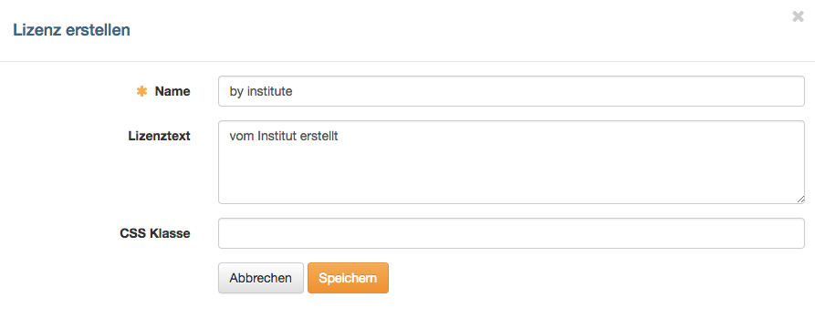
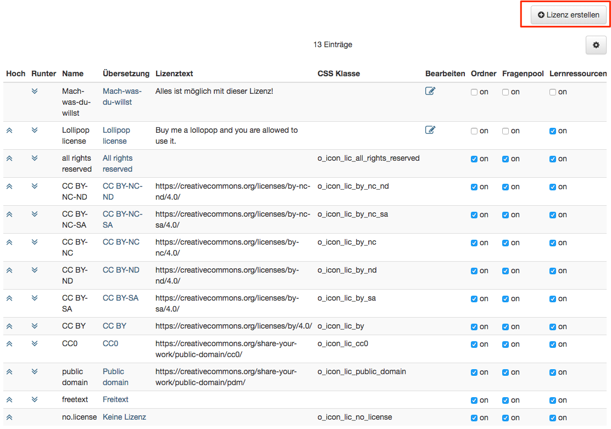
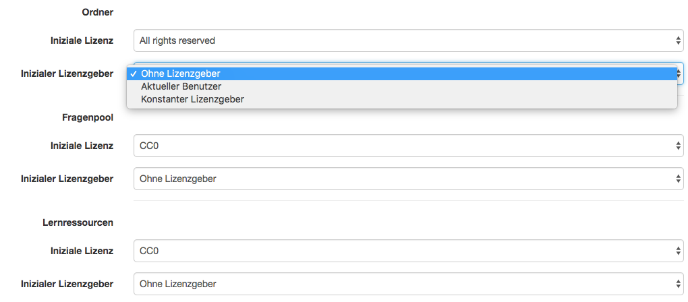

# Lizenzen {: #licences}

Das Lizenzmanagement in OpenOlat ist optional. Administrator:innen konfigurieren
es in der System-Administration unter: 
`Administration > Core Konfiguration > Lizenzen`

## Aktivierung von Lizenzbereichen {: #licences_activation}

{ class="shadow lightbox aside-right-lg" }

Die Verwendung von Lizenzen ist für folgende Bereiche in OpenOlat möglich:

  * Ordner
  * Fragenpool
  * Lernressourcen
  * Media Center

Unter "Lizenzen aktivieren in" werden die Lizenzen für diese Bereiche aktiviert
bzw. deaktiviert. Nach jeder Änderung weist OpenOlat darauf hin, den Indexer der
Volltextsuche zu starten, damit die Lizenzen in den Suchresultaten korrekt
angezeigt werden.

[Zum Seitenanfang ^](#licences)

---

## Lizenztypen {: #licences_types}

In OpenOlat sind 12 Standardlizenztypen vorgegeben: sieben
Creative-Commons-Lizenzen (CC0, CC BY, CC BY-SA, CC BY-ND, CC BY-NC, CC BY-NC-SA,
CC BY-NC-ND), "Public domain", "All rights reserved", "YouTube Lizenz",
"Freitext" und "Keine Lizenz". Diese Standardlizenztypen können nicht gelöscht
werden. Informationen zu Creative Commons finden Sie in der
[Wikipedia](http://de.wikipedia.org/wiki/Creative_Commons "Wikipedia") und unter
[www.creativecommons.org](http://www.creativecommons.org/
"www.creativecommons.org"). Während die Creative-Commons-Lizenzen alle eine
Kopie und Weiterverteilung eines geschützten Werkes erlauben, gestattet die
"All rights reserved"-Lizenz nur die Nutzung in dem Kontext, den die Urheber:in
vorsieht.

Es können zusätzlich eigene Lizenzen erstellt werden, sollten die
Standardlizenztypen nicht genügen. Über "Lizenz erstellen" öffnet sich ein
Dialog, in dem der Lizenzname, ein zugehöriger Lizenztext sowie eine CSS-Klasse
eingetragen werden können. So erstellte Lizenztypen können nachträglich nur
bearbeitet, aber nicht gelöscht werden.

{ class="shadow lightbox" }

Alle verfügbaren Lizenzen werden in der Übersicht dargestellt. Mit den Pfeilen
in den Spalten "Hoch" und "Runter" kann die Anzeige-Reihenfolge der Lizenzen
verändert werden. Über den Link in der Spalte "Übersetzung" kann der
Lizenzname in einer anderen Sprache hinterlegt werden. Eigene Lizenzen können
über die Spalte "Bearbeiten" geändert werden.

Die Spalten "Ordner", "Fragenpool", "Lernressourcen" und "Media Center" sind in
der Übersicht nur sichtbar, wenn die Lizenzen generell für den jeweiligen
Bereich aktiviert sind. Es ist hier möglich, für die einzelnen Bereiche nur
bestimmte Lizenztypen zu aktivieren.

{ class="shadow lightbox" }

Lizenztypen, die als Open Educational Resource gelten, tragen ein
OER-Kennzeichen. Bei den Standardlizenztypen sind das die sieben
Creative-Commons-Lizenzen und "Public domain". Bei eigenen Lizenzen wird das
Kennzeichen im Dialog "Lizenz erstellen" bzw. "Lizenz bearbeiten" mit der
Checkbox "Qualifiziert als OER-Lizenz" gesetzt. Die Spalte "OER-Lizenz" der
Übersicht zeigt das Kennzeichen an. [:octicons-tag-16:{ title="ab Release 17.2 (OO-6683)" }](https://track.frentix.com/issue/OO-6683)

[Zum Seitenanfang ^](#licences)

---

## Initiale Lizenzen festlegen {: #licences_initial}

{ class="shadow lightbox aside-right-lg" }

Für die einzelnen Bereiche "Ordner", "Fragenpool", "Lernressourcen" und
"Media Center" kann eine initiale Lizenz sowie ein initialer Lizenzgeber
festgelegt werden.

  *  **Initiale Lizenz:** Es kann eine Lizenz aus allen für diesen Bereich verfügbaren Lizenzen ausgewählt werden.
  *  **Initialer Lizenzgeber:** Es kann zwischen "Ohne Lizenzgeber", "Aktuelle:r Benutzer:in" und "Konstanter Lizenzgeber" ausgewählt werden. Der "Konstante Lizenzgeber" kann im nächsten Schritt angegeben bzw. bearbeitet werden.

Beim Anlegen eines neuen Dokuments im Kursbaustein Ordner, einer neuen Frage
im Fragenpool, einer neuen Lernressource im Autorenbereich bzw. eines neuen
Mediums im Media Center wird automatisch die hinterlegte Lizenz sowie der
angegebene Lizenzgeber zugeordnet.

[Zum Seitenanfang ^](#licences)

---

## Weiterführende Informationen {: #further_information}

[Creative Commons in der Wikipedia >](http://de.wikipedia.org/wiki/Creative_Commons) 
[www.creativecommons.org >](http://www.creativecommons.org/) 
[Modul Media Center >](Modules_Media_Center.de.md) 
[Dateien und Ordner >](Files_and_Folders.de.md) 
[Modul OAI PMH >](Modules_OAI.de.md) 
[Kurseinstellungen - Tab Metadaten >](../../manual_user/learningresources/Course_Settings_Metadata.de.md)

[Zum Seitenanfang ^](#licences)
