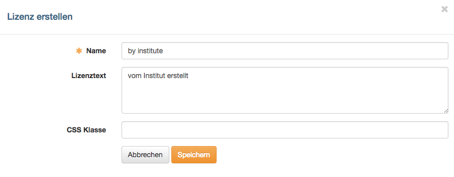
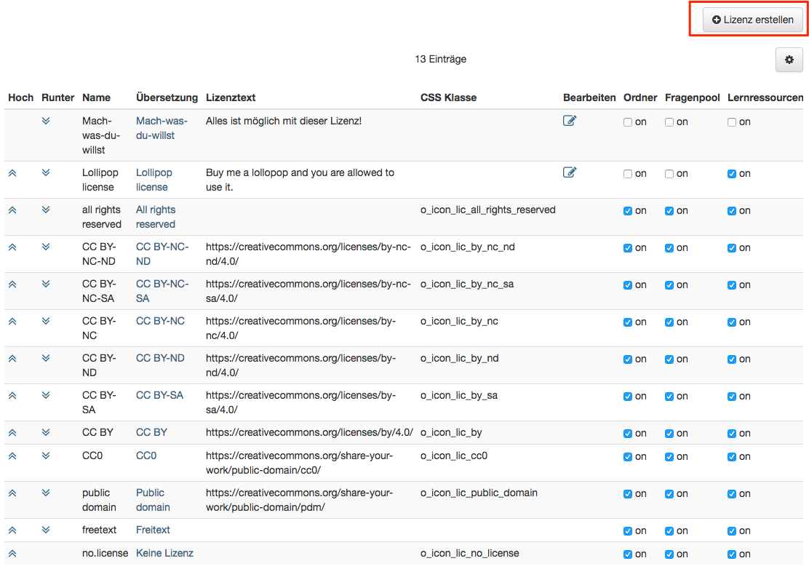
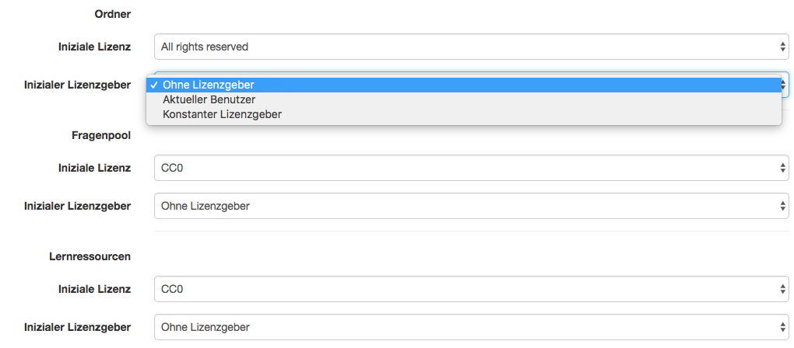

# Lizenzen

Das Lizenzmanagement in OpenOlat ist optional und kann in der Administration
konfiguriert werden.

## Aktivierung von Lizenzbereichen

{ class="shadow lightbox aside-right-lg" }

Die Verwendung von Lizenzen ist für folgende Bereiche in OpenOlat möglich:

  * Ordner
  * Fragenpool
  * Lernressourcen

In der Administration können die Lizenzen für diese Bereiche aktiviert bzw.
deaktiviert werden.

## Lizenztypen

In OpenOlat sind bereits 8 Standardlizenzen definiert, sieben Creative
Commons-Lizenzen, sowie eine „All rights reserved“-Lizenz. Diese Standard
Lizenztypen können nicht gelöscht werden. Informationen zu Creative Commons
finden Sie in der [Wikipedia](http://de.wikipedia.org/wiki/Creative_Commons
"Wikipedia") und unter
[www.creativecommons.org](http://www.creativecommons.org/
"www.creativecommons.org"). Während die Creative Commons Lizenzen alle eine
Kopie und Weiterverteilung eines geschützten Werkes erlauben, gestattet die
„All rights reserved“ - Lizenz nur die Nutzung im vom Urheber vorgesehenen
Kontext.

Es können zusätzlich eigene Lizenzen erstellt werden, sollten die Standard
Lizenztypen nicht genügen. Über "Lizenz erstellen" öffnet sich ein Dialog, in
dem der Lizenzname, ein zugehöriger Lizenztext sowie eine CSS-Klasse
eingetragen werden können. So erstellte Lizenztypen können nachträglich nur
bearbeitet, aber nicht gelöscht werden.

{ class="shadow lightbox" }

  

Alle verfügbaren Lizenzen werden in der Übersicht dargestellt. Mit den Pfeilen
in den Spalten "Hoch" und "Runter" kann die Anzeige-Reihenfolge der Lizenzen
verändert werden. Über den Link in der Spalte "Übersetzung" kann der
Lizenzname in einer anderen Sprache hinterlegt werden. Eigene Lizenzen können
über die Spalte "Bearbeiten" geändert werden.

Die Spalten "Ordner", "Fragenpool" und "Lernressourcen" sind in der Übersicht
nur sichtbar, wenn die Lizenzen generell für den jeweiligen Bereich aktiviert
sind. Es ist hier möglich, für die einzelnen Bereiche nur bestimmte
Lizenztypen zu aktivieren.

{ class="shadow lightbox" }

  

## Initiale Lizenzen festlegen

{ class="shadow lightbox aside-right-lg" }

Für die einzelnen Bereiche "Ordner", "Fragenpool" und "Lernressourcen" kann
eine initiale Lizenz sowie ein initialer Lizenzgeber festgelegt werden.

  *  **Initiale Lizenz:** Es kann eine Lizenz aus allen für diesen Bereich verfügbaren Lizenzen ausgewählt werden.
  *  **Initialer Lizenzgeber:** Es kann zwischen "Ohne Lizenzgeber", "Aktueller Benutzer" und "Konstanter Lizenzgeber" ausgewählt werden. Der "Konstante Lizenzgeber" kann im nächsten Schritt angegeben bzw. bearbeitet werden.

Beim Anlegen eines neuen Dokuments im Ordner-Kursbaustein, einer neuen Frage
im Fragenpool bzw. einer neuen Lernressource im Autorenbereich wird
automatisch die hinterlegte Lizenz sowie der angegebene Lizenzgeber
zugeordnet.

  

