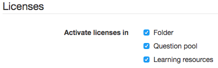
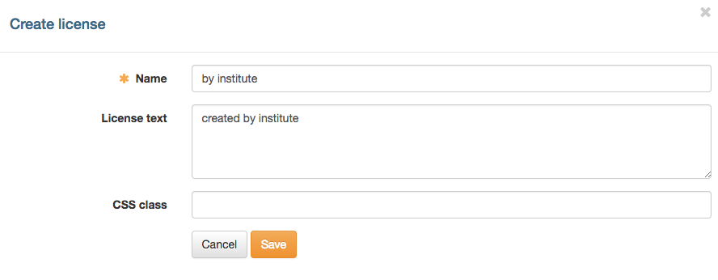
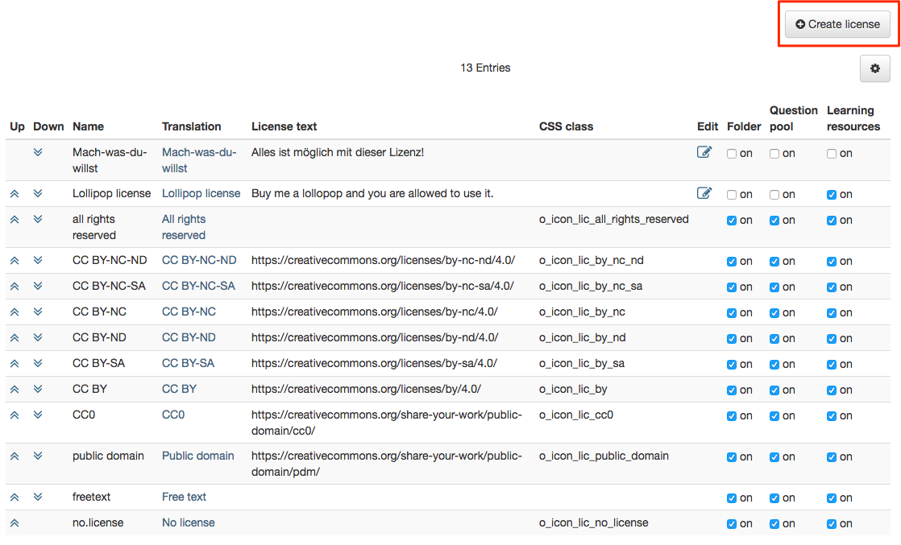
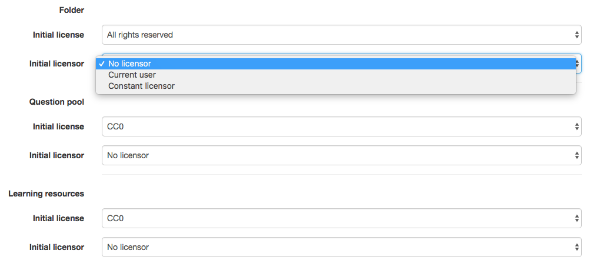

# Licenses {: #licences}

The license management in OpenOlat is optional. Administrators configure it in
the system administration under: 
`Administration > Core functions > Licenses`

## Activating license sections {: #licences_activation}

{ class="shadow lightbox aside-right-lg" }

Licenses can be used in the following OpenOlat sections:

  * Folder
  * Question pool
  * Learning resources
  * Media Center

Under "Activate licenses in" the licenses are activated or deactivated for
these sections. After each change, OpenOlat reminds you to start the full text
search indexer so that the licenses are shown correctly in the search results.

[To the top of the page ^](#licences)

---

## License types {: #licences_types}

OpenOlat provides 12 default license types: seven Creative Commons licenses
(CC0, CC BY, CC BY-SA, CC BY-ND, CC BY-NC, CC BY-NC-SA, CC BY-NC-ND), "Public
domain", "All rights reserved", "YouTube license", "Free text" and "No
license". These default license types cannot be deleted. Information on
Creative Commons can be found in the
[Wikipedia](http://en.wikipedia.org/wiki/Creative_Commons "Wikipedia") and on
[www.creativecommons.org](http://www.creativecommons.org/
"www.creativecommons.org"). While the Creative Commons licenses all allow
copying and redistributing a protected work, the "All rights reserved" license
only permits use in the context intended by the author.

In addition, own licenses can be created if the default license types are not
sufficient. "Create license" opens a dialog in which the license name, a
corresponding license text and a CSS class can be entered. License types
created in this way can only be edited afterwards, not deleted.

{ class="shadow lightbox" }

All available licenses are listed in the overview. Use the arrows in the
columns "Up" and "Down" to change the display order of the licenses. The link
in the column "Translation" allows you to store the license name in another
language. Own licenses can be changed via the column "Edit".

The columns "Folder", "Question pool", "Learning resources" and "Media Center"
are only visible in the overview if the licenses are generally activated for
the respective section. Here it is possible to activate only specific license
types for the individual sections.

{ class="shadow lightbox" }

License types that qualify as Open Educational Resource carry an OER flag.
Among the default license types, these are the seven Creative Commons licenses
and "Public domain". For own licenses, the flag is set in the dialog "Create
license" or "Edit license" with the checkbox "Qualifies as OER License". The
column "OER-License" of the overview shows the flag. [:octicons-tag-16:{ title="from Release 17.2 (OO-6683)" }](https://track.frentix.com/issue/OO-6683)

[To the top of the page ^](#licences)

---

## Set initial licenses {: #licences_initial}

{ class="shadow lightbox aside-right-lg" }

For the individual sections "Folder", "Question pool", "Learning resources" and
"Media Center", an initial license and an initial licensor can be set.

  *  **Initial license:** A license can be selected from all licenses available for this section.
  *  **Initial licensor:** You can choose between "No licensor", "Current user" and "Constant licensor". The "Constant licensor" can be entered or edited in the next step.

When a new document is added to the course element Folder, a new question to
the Question bank, a new learning resource in Authoring or a new media in the
Media Center, the stored license and the specified licensor are assigned
automatically.

[To the top of the page ^](#licences)

---

## Further information {: #further_information}

[Creative Commons in the Wikipedia >](http://en.wikipedia.org/wiki/Creative_Commons) 
[www.creativecommons.org >](http://www.creativecommons.org/) 
[Module Media Center >](Modules_Media_Center.md) 
[Files and Folders >](Files_and_Folders.md) 
[Module OAI-PMH >](Modules_OAI.md) 
[Course Settings - Tab Metadata >](../../manual_user/learningresources/Course_Settings_Metadata.md)

[To the top of the page ^](#licences)
