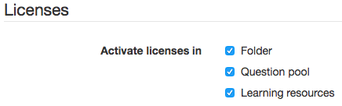
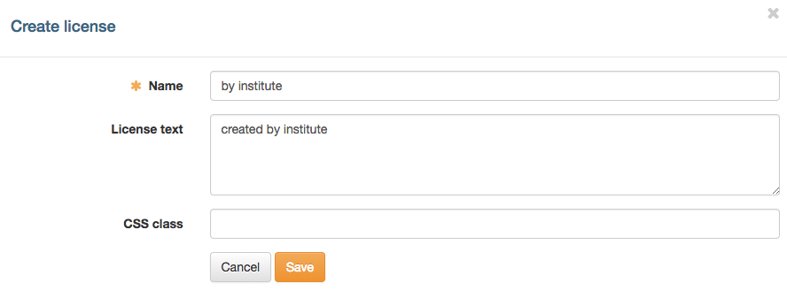
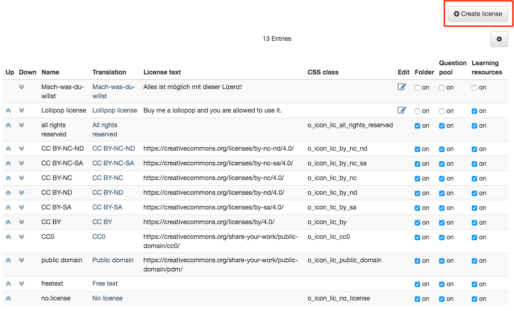
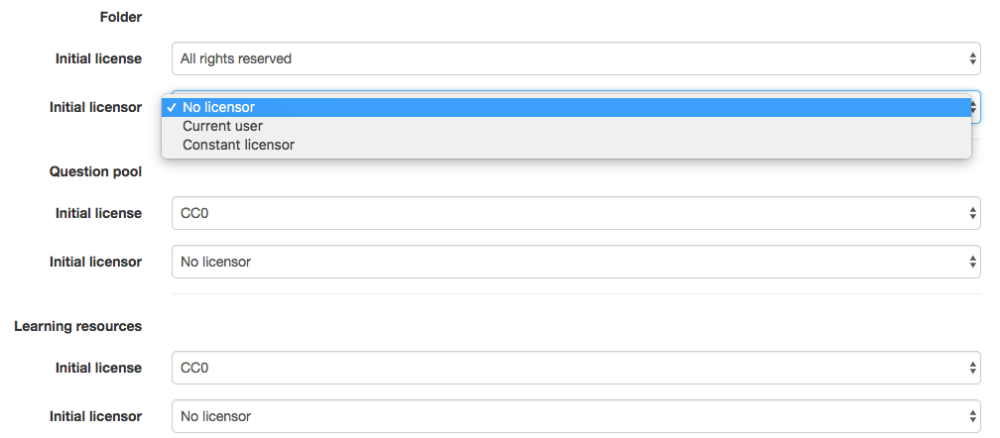

# Licenses {: #licences}

With a license, you state for files, questions, learning resources and media
how others may use them. Licenses are optional in OpenOlat. Administrators
configure them in the system administration under: 
`Administration > Core functions > Licenses`

## Activate licenses in areas [:octicons-tag-16:{ title="from Release 12.4 (OO-3170)" }](https://track.frentix.com/issue/OO-3170) {: #licences_activation}

{ class="shadow lightbox aside-right-lg" }

Licenses can be used in the following OpenOlat areas:

  * Folder
  * Question bank
  * Learning resources
  * Media Center

Under "Activate licenses in", you switch the licenses on or off per area.
After each change, OpenOlat reminds you to start the full text search indexer
so that the search results show the licenses correctly.

[To the top of the page ^](#licences)

---

## License types {: #licences_types}

OpenOlat provides 12 default license types: seven Creative Commons licenses
(CC0, CC BY, CC BY-SA, CC BY-ND, CC BY-NC, CC BY-NC-SA, CC BY-NC-ND), "Public
domain", "All rights reserved", "YouTube license", "Free text" and "No
license". These default license types cannot be deleted. Information on
Creative Commons can be found in the
[Wikipedia](http://en.wikipedia.org/wiki/Creative_Commons "Wikipedia") and on
[www.creativecommons.org](http://www.creativecommons.org/
"www.creativecommons.org"). While the Creative Commons licenses all allow
copying and redistributing a protected work, the "All rights reserved" license
only permits use in the context intended by the author.

If the default license types are not sufficient, you create your own
licenses. The button "Create license" opens a dialog with the fields "Name",
"License text" and "CSS class". Own license types can be edited afterwards, but
not deleted. When editing, you can no longer change the name, it only appears
as text.

{ class="shadow lightbox" title="Dialog Create license" }

The overview lists all available licenses. Use the arrows in the columns "Up"
and "Down" to change the order in which the licenses appear. With the link in
the column "Translation", you store the license name in another language. You
change own licenses via the column "Edit".

The columns "Folder", "Question bank", "Learning resources" and "Media Center"
only appear in the overview if the licenses are switched on for the respective
area. In these columns, you switch individual license types on or off for each
area.

{ class="shadow lightbox" title="Overview of license types" }

License types that qualify as Open Educational Resource carry an OER flag.
Among the default license types, these are the seven Creative Commons licenses
and "Public domain". For own licenses, you set the flag in the dialog "Create
license" or "Edit license" with the checkbox "Qualifies as OER License". The
column "OER-License" of the overview shows the flag. [:octicons-tag-16:{ title="from Release 17.2 (OO-6683)" }](https://track.frentix.com/issue/OO-6683)

[To the top of the page ^](#licences)

---

## Set initial licenses {: #licences_initial}

{ class="shadow lightbox aside-right-lg" }

For the areas "Folder", "Question bank", "Learning resources" and "Media
Center", you set an initial license and an initial licensor. The settings
appear for each area in which licenses are switched on.

  *  **Initial license:** All licenses that are switched on for this area are available for selection.
  *  **Initial licensor:** "No licensor", "Current user" and "Constant licensor" are available for selection. If "Constant licensor" is selected, you enter the name with the button "Edit" in the dialog "Edit licensor".

When someone adds a new document to the course element Folder, a new question
to the Question bank, a new learning resource in Authoring or a new medium in
the Media Center, OpenOlat automatically assigns the stored license and the
specified licensor.

[To the top of the page ^](#licences)

---

## Further information {: #further_information}

[Creative Commons in the Wikipedia >](http://en.wikipedia.org/wiki/Creative_Commons) 
[www.creativecommons.org >](http://www.creativecommons.org/) 
[Module Media Center >](Modules_Media_Center.md) 
[Files and Folders >](Files_and_Folders.md) 
[Module OAI-PMH >](Modules_OAI.md) 
[Course Settings - Tab Metadata >](../../manual_user/learningresources/Course_Settings_Metadata.md)

[To the top of the page ^](#licences)
