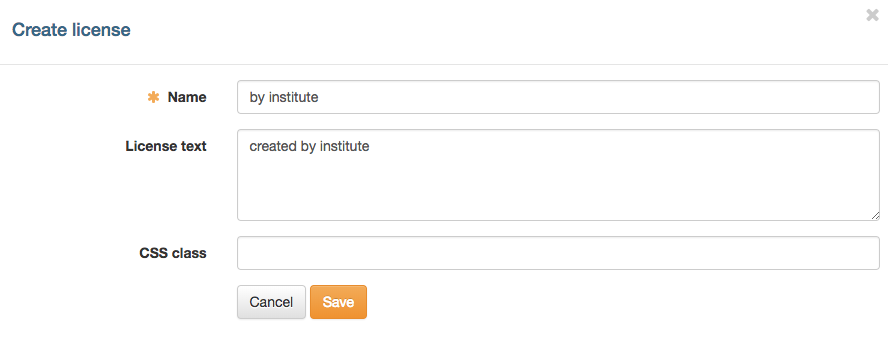
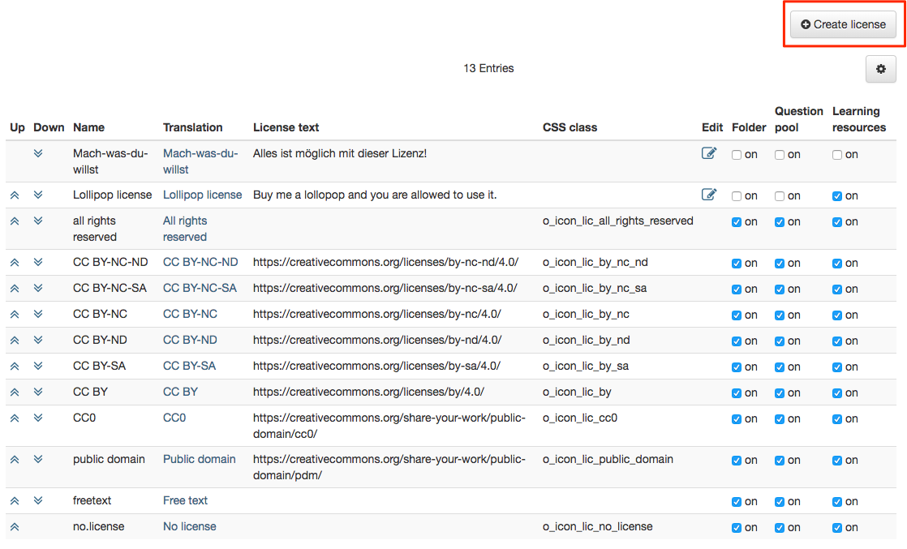

# Licenses

The OpenOlat license management is optional and can be managed in the
administration.

  

### **Activating Licenses**

Licenses can be used in the following OpenOlat sections:

  * Folder
  * Question bank
  * Learning resource

In the administration the licenses can be activated and deactivated for these
sections.

  

### Types of licenses

OpenOlat offers 8 default licenses, of which seven are Creative Commons
licenses, and the eighth is an „All rights reserved“ license. Please note that
the default licenses can not be deleted.  Information on Creative Commons can
be found in the [Wikipedia](http://en.wikipedia.org/wiki/Creative_Commons
"Wikipedia") and on [www.creativecommons.org](http://www.creativecommons.org/
"www.creativecommons.org"). While the Creative Commons licenses all allow user
to at least copy and share copyrighted material, the "All rights reserved"
license clearly states that the material in question cannot be copied freely.

In addition, own licenses can be added. When clicking on "Create license" a
dialog opens to fill in a license name, a corresponding licenses text and a
CSS class. Licenses created in such a way can just be edited afterwards, they
can not be deleted.

  

All available licenses are listed in the overview. Use the arrows (column "Up"
and "Down") to change the order of the licenses. If the license name is
available in another language, add it as a link to the column "Translation".
Change your own licenses by clicking on the "edit" icon (column "Edit").

The columns "Folder", "Question pool" and "Learning resources" are only
visible in the overview if the licenses have been generally activated for the
corresponding section. You can activate specific licenses to individual
section if required.

  

### Set initial licenses

In the sections "Folder", "Question pool" and "Learning resources" you can set
an initial license, and an initial licensor, respectively.

  *  **Initial license:** Choose one of the available licenses within a section.
  *  **Initial licenser:** You can choose between "No licensor", "Current user" and "Constant licensor". The latter can be set up or edited in the next step.

When adding a new document to the course element "Folder", a new question to
the Question pool, or a new learning resource to the authoring section, the
system will automatically assign the deposited license and the appropriate
licensor.

