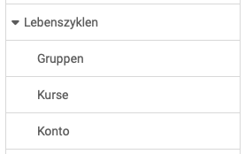

# Lebenszyklen: Übersicht {: #lifecycles}

{ class="shadow lightbox aside-left-lg" }

In diesem Abschnitt können die folgenden Lebenszyklen administriert werden:

---

## Gruppen {: #lifecycle_groups}

In der OpenOlat-Administration können Einstellungen für den [Gruppen-Lebenszyklus](Automatic_Group_Lifecycle.de.md) vorgenommen werden. Dieser vollzieht sich in den Schritten

* Inaktivierung
* Löschung 
* unwiderruflichen Löschung

Einstellung können sowohl für Gruppen generell, als auch nur für bestimmte Gruppentypen gemacht werden. 

[Zu den Details >](Automatic_Group_Lifecycle.de.md) 
[Zum Seitenanfang ^](#lifecycles)

## Kurse {: #lifecycle_courses}

Im Lebenszyklus von Kursen kann festgelegt werden, 

* ob und wann ein Kurs automatisch in den Status "Beendet" versetzt wird,
* wann er danach in den Papierkorb verschoben wird,
* und wann er endgültig gelöscht wird

Über jede Statusänderung können die Kursbesitzer:innen automatisch informiert werden.

[Zum Seitenanfang ^](#lifecycles)

## Konto {: #lifecycle_accounts}

Ähnlich dem automatisch gesteuerten Kurs-Lifecycle kann auch der Lebenszyklus von Konten der OpenOlat-Benutzer:innen automatisiert werden. 

* In einem ersten Schritt können die Konten von Benutzer:innen, die über einen längeren Zeitraum nicht aktiv waren, zunächst deaktiviert und der Benutzerstatus auf "inaktiv" gesetzt werden. 
* Erfolgt im festgelegten Zeitraum kein erneuter Login, so wird das Benutzerkonto gelöscht. Je nach Konfiguration können die Benutzer vor bzw. nach der Deaktivierung oder Löschung des Kontos eine E-Mail mit einem entsprechenden Hinweis erhalten.
* Es kann eingerichtet werden, dass die unwiderrufliche Löschung im letzten Schritt automatisch oder ausschliesslich manuell erfolgen soll.

Zu jedem Schritt können unterschiedliche Benachrichtigungen im Kontext der Schritte formuliert und der Zeitpunkt der Mailbenachrichtigung definiert werden.

[Zum Seitenanfang ^](#lifecycles)

  

