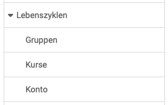

# Lebenszyklen: Übersicht {: #lifecycles}

{ class="shadow lightbox aside-left-lg" }

In diesem Abschnitt können die folgenden Lebenszyklen administriert werden:

---

## Gruppen {: #lifecycle_groups}

In der OpenOlat-Administration können Einstellungen für den [Gruppen-Lebenszyklus](Automatic_Group_Lifecycle.de.md) vorgenommen werden. Dieser vollzieht sich in den Schritten

* Inaktivierung
* Löschung 
* unwiderruflichen Löschung

Einstellung können sowohl für Gruppen generell, als auch nur für bestimmte Gruppentypen gemacht werden. 

!!! info "Gruppen-Lebenszyklus — Details"
    Schritte und Einstellungen für den automatischen Gruppen-Lebenszyklus. 
    [Gruppen-Lebenszyklus](Automatic_Group_Lifecycle.de.md)

[Zum Seitenanfang ^](#lifecycles)

## Kurse {: #lifecycle_courses}

Im Lebenszyklus von Kursen kann festgelegt werden, 

* ob und wann ein Kurs automatisch in den Status "Beendet" versetzt wird,
* wann er danach in den Papierkorb verschoben wird,
* und wann er endgültig gelöscht wird

Über jede Statusänderung können die Kursbesitzer:innen automatisch informiert werden.

[Zum Seitenanfang ^](#lifecycles)

## Konto {: #lifecycle_accounts}

Ähnlich dem automatisch gesteuerten Kurs-Lifecycle kann auch der Lebenszyklus von Konten der OpenOlat-Benutzer:innen automatisiert werden. 

!!! note "Hinweis"
    Der Lebenszyklus läuft in getrennten Schritten und wird aus teils Unterschiedlichen Einstellungen gefüttert. Folgende Tabelle soll der Übersicht dienen.

| Variante | Einstellungsquelle | Mailaktionen für Automatisierungen | Version |
|----------|-------------------|--------------|---------|
| Kontoablauf | **a)** Benutzerverwaltung > Benutzer erstellen (Feld «Kontoablauf») oder nachträglich im Tab «Konto» **b)** Automatisch und damit Systemweit, in der Administration festlegen. **Wichtig** es können natürlich beide Wege aktiv sein, dann greift der zuerst dessen Zeit früher abläuft. | Vor und/oder nach Kontoablauf konfigurierbar | :octicons-tag-24:{ title="ab Release 15.4" } |
| Deaktivierung | Automatisch: Administration > Lebenszyklen > Konto (Inaktivitätsfrist) oder Manuell: Benutzerverwaltung > Benutzer > Tab «Konto» | Vor und/oder nach der Deaktivierung konfigurierbar | :octicons-tag-24:{ title="verfügbar seit mindestens OO 20.1" } |
| Löschung | Automatisch: Administration > Lebenszyklen > Konto (nach Deaktivierungsperiode) oder Manuell: Benutzerverwaltung > Benutzer löschen | Vor und/oder nach der Löschung konfigurierbar | :octicons-tag-24:{ title="verfügbar seit mindestens OO 20.1" } |

!!! note "Hinweis"
    Generell gilt: Erfolgt im festgelegten Zeitraum kein erneuter Login, so wird das Benutzerkonto gelöscht.
    Zusätzlich: Es kann eingerichtet werden, dass die unwiderrufliche Löschung im letzten Schritt automatisch oder ausschliesslich manuell erfolgen soll.

Zu jedem Schritt können unterschiedliche Benachrichtigungen im Kontext der Schritte formuliert und der Zeitpunkt der Mailbenachrichtigung definiert werden.

[Zum Seitenanfang ^](#lifecycles)
