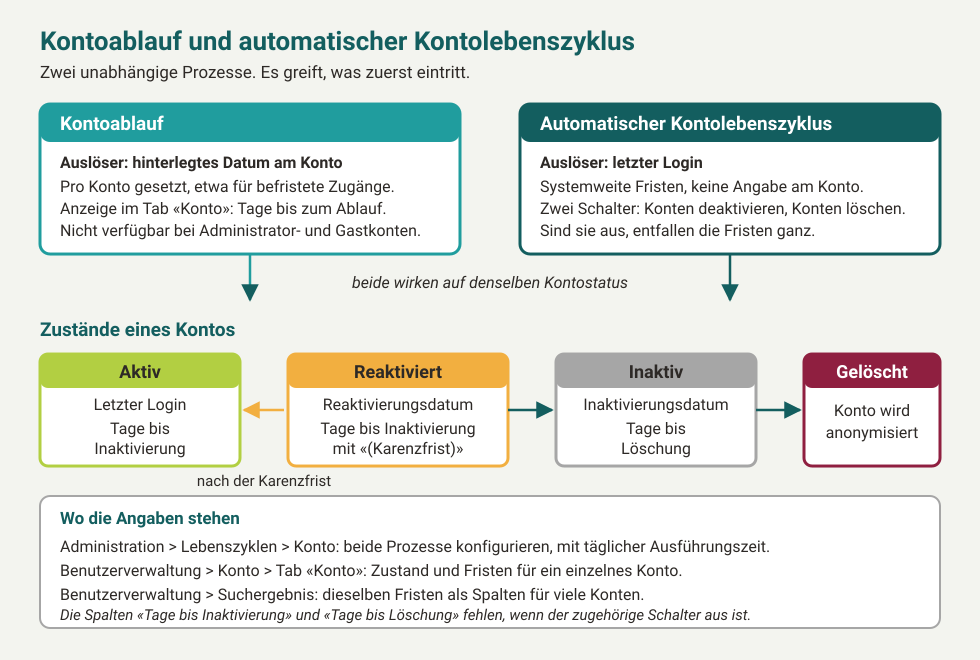

# Lebenszyklen: Übersicht {: #lifecycles}

{ class="shadow lightbox aside-left-lg" }

Unter `Administration > Lebenszyklen` stellen Sie in der System-Administration drei der vier Lebenszyklen von OpenOlat ein: den Gruppen-Lebenszyklus, den Kurs-Lebenszyklus und den automatischen Kontolebenszyklus. Jeder hat einen eigenen Auslöser und eigene Schritte.

Der vierte, der Durchführungs-Lebenszyklus, steht nicht in diesem Menü. Er führt die Durchführungen des Course Planners durch ihre Status und löscht nichts. Seine Regeln legt der Elementtyp fest, die einzelne Durchführung kann sie überschreiben, siehe [Automatisierung konfigurieren](../../manual_user/area_modules/Course_Planner_Implementations.de.md#tab_settings_automation). [:octicons-tag-16:{ title="ab Release 21.0 (OO-9452)" }](https://track.frentix.com/issue/OO-9452)

## Steckbrief

Name | Lebenszyklen
---------|----------
Verfügbar seit | Release 16.1 (2021)

---

## Gruppen [:octicons-tag-16:{ title="ab Release 16.1 (OO-5190)" }](https://track.frentix.com/issue/OO-5190) {: #lifecycle_groups}

In der OpenOlat-Administration können Einstellungen für den [Gruppen-Lebenszyklus](Automatic_Group_Lifecycle.de.md) vorgenommen werden. Dieser vollzieht sich in den Schritten

* Inaktivierung
* Löschung
* Unwiderrufliche Löschung

Auslöser ist die Zeit ohne Besuch durch die Gruppenbetreuer:innen oder Gruppenteilnehmer:innen. Der Gruppen-Lebenszyklus gilt wahlweise für alle Gruppen oder nur für Gruppen ohne eingebundene Kurse. Extern verwaltete Gruppen lassen sich zusätzlich ausschliessen.

Schritte und Einstellungen beschreibt die Seite [Automatischer Gruppen-Lebenszyklus](Automatic_Group_Lifecycle.de.md).

[Zum Seitenanfang ^](#lifecycles)

## Kurse {: #lifecycle_courses}

Im [Kurs-Lebenszyklus](Automatic_Course_Lifecycle.de.md) kann festgelegt werden, wie ein Kurs nach dem Kursende den Betrieb verlässt:

* ob und wann ein Kurs automatisch in den Status "Beendet" versetzt wird,
* wann er danach in den Papierkorb verschoben wird,
* und wann er endgültig gelöscht wird.

Die Fristen zählen ab dem Enddatum des Durchführungszeitraums, beim endgültigen Löschen ab dem Tag, an dem der Kurs in den Papierkorb kam.

Zusätzlich lässt sich die Benachrichtigung der Besitzer:innen erzwingen, wenn jemand einen Kurs im Autorenbereich beendet oder löscht.

Schritte, Konfiguration, Bestätigung vor dem Speichern und Statusanzeige beschreibt die Seite [Automatischer Kurs-Lebenszyklus](Automatic_Course_Lifecycle.de.md).

[Zum Seitenanfang ^](#lifecycles)

## Konto [:octicons-tag-16:{ title="ab Release 15.1 (OO-4460)" }](https://track.frentix.com/issue/OO-4460) {: #lifecycle_accounts}

Ähnlich dem Kurs-Lebenszyklus lässt sich auch der Lebenszyklus der Konten automatisieren: mit dem automatischen Kontolebenszyklus. Sie konfigurieren ihn in der System-Administration unter: 
`Administration > Lebenszyklen > Konto`

### Kontoablauf und automatischer Kontolebenszyklus [:octicons-tag-16:{ title="ab Release 21.1 (OO-8382)" }](https://track.frentix.com/issue/OO-8382) {: #account_expiration_and_lifecycle}

Die Konfiguration steht in zwei getrennten Bereichen. Der Bereich **Kontoablauf** steuert, was geschieht, wenn ein Konto sein hinterlegtes Ablaufdatum erreicht. Dieses Datum wird pro Konto gesetzt, etwa für Gastdozierende oder befristete Projektmitarbeit. Der Bereich **Automatischer Kontolebenszyklus** steuert dagegen, was mit Konten geschieht, die über längere Zeit nicht mehr benutzt werden. Hier zählt nicht ein Datum, sondern der letzte Login.

Beide Prozesse haben eigene Auslöser und eigene Benachrichtigungen. Es greift, was zuerst eintritt: Ein Konto wird durch seinen Kontoablauf deaktiviert, auch wenn die Inaktivitätsfrist noch lange nicht erreicht ist.

Liegt das Ablaufdatum vor dem Termin der automatischen Inaktivierung, nennt die Angabe "Tage bis Inaktivierung" im Reiter "Konto" deshalb das Ablaufdatum. Sie zeigt immer den nächsten fälligen Termin, nicht die reine Inaktivitätsfrist.

Jeder der beiden Bereiche nennt in seinem Erklärtext die Uhrzeit, zu der OpenOlat den jeweiligen Prozess täglich ausführt.

Ein Konto durchläuft dabei die Zustände aktiv, reaktiviert in der Karenzfrist (Schonfrist), inaktiv und gelöscht. Welche Angaben ein Konto in welchem Zustand zeigt, beschreibt [Konto konfigurieren](../usermanagement/Configure_User.de.md#automatic_user_lifecycle).

{ class="shadow lightbox" }

### Die drei Schritte im Überblick {: #lifecycle_accounts_variants}

Drei Schritte beenden die Nutzung eines Kontos: der Kontoablauf, die Deaktivierung und die Löschung. Die Tabelle nennt zu jedem Schritt den Auslöser, den Ort der Einstellung und die Benachrichtigung.

| Schritt | Auslöser | Wo Sie es einstellen | Mailbenachrichtigung | Version |
|---------|----------|----------------------|----------------------|---------|
| Kontoablauf | Das hinterlegte Ablaufdatum des Kontos ist erreicht. | Das Datum setzen Sie pro Konto in der Benutzerverwaltung: beim Erstellen unter `Benutzerverwaltung > Konto erstellen` oder nachträglich unter `Benutzerverwaltung > "Konto der Person" > Reiter "Konto"`. Auch die Aktionen "Konten importieren" und "Temporäres Konto erstellen" in der Benutzerverwaltung sowie die Aktion "Kontoeinstellungen ändern" für ausgewählte Konten in der Kontosuche setzen es. | Vor und nach dem Kontoablauf, im Bereich "Kontoablauf" | :octicons-tag-16:{ title="ab Release 15.4" } |
| Deaktivierung | Während der Inaktivitätsfrist erfolgt keine Anmeldung. | Automatisch: Schalter "Konten nach Inaktivität deaktivieren" und Feld "Anzahl Tage vor Deaktivierung" in der System-Administration unter `Administration > Lebenszyklen > Konto`. Manuell: Status "Inaktiv" unter `Benutzerverwaltung > "Konto der Person" > Reiter "Konto"`. | Vor und nach der Deaktivierung, im Bereich "Automatischer Kontolebenszyklus" | :octicons-tag-16:{ title="ab Release 15.1" } |
| Löschung | Das Konto bleibt nach der Deaktivierung die eingestellte Zeit inaktiv. | Automatisch: Schalter "Inaktive Konten löschen" und Feld "Anzahl Tage vor Löschung" in der System-Administration unter `Administration > Lebenszyklen > Konto`. Manuell: Aktion "Konten löschen" unter `Benutzerverwaltung > Konten löschen`. | Vor und nach der Löschung, im Bereich "Automatischer Kontolebenszyklus" | :octicons-tag-16:{ title="ab Release 15.1" } |

!!! info "Wichtig"
    Der Bereich "Kontoablauf" konfiguriert nur die Benachrichtigungen. Ein systemweites Ablaufdatum gibt es nicht: Das Datum trägt jedes Konto einzeln.

Zu jedem Schritt formulieren Sie eine eigene Benachrichtigung und legen fest, wie viele Tage vor dem Schritt OpenOlat sie versendet. Die unwiderrufliche Löschung im letzten Schritt richten Sie automatisch oder ausschliesslich manuell ein.

### Deaktivierung und Reaktivierung {: #account_reactivation}

Wer ein Konto deaktiviert oder ein deaktiviertes Konto sucht, trifft in der Oberfläche auf drei Wörter. Sie bezeichnen dieselbe Sache aus drei Blickwinkeln:

| Wort | Was es bezeichnet | Wo es steht |
|------|-------------------|-------------|
| deaktivieren, Deaktivierung | Die Aktion: OpenOlat oder eine Person setzt das Konto auf inaktiv. | Schalter "Konten nach Inaktivität deaktivieren", Felder "Anzahl Tage vor Deaktivierung" und "E-Mail vor Deaktivierung" |
| Inaktivierung | Der Zeitpunkt, an dem die Aktion ausgeführt wird oder wurde. | Spalten "Tage bis Inaktivierung" und "Inaktivierungsdatum", Filter "Inaktivierung" in der Kontosuche |
| Inaktiv | Der Status des Kontos nach der Deaktivierung. | Feld "Status" im Reiter "Konto", Filter-Tab "Inaktiv" in der Kontosuche |

Die Deaktivierung setzt den Kontostatus auf "Inaktiv". Die Person kann sich nicht mehr anmelden. Das Konto selbst bleibt vollständig erhalten. Passwort, Profil, Rollen, Gruppenmitgliedschaften und Kursdaten bleiben unverändert.

Die Reaktivierung setzt den Kontostatus zurück auf "Aktiv". Die Person meldet sich mit dem bisherigen Passwort an. Ein neues Passwort ist nicht nötig.

Ein Konto reaktivieren Sie manuell unter: 
`Benutzerverwaltung > "Konto der Person" > Reiter "Konto"`

Meldet sich die Person über Shibboleth an, reaktiviert OpenOlat das inaktive Konto automatisch.

Bei eingeschalteter automatischer Deaktivierung hat die Person nach einer Reaktivierung 30 Tage Zeit, sich anzumelden. Diese Zeit ist die Karenzfrist: Der automatische Kontolebenszyklus deaktiviert das Konto in dieser Zeit nicht erneut, und der Reiter "Konto" weist die verbleibenden Tage mit dem Zusatz "(Karenzfrist)" aus. Erfolgt keine Anmeldung, deaktiviert OpenOlat das Konto erneut. [:octicons-tag-16:{ title="ab Release 15.2.3 (OO-4925)" }](https://track.frentix.com/issue/OO-4925)

Die 30 Tage sind systemweit festgelegt und gelten für alle Konten.

### Löschung und gelöschte Konten {: #account_deletion}

Die Deaktivierung lässt die Daten stehen. Erst die Löschung entfernt sie: Sie löscht das Passwort unwiderbringlich und trägt die Person aus allen Gruppen und Rollen aus, siehe [Benutzer:in löschen](../usermanagement/Delete_User.de.md).

Der Datensatz selbst bleibt anonymisiert bestehen. OpenOlat ersetzt den Anmeldenamen durch eine ID der Form "del_884736" und setzt den Status auf "Gelöscht". Das ist nötig, weil Objekte wie Forenbeiträge weiterhin auf das Konto verweisen. Die anonymisierten Konten finden Sie unter: 
`Benutzerverwaltung > Status > Gelöschte Konten`

Ein Konto mit dem Status "Aktiv und nicht löschbar" nimmt der automatische Kontolebenszyklus von der Löschung aus.

[Zum Seitenanfang ^](#lifecycles)

## Weiterführende Informationen {: #further_information}

**Auf dieser Seite erwähnt** 
[Course Planner: Durchführungen >](../../manual_user/area_modules/Course_Planner_Implementations.de.md) 
[Automatischer Gruppen-Lebenszyklus >](Automatic_Group_Lifecycle.de.md) 
[Automatischer Kurs-Lebenszyklus >](Automatic_Course_Lifecycle.de.md) 
[Konto konfigurieren >](../usermanagement/Configure_User.de.md) 
[Benutzer:in löschen >](../usermanagement/Delete_User.de.md)

**Weiterführend** 
[Kontosuche >](../usermanagement/Search_Users.de.md) 
[Konto erstellen >](../usermanagement/Create_User.de.md) 
[Wie manage ich Lebenszyklen von Gruppen, Kursen oder Benutzerkonten? >](../../manual_how-to/lifecycle/lifecycle.de.md) 
[Modul Course Planner >](Modules_Course_Planner.de.md)

[Zum Seitenanfang ^](#lifecycles)
