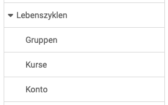
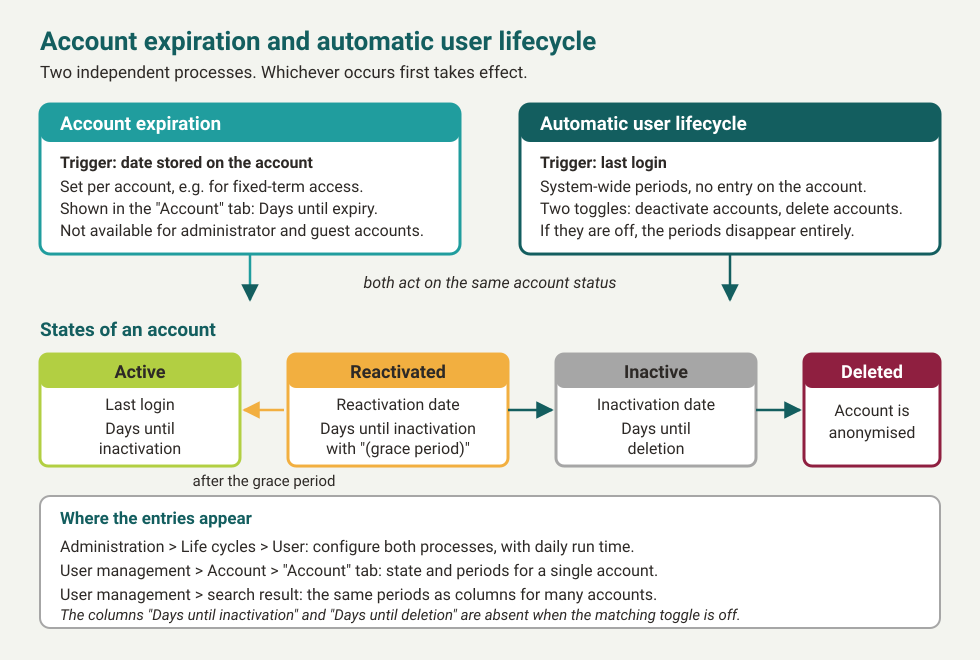

# Life cycles - Overview {: #lifecycles}

{ class="shadow lightbox aside-left-lg" }

The following life cycles can be administered in this section:

---

## Groups {: #lifecycle_groups}

In OpenOlat Administration, settings for the [group lifecycle](Automatic_Group_Lifecycle.md) can be configured. It proceeds in the following steps:

* Inactivation
* Deletion
* Irrevocable deletion

Settings can be made both for groups in general and only for certain group types. 

!!! info "Group lifecycle — Details"
    Steps and settings for the automatic group lifecycle. 
    [Group lifecycle](Automatic_Group_Lifecycle.md)

[To the top of the page ^](#lifecycles)

## Courses {: #lifecycle_courses}

The life cycle of courses can be defined, 

* whether and when a course is automatically set to "Finished" status 
* when it is then moved to the trash,
* and when it will be permanently deleted

Course owners can be automatically informed of any status changes.

### Controlling a running process [:octicons-tag-16:{ title="from Release 21.0 (OO-9589)" }](https://track.frentix.com/issue/OO-9589)

A saved change to the lifecycle settings takes effect **immediately** on a process that is already running: the process re-checks the active configuration before each course. This ensures that changed rules take effect immediately. Using the **"Stop process"** button, a running pass can additionally be stopped immediately. This way a corrected setting takes effect right away, even when many courses have already been selected for processing.

[To the top of the page ^](#lifecycles)

## Account {: #lifecycle_accounts}

Similar to the automatically controlled course lifecycle, the lifecycle of accounts can also be automated. You configure it in the system administration under: 
`Administration > Life cycles > User`

### Account expiration and automatic user lifecycle [:octicons-tag-16:{ title="from Release 21.1 (OO-8382)" }](https://track.frentix.com/issue/OO-8382) {: #account_expiration_and_lifecycle}

The configuration is held in two separate areas. The area **Account expiration** controls what happens when an account reaches the expiry date stored for it. This date is set per account, for example for guest lecturers or fixed-term project work. The area **Automatic user lifecycle** controls what happens to accounts that are no longer used over a longer period. What counts here is not a date but the last login.

Both processes have their own triggers and their own notifications. Whichever occurs first takes effect: an account is deactivated by its account expiration even when the inactivity period is still far from being reached.

If the expiry date falls before the date of the automatic inactivation, the entry "Days until inactivation" in the "Account" tab therefore names the expiry date. It always shows the next date due, not the plain inactivity period.

Each of the two areas states in its explanatory text the time at which OpenOlat runs the respective process daily.

An account passes through the states active, reactivated within the grace period, inactive and deleted. Which entries an account shows in which state is described in [Configure user](../usermanagement/Configure_User.md#automatic_user_lifecycle).

{ class="shadow lightbox" }

### Variants at a glance {: #lifecycle_accounts_variants}

The lifecycle runs in separate steps and is fed by partly different settings.

| Variant | Trigger | Settings source | Mail notification | Version |
|---------|---------|-----------------|-------------------|---------|
| Account expiration | The expiry date stored for the account is reached. | The date is set per account: `User management > Create account` or subsequently in the "Account" tab. The user import, the bulk change and the action "Create temporary account" set it as well. | Before and after the account expiration, in the area "Account expiration" | :octicons-tag-16:{ title="from Release 15.4" } |
| Deactivation | No login occurs during the inactivity period. | Toggle "Deactivate user after inactivity" and field "Num. of days before deactivation". Manually via the "Account" tab of a person. | Before and after the deactivation, in the area "Automatic user lifecycle" | :octicons-tag-16:{ title="from Release 20.1" } |
| Deletion | The account stays inactive for the configured time after the deactivation. | Toggle "Delete inactive user" and field "Num. of days before deletion". Manually via `User management > Delete accounts`. | Before and after the deletion, in the area "Automatic user lifecycle" | :octicons-tag-16:{ title="from Release 20.1" } |

!!! info "Important"
    The area "Account expiration" only configures the notifications. There is no system-wide expiry date: each account carries the date individually.

For each step you formulate your own notification and define how many days before the step OpenOlat sends it. You set up the irrevocable deletion in the last step to run automatically or exclusively manually.

### Deactivation and reactivation {: #account_reactivation}

Deactivation sets the account status to "Inactive". The person can no longer log in. The account itself is fully retained. Password, profile, roles, group memberships and course data remain unchanged.

Reactivation sets the account status back to "Active". The person logs in with the existing password. A new password is not required.

You reactivate an account manually under: 
`User management > "Account of the person" > Tab "Account"`

If the person logs in via Shibboleth, OpenOlat reactivates the inactive account automatically.

After a reactivation a grace period runs. During this time the automatic user lifecycle does not deactivate the account again, and the "Account" tab marks the period with the addition "(grace period)". Without a deviating setting it lasts 30 days.

The length of the grace period is held in the configuration file of the instance, not in the administration. For a change, or for information about the value in force, please contact frentix: [contact@frentix.com](mailto:contact@frentix.com)

Only deletion removes data. It also deletes the password irrevocably, see [Delete user >](../usermanagement/Delete_User.md).

Deletion removes the data of the account and takes the person out of all groups and roles. The record itself remains in anonymised form: OpenOlat replaces the login name with an ID of the form "del_884736" and sets the status to "Deleted". This is necessary because objects such as forum posts still refer to the account. You find the anonymised accounts under `User management > Status > Deleted accounts`, see [User/account search](../usermanagement/Search_Users.md#search_user_roles).

An account with the status "Active and not deletable" is excluded from deletion by the automatic lifecycle.

[To the top of the page ^](#lifecycles)

## Further information {: #further_information}

**Mentioned on this page** 
[Group lifecycle >](Automatic_Group_Lifecycle.md) 
[Delete user >](../usermanagement/Delete_User.md)

**Further reading** 
[Configure user >](../usermanagement/Configure_User.md) 
[User/account search >](../usermanagement/Search_Users.md)

[To the top of the page ^](#lifecycles)
