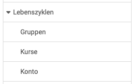

# Life cycles - Overview {: #lifecycles}

{ class="shadow lightbox aside-left-lg" }

The following life cycles can be administered in this section:

---

## Groups {: #lifecycle_groups}

In der OpenOlat-Administration können Einstellungen für den [Gruppen-Lebenszyklus](Automatic_Group_Lifecycle.md) vorgenommen werden. Dieser vollzieht sich in den Schritten

* Inactivation
* Deletion
* Irrevocable deletion

Settings can be made both for groups in general and only for certain group types. 

[See the details >](Automatic_Group_Lifecycle.md) 
[To the top of the page ^](#lifecycles)

## Courses {: #lifecycle_courses}

The life cycle of courses can be defined, 

* whether and when a course is automatically set to "Finished" status 
* when it is then moved to the trash,
* and when it will be permanently deleted

Course owners can be automatically informed of any status changes.

[To the top of the page ^](#lifecycles)

## Account {: #lifecycle_accounts}

Similar to the automatically controlled course lifecycle, the lifecycle of OpenOlat users' accounts can also be automated. 

* In a first step, the accounts of users who have not been active for a longer period of time can be deactivated and the user status set to "inactive".
* If the user does not log in again within the specified period, the user account is deleted. Depending on the configuration, users may receive an email with a corresponding message before or after the account is deactivated or deleted.
* It can be set up that the irrevocable deletion in the last step should take place automatically or exclusively manually.

Different notifications can be formulated for each step in the context of the steps and the time of the mail notification can be defined.

[To the top of the page ^](#lifecycles)
