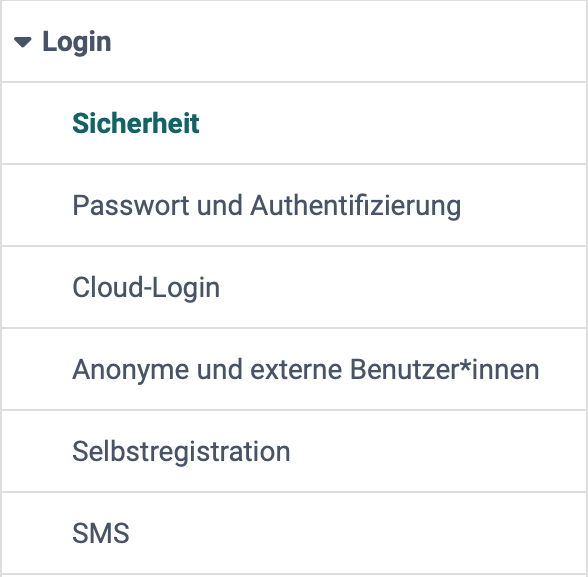

# Login: Übersicht {: #login}

{ class="shadow lightbox aside-left-lg" }

Wie sich Benutzer:innen bei OpenOlat anmelden und selbst registrieren, legen Administrator:innen und Systemadministrator:innen im nebenstehenden Menü der System-Administration fest: 
`Administration > Login`

Die Einträge "Shibboleth" und "LDAP" erscheinen im Menü nur, wenn die jeweilige Anbindung in der Serverkonfiguration eingeschaltet ist. frentix-Kund:innen wenden sich dafür an den frentix Support: [support@frentix.com](mailto:support@frentix.com)

## Steckbrief

Name | Login
---------|----------
Verfügbar seit | Release 10.2 (2015)

---

## Sicherheit {: #security}

Die Anforderungen an die Sicherheit können je nach Institution variieren. In den Sicherheitseinstellungen können Sie daher den notwendigen Level an Sicherheit unter Berücksichtigung der damit eingegangenen Risiken einstellen.

[Zu den Details >](../administration/Login_Security.de.md) 
[Zum Seitenanfang ^](#login)

## Passwort und Authentifizierung [:octicons-tag-16:{ title="ab Release 18.1.2 (OO-7418)" }](https://track.frentix.com/issue/OO-7418) {: #password_and_authentification}

Hier kann die Sicherheitsstufe eingestellt werden (mit oder ohne Passkey). Ausserdem können die Syntax-Regeln für die OpenOlat Passwörter konfiguriert werden. Als Minimum muss eine Mindest- und eine Maximallänge definiert werden. Darüber hinaus können weitere Anforderungen, wie Anzahl von Buchstaben, Gross- und
Kleinschreibung, Anforderungen zu Ziffern und Sonderzeichen sowie bestimmte nicht erlaubte Werte definiert werden. Im Tab "Richtlinie zur Passwortänderung" kann festgelegt werden wie oft Benutzer:innen ihr Passwort ändern müssen.

[Zu den Details >](../administration/Login_Password_and_Authentication.de.md) 
[Zum Seitenanfang ^](#login)

## Cloud-Login [:octicons-tag-16:{ title="ab Release 10.1 (OO-729)" }](https://track.frentix.com/issue/OO-729) {: #cloud_login}

Damit sich Benutzer:innen mit dem Konto eines anderen Dienstes anmelden können, verbinden Sie OpenOlat hier mit sozialen Netzwerken wie LinkedIn, X, Google und Facebook oder mit Microsoft Azure AD, Microsoft ADFS, Keycloak, Switch edu-ID und Datenlotsen. Weitere Provider binden Sie mit "OAuth 2.0 Provider hinzufügen" oder "OAuth 2.0 Provider mit Discovery URL hinzufügen" an. Diese Anbindungen konfigurieren Administrator:innen und Systemadministrator:innen in der System-Administration unter: 
`Administration > Login > Cloud-Login`

### OAuth 2.0 und OpenID Connect [:octicons-tag-16:{ title="ab Release 20.2.6 (OO-9287)" }](https://track.frentix.com/issue/OO-9287)

Aus Sicherheitsgründen unterstützt OpenOlat für OpenID-Connect- und OAuth-2.0-Anbindungen ausschliesslich den sicheren Authorization Code Flow. Beim Anlegen eines Providers über die Schaltfläche "OAuth 2.0 Provider hinzufügen" ist im Feld "Response type" daher der Wert "code" zu wählen.

[Zum Seitenanfang ^](#login)

## Anonyme und externe Benutzer:innen [:octicons-tag-16:{ title="ab Release 10.2 (OO-1362)" }](https://track.frentix.com/issue/OO-1362) {: #anonymous_and_external}

Administrator:innen können festlegen, ob und in welchem Umfang OpenOlat von anonymen Gästen und externen Benutzer:innen genutzt werden kann.

[Zu den Details >](../administration/Guest_and_invitation.de.md) 
[Zum Seitenanfang ^](#login)

## Selbstregistration [:octicons-tag-16:{ title="ab Release 8.1.1 (OO-226)" }](https://track.frentix.com/issue/OO-226) {: #self-registration}

Hier können Administrator:innen die Selbstregistration aktivieren, sowie weitere Detaileinstellungen in diesem Kontext vornehmen. Login-Formulare können auch in externe Webseiten eingebaut werden. Ferner kann z.B. über das Feld "Gültigkeitsdauer der Logindaten" eingeschränkt werden, wie lange ein Konto aus der Selbstregistrierung gültig bleibt.

[Zu den Details >](../administration/Login_Self-Registration.de.md) 
[Zum Seitenanfang ^](#login)

## SMS [:octicons-tag-16:{ title="ab Release 11.3 (OO-2452)" }](https://track.frentix.com/issue/OO-2452) {: #sms}

Damit Benutzer:innen ein vergessenes Passwort mit einem Code per SMS zurücksetzen können, richten Sie hier einen SMS-Dienst ein. Mit "SMS Versand" schalten Sie den Versand ein und wählen unter "Dienst" den Provider. Danach legen Sie fest, ob der Code bei "Passwort zurücksetzen" zum Einsatz kommt und ob OpenOlat mit "Telefonnummer Verifikation" eine fehlende Telefonnummer beim ersten Login abfragt. Für jede versendete SMS fallen Kosten an.

[Zum Seitenanfang ^](#login)

## Weiterführende Informationen {: #further_information}

**Weiterführend** 
[Login-Konzept >](../../manual_user/login_registration/Login_Concept.de.md) 
[Login-Seite >](../../manual_user/login_registration/Login_Page.de.md) 
[Rollen und Rechte: Gastzugang >](../../manual_user/basic_concepts/guest_access.de.md)

[Zum Seitenanfang ^](#login)

