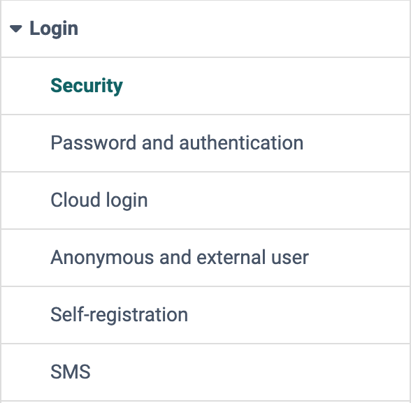

# Login: Overview {: #login}

{ class="shadow lightbox aside-left-lg" }

Administrators and system administrators define how users log in to OpenOlat and register themselves in the adjacent menu of the system administration: 
`Administration > Login`

The entries "Shibboleth" and "LDAP" only appear in the menu if the respective integration is switched on in the server configuration. frentix customers contact the frentix support for this: [support@frentix.com](mailto:support@frentix.com)

## Profile

Name | Login
---------|----------
Available since | Release 10.2 (2015)

---

## Security {: #security}

Requirements towards security can vary greatly depending on the institution. Use the security settings to configure the necessary security level while taking the associated risk into account.

[See the details >](../administration/Login_Security.md) 
[To the top of the page ^](#login)

## Password and authentication [:octicons-tag-16:{ title="from Release 18.1.2 (OO-7418)" }](https://track.frentix.com/issue/OO-7418) {: #password_and_authentification}

The security level can be set here (with or without passkey). The syntax rules for the OpenOlat passwords can also be configured.
A minimum and a maximum length must be defined as a minimum. In addition, further requirements such as number of letters, upper and lower case, requirements for numbers and special characters as well as certain invalid values can be defined. Under the tab "Password change policies" you can define how often certain users have to change their password.

[See the details >](../administration/Login_Password_and_Authentication.md) 
[To the top of the page ^](#login)

## Cloud login [:octicons-tag-16:{ title="from Release 10.1 (OO-729)" }](https://track.frentix.com/issue/OO-729) {: #cloud_login}

So that users can log in with the account of another service, you connect OpenOlat here with social networks such as LinkedIn, X, Google and Facebook or with Microsoft Azure AD, Microsoft ADFS, Keycloak, Switch edu-ID and Datenlotsen. You connect further providers with "Add OAuth 2.0 provider" or "Add OAuth 2.0 provider with discovery URL". Administrators and system administrators configure these integrations in the system administration under: 
`Administration > Login > Cloud login`

### OAuth 2.0 and OpenID Connect [:octicons-tag-16:{ title="from Release 20.2.6 (OO-9287)" }](https://track.frentix.com/issue/OO-9287)

For security reasons, OpenOlat supports only the secure authorization code flow for OpenID Connect and OAuth 2.0 integrations. When creating a provider using the "Add OAuth 2.0 provider" button, you must therefore select "code" in the "Response type" field.

[To the top of the page ^](#login)

## Anonymous and external users [:octicons-tag-16:{ title="from Release 10.2 (OO-1362)" }](https://track.frentix.com/issue/OO-1362) {: #anonymous_and_external}

Administrators can define whether and to what extent OpenOlat can be used by anonymous guests and external users.

[See the details >](../administration/Guest_and_invitation.md) 
[To the top of the page ^](#login)

## Self-registration [:octicons-tag-16:{ title="from Release 8.1.1 (OO-226)" }](https://track.frentix.com/issue/OO-226) {: #self-registration}

Here, administrators can activate self-registration and configure additional detailed settings in this context. Login forms can also be integrated into external websites. Furthermore, the field "Validity period of the login data" restricts, for example, how long an account from self-registration stays valid.

[See the details >](../administration/Login_Self-Registration.md) 
[To the top of the page ^](#login)

## SMS [:octicons-tag-16:{ title="from Release 11.3 (OO-2452)" }](https://track.frentix.com/issue/OO-2452) {: #sms}

So that users can reset a forgotten password with a code by SMS, you set up an SMS service here. With "SMS distribution" you switch on the sending and select the provider under "Service". Then you define whether the code is used for "Reset password" and whether OpenOlat asks for a missing phone number at the first login with "Phone number's verification". Costs are incurred for each SMS sent.

[To the top of the page ^](#login)

## Further information {: #further_information}

**Further reading** 
[Login Concept >](../../manual_user/login_registration/Login_Concept.md) 
[Login Page >](../../manual_user/login_registration/Login_Page.md) 
[Roles and Rights: Guest access >](../../manual_user/basic_concepts/guest_access.md)

[To the top of the page ^](#login)