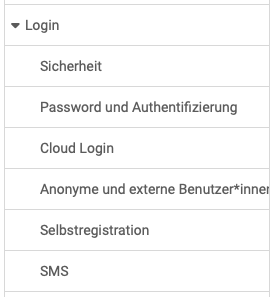

# Login

{ class="shadow lightbox aside-left-lg" }

The adjacent menu is available for configuring the login.

---

## Security {: #security}

Requirements towards security can vary greatly depending on the institution. Use the security settings to configure the necessary security level while taking the associated risk into account.

[See the details >](../administration/Login_Security.md) 
[To the top of the page ^](#login)

## Password and authentification {: #password_and_authentification}

The security level can be set here (with or without passkey). The syntax rules for the OpenOlat passwords can also be configured.
A minimum and a maximum length must be defined as a minimum. In addition, further requirements such as number of letters, upper and lower case, requirements for numbers and special characters as well as certain invalid values can be defined. Under the tab "Change policies" you can define how often certain users have to change their password.

[See the details >](../administration/Login_Password_and_Authentication.md) 
[To the top of the page ^](#login)

## Cloud Login {: #cloud_login}

It is possible to connect to social networks such as LinkedIn, X, Google, Facebook, etc. for authentication.

[To the top of the page ^](#login)

## Anonymous and external users {: #anonymous_and_external}

Administrators can define whether and to what extent OpenOlat can be used by anonymous guests and external users.

[See the details >](../administration/Guest_and_invitation.md) 
[To the top of the page ^](#login)

## Self-registration {: #self-registration}

Here administrators can activate self-registration and make further detailed
settings in this context. Login forms can also be integrated into external
websites. Furthermore, the validity period of the self-registration can be
limited (default value for account validity).

[See the details >](../administration/Login_Self-Registration.md) 
[To the top of the page ^](#login)

## SMS {: #sms}

It is possible to configure an SMS service here. Notifications can then also be sent by SMS. Please note that costs are incurred for sending SMS messages in this context.

[To the top of the page ^](#login)