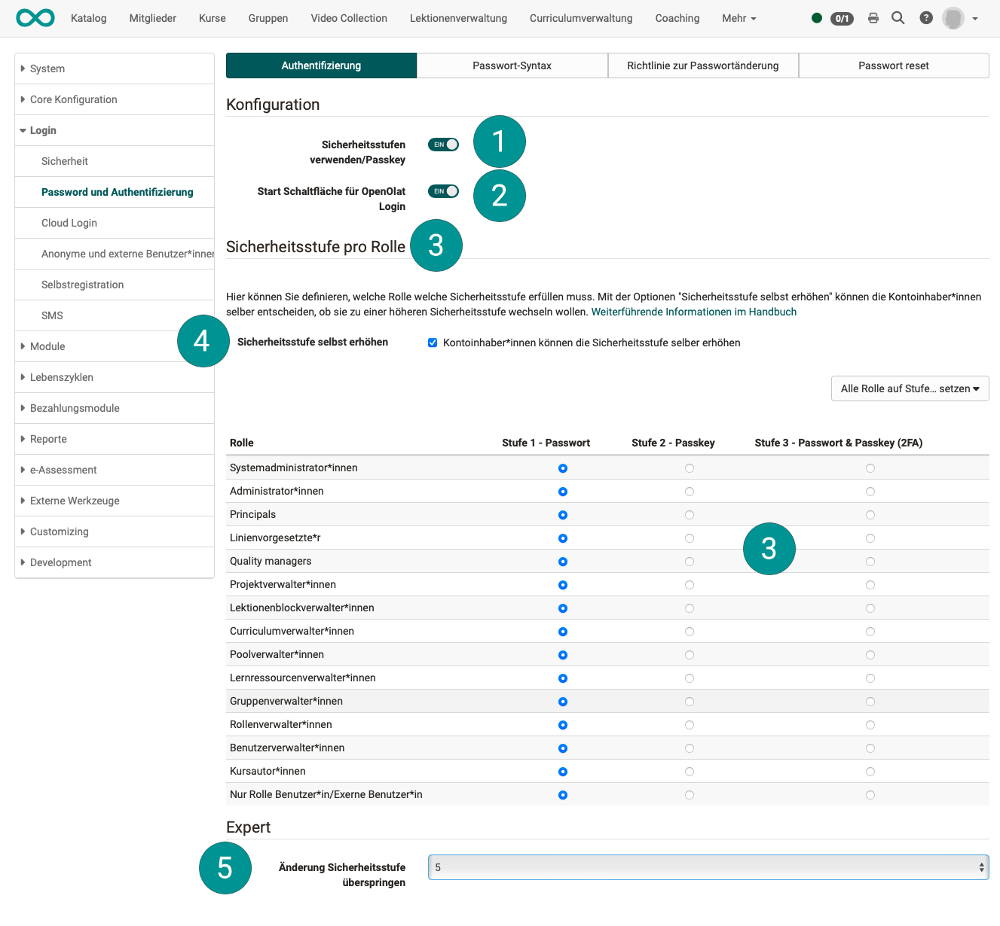
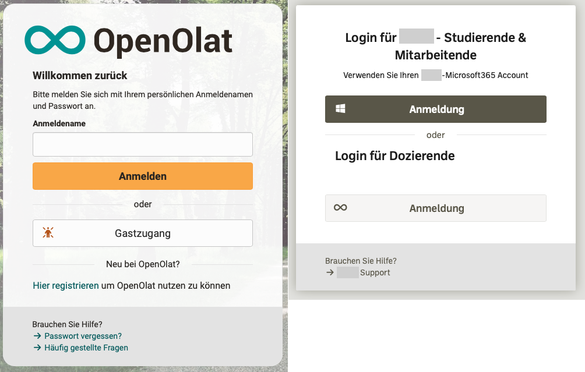
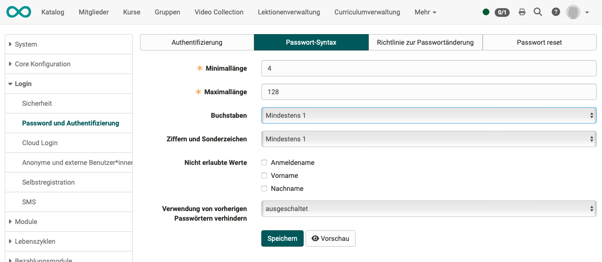
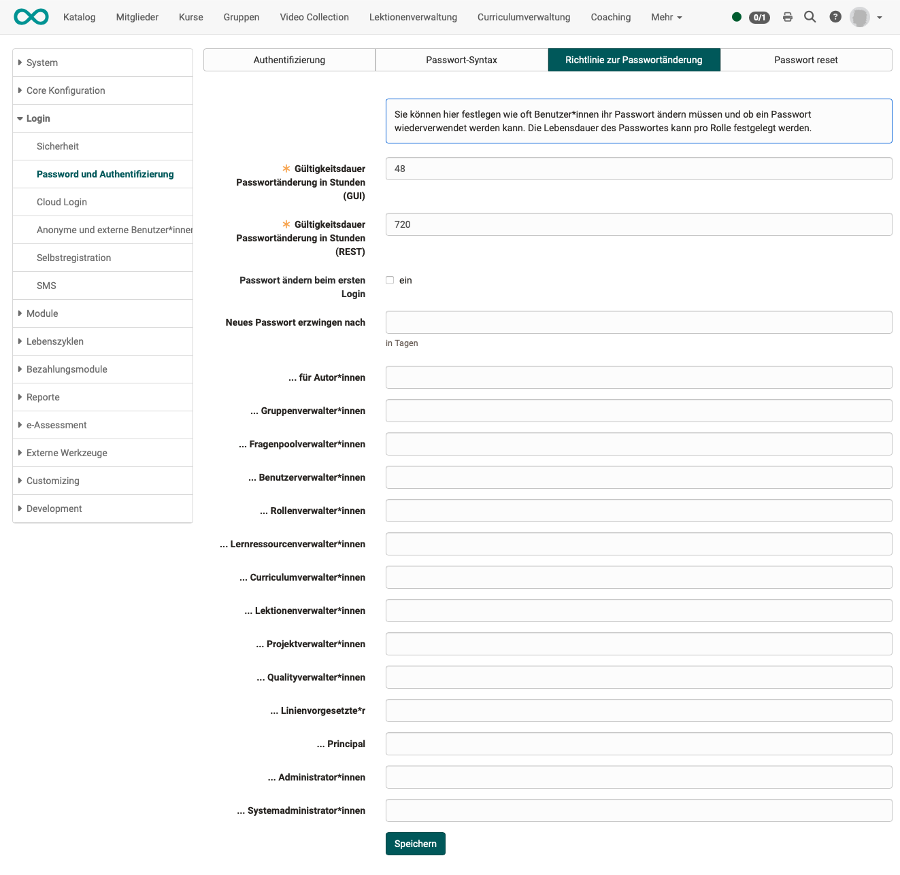
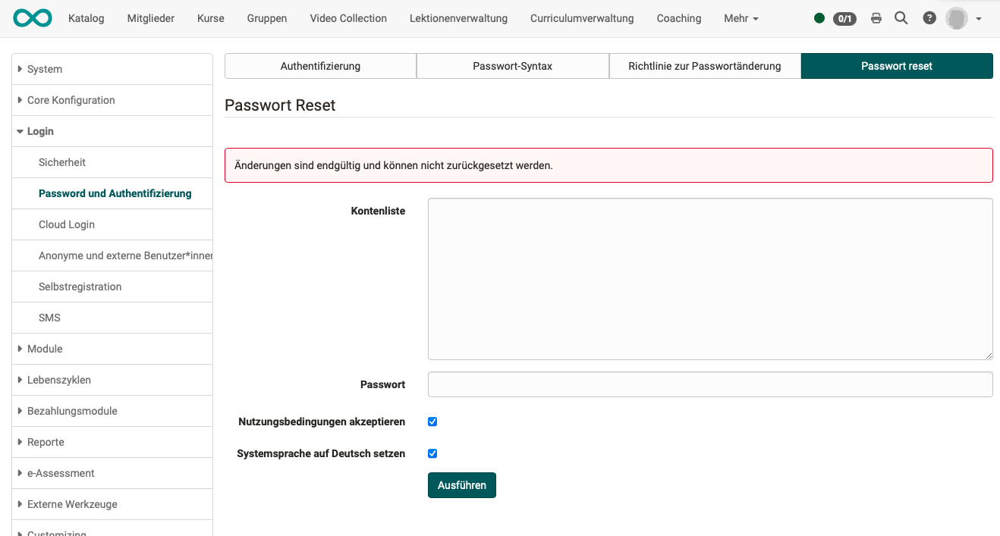

# Passwort und Authentifizierung

## Tab "Authentifizierung"

{ class="shadow lightbox" }

<h3>1 Sicherheitsstufen verwenden/Passkey</h3>

OpenOlat hat ein dreistufiges Sicherheitskonzept: 
**Stufe 1: nur Passwort** 
**Stufe 2: nur Passkey** 
**Stufe 3: Passkey + Passwort**

Durch das Einschalten wird die Option für Stufe 2 und 3 aktiviert und es werden die weiteren Konfigurationsmöglichkeiten für Administrator:innen angezeigt.

<h3>2 Start Schaltfläche für OpenOlat Login</h3>

Durch das Einschalten wird auf der Login-Seite **statt des Eingabefeldes** für den Benutzernamen eine **Schaltfläche** angezeigt, mit der das Eingabefeld aufgerufen werden kann.

**Zweck:** 
Wenn das primäre Anmeldeverfahren nicht das OpenOlat-Login ist, dann soll oft das Eingabefeld für das OpenOlat-Login nicht direkt und prominent angezeigt werden. Ein Eingabefeld hat einen hohen Aufforderungscharakter und die Benutzer geben sofort Ihren (falschen) Anmeldenamen ein, statt die übrigen Anmeldeoptionen zu beachten. 
Mit einer Schaltfläche neben anderen Schaltflächen (andere Anmeldeoptionen) fällt die Entscheidung für ein bestimmtes Anmeldeverfahren überlegter.

{ class="lightbox" }

<h3>3 Sicherheitsstufe pro Rolle</h3>

Mit den hier eingestellten Stufen definieren Sie die **Mindestanforderung** für die jeweilige Rolle.

<h3>4 Sicherheitsstufe selbst erhöhen</h3>

Mit der Optionen "Sicherheitsstufe selbst erhöhen" können die Kontoinhaber*innen selbst entscheiden, ob sie zu einer höheren Sicherheitsstufe wechseln wollen. Eine Herabstufung unter die von Administrator:innen gesetzte Mindeststufe ist nicht möglich.

<h3>5 Expert</h3>

Wenn von einem/einer Administrator:in die Sicherheitsstufe erhöht wurde, werden die betroffenen Personen bei der Anmeldung aufgefordert, Passkey einzurichten. Mit dieser Einstellung wird bestimmt, wie oft ein Benutzer diese Aufforderung übergehen kann.

## Tab "Passwort-Syntax"

Hier legen Sie als Administrator:in fest, welche Kriterien ein Passwort erfüllen muss.
Als Minimum muss eine Mindest- und eine Maximallänge definiert werden.

{ class="shadow lightbox" }

## Tab "Richtlinie zur Passwortänderung"

Sie können hier festlegen wie oft Benutzer*innen ihr Passwort ändern müssen und ob ein Passwort wiederverwendet werden kann. Die Lebensdauer des Passwortes kann pro Rolle festgelegt werden.

{ class="shadow lightbox" }

## Tab "Passwort Reset"

Hier kann für mehrere Benutzer:innen (Kontenliste) das Passwort neu gesetzt werden.

{ class="shadow lightbox" }
