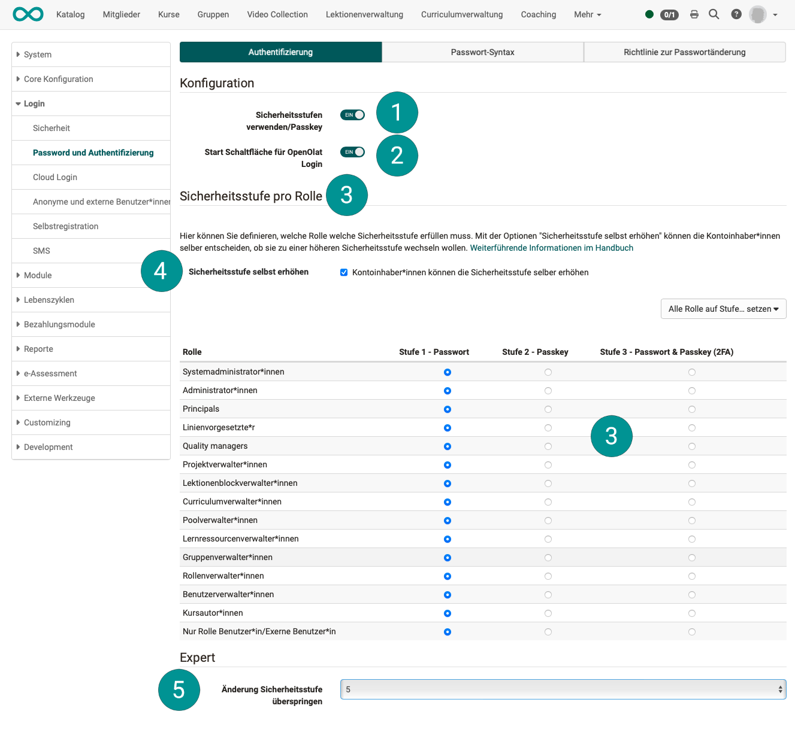
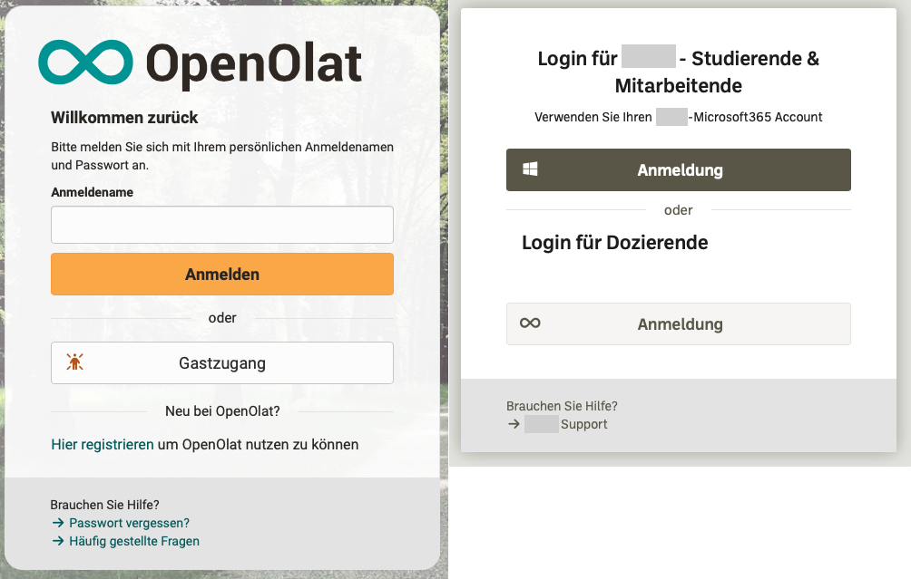
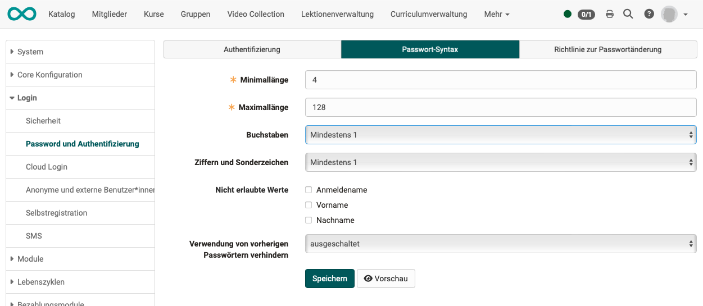
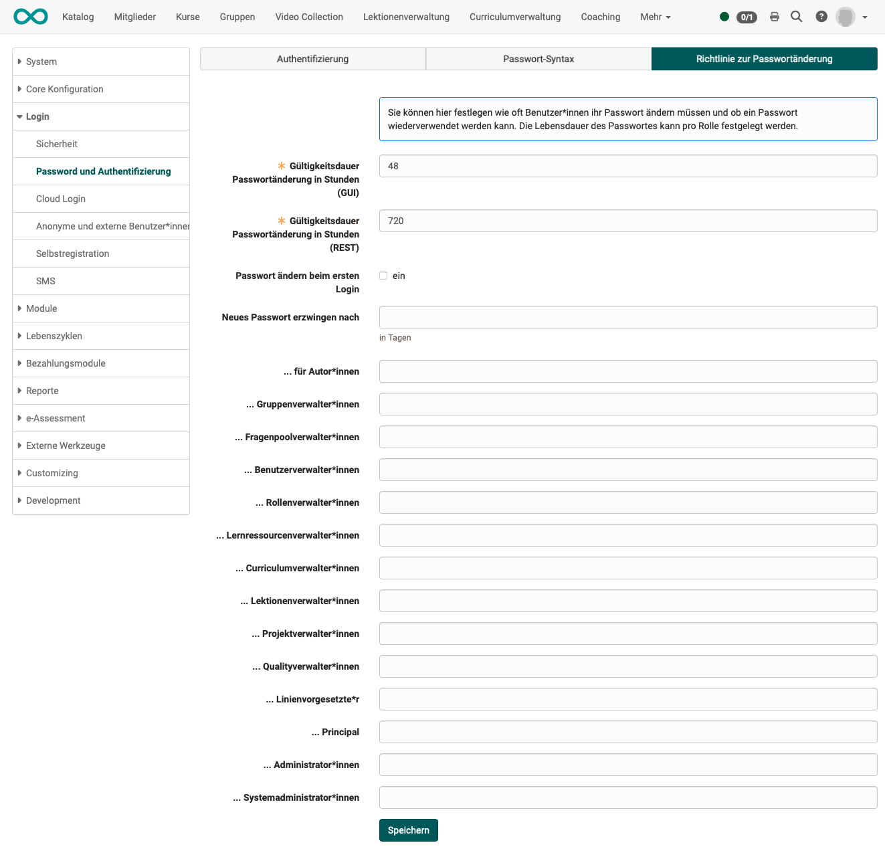

# Passwort und Authentifizierung

## Tab "Authentifizierung"

{ class="shadow lightbox" }

<h3>1 Sicherheitsstufen verwenden/Passkey</h3>

OpenOlat hat ein dreistufiges Sicherheitskonzept: 
**Stufe 1: nur Passwort** 
**Stufe 2: nur Passkey** 
**Stufe 3: Passkey + Passwort**

Durch das Einschalten wird die Option für Stufe 2 und 3 aktiviert und es werden die weiteren Konfigurationsmöglichkeiten für Administrator:innen angezeigt.

<h3>2 Start Schaltfläche für OpenOlat Login</h3>

Durch das Einschalten wird auf der Login-Seite **statt des Eingabefeldes** für den Benutzernamen eine **Schaltfläche** angezeigt, mit der das Eingabefeld aufgerufen werden kann.

**Zweck:** 
Wenn das primäre Anmeldeverfahren nicht das OpenOlat-Login ist, dann soll oft das Eingabefeld für das OpenOlat-Login nicht direkt und prominent angezeigt werden. Ein Eingabefeld hat einen hohen Aufforderungscharakter und die Benutzer geben sofort Ihren (falschen) Anmeldenamen ein, statt die übrigen Anmeldeoptionen zu beachten. 
Mit einer Schaltfläche neben anderen Schaltflächen (andere Anmeldeoptionen) fällt die Entscheidung für ein bestimmtes Anmeldeverfahren überlegter.

{ class="lightbox" }

<h4>3 One Time Code</h4>

Mit der Option "One Time Code verwenden" aktivieren Sie eine zusätzliche zweite Sicherheitsstufe per E-Mail. [:octicons-tag-16:{ title="ab Release 21.0 (OO-9509)" }](https://track.frentix.com/issue/OO-9509) Nach Eingabe von Benutzername und Passwort erhalten Kontoinhaber:innen einen 8-stelligen Bestätigungscode per E-Mail und schliessen die Anmeldung mit diesem Code auf einer Validierungsseite ab.

Ohne aktiven Passkey ist der One Time Code die zweite Sicherheitsstufe für alle lokalen Logins. Ist zusätzlich Passkey aktiviert, dient der One Time Code als Ausweichlösung für Kontoinhaber:innen ohne hinterlegten Passkey.

Voraussetzung ist eine gültige E-Mail-Adresse am Konto sowie ein funktionsfähig konfigurierter E-Mail-Versand in OpenOlat, damit der Code zugestellt werden kann.

<h4>4 Sicherheitsstufe pro Rolle</h4>

Mit den hier eingestellten Stufen definieren Sie die **Mindestanforderung** für die jeweilige Rolle.

<h4>5 Sicherheitsstufe selbst erhöhen</h4>

Mit der Optionen "Sicherheitsstufe selbst erhöhen" können die Kontoinhaber*innen selbst entscheiden, ob sie zu einer höheren Sicherheitsstufe wechseln wollen. Eine Herabstufung unter die von Administrator:innen gesetzte Mindeststufe ist nicht möglich.

<h4>6 Expert</h4>

Wenn von einem/einer Administrator:in die Sicherheitsstufe erhöht wurde, werden die betroffenen Personen bei der Anmeldung aufgefordert, Passkey einzurichten. Mit dieser Einstellung wird bestimmt, wie oft ein Benutzer diese Aufforderung übergehen kann.

## Tab "Passwort-Syntax"

Hier legen Sie als Administrator:in fest, welche Kriterien ein Passwort erfüllen muss.
Als Minimum muss eine Mindest- und eine Maximallänge definiert werden.

{ class="shadow lightbox" }

## Tab "Richtlinie zur Passwortänderung"

Sie können hier festlegen wie oft Benutzer*innen ihr Passwort ändern müssen und ob ein Passwort wiederverwendet werden kann. Die Lebensdauer des Passwortes kann pro Rolle festgelegt werden.

{ class="shadow lightbox" }

