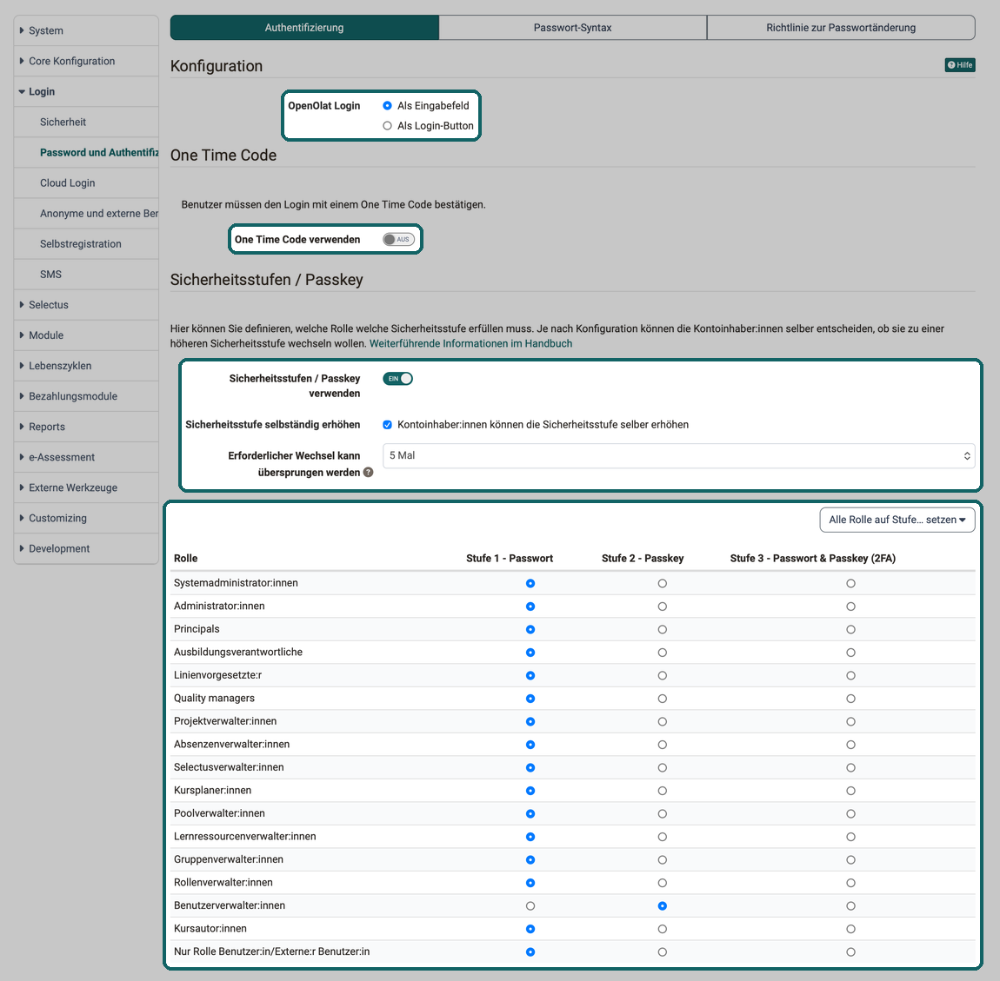
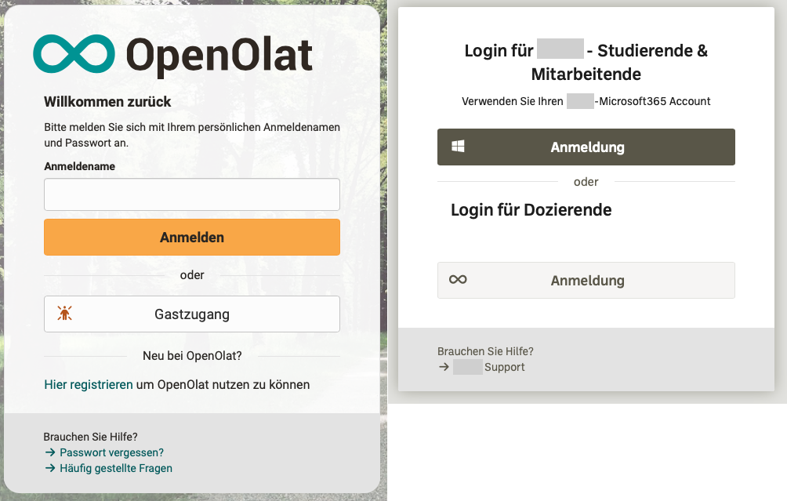
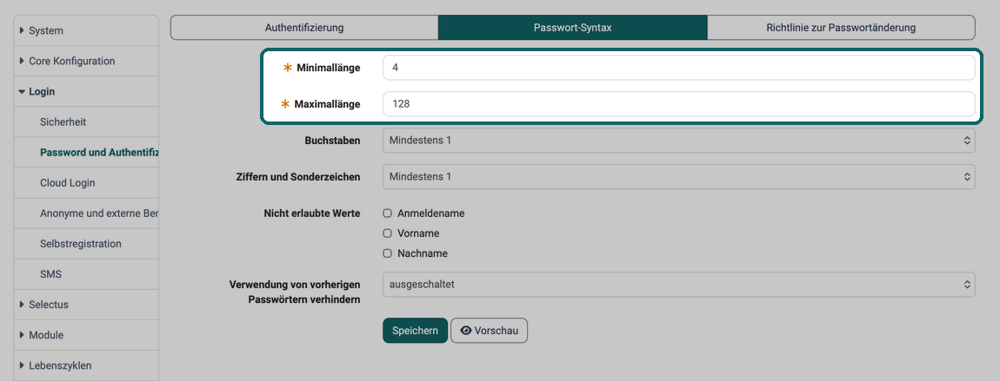
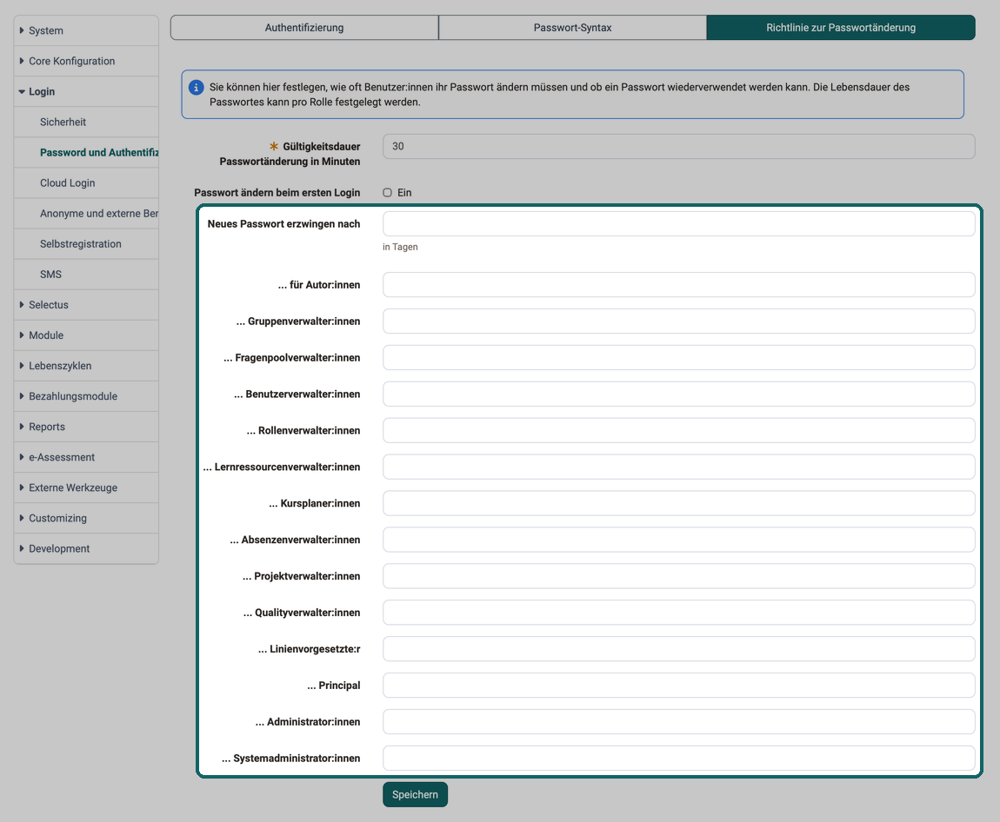

# Passwort und Authentifizierung {: #password_and_authentication}

Administrator:innen und Systemadministrator:innen legen hier fest, wie sich Kontoinhaber:innen bei OpenOlat anmelden, welche Regeln ein Passwort erfüllen muss und wann es zu ändern ist. Die Einstellungen liegen in der System-Administration unter: 
`Administration > Login > Password und Authentifizierung`

## Tab "Authentifizierung" [:octicons-tag-16:{ title="ab Release 18.1.2 (OO-7418)" }](https://track.frentix.com/issue/OO-7418) {: #tab-authentication}

Im Tab "Authentifizierung" bestimmen Sie, wie die Login-Seite das OpenOlat-Login anbietet und mit welchem zweiten Faktor sich Kontoinhaber:innen zusätzlich ausweisen. Der Tab gliedert sich in die Abschnitte "Konfiguration", "One Time Code" und "Sicherheitsstufen / Passkey". Jede Änderung in diesem Tab gilt sofort, eine Schaltfläche zum Speichern gibt es nicht.

{ class="shadow lightbox" title="Tab Authentifizierung in der Administration · 2026.10.02" }

### Konfiguration [:octicons-tag-16:{ title="ab Release 18.1.2 (OO-7394)" }](https://track.frentix.com/issue/OO-7394) {: #configuration}

#### OpenOlat Login {: #openolat_login}

Mit den Optionen "Als Eingabefeld" und "Als Login-Button" legen Sie fest, wie die Login-Seite das OpenOlat-Login anzeigt. Mit "Als Login-Button" wird auf der Login-Seite **statt des Eingabefeldes** für den Benutzernamen eine **Schaltfläche** angezeigt, mit der das Eingabefeld aufgerufen werden kann.

**Zweck:** 
Wenn das primäre Anmeldeverfahren nicht das OpenOlat-Login ist, dann soll oft das Eingabefeld für das OpenOlat-Login nicht direkt und prominent angezeigt werden. Ein Eingabefeld fordert zur Eingabe auf, und die Benutzer:innen geben sofort ihren (falschen) Anmeldenamen ein, statt die übrigen Anmeldeverfahren zu beachten. 
Mit einer Schaltfläche neben anderen Schaltflächen (andere Anmeldeverfahren) fällt die Entscheidung für ein bestimmtes Anmeldeverfahren überlegter.

{ class="shadow lightbox" title="Login-Seite von OpenOlat" }

### One Time Code [:octicons-tag-16:{ title="ab Release 21.0 (OO-9509)" }](https://track.frentix.com/issue/OO-9509) {: #one_time_code}

#### One Time Code verwenden {: #use_one_time_code}

Mit der Option "One Time Code verwenden" aktivieren Sie eine zusätzliche zweite Sicherheitsstufe per E-Mail. Nach Eingabe von Benutzername und Passwort erhalten Kontoinhaber:innen einen 8-stelligen Bestätigungscode per E-Mail und schliessen die Anmeldung mit diesem Code auf einer Validierungsseite ab.

Ohne aktiven Passkey ist der One Time Code die zweite Sicherheitsstufe für alle lokalen Logins. Ist zusätzlich Passkey aktiviert, dient der One Time Code als Ausweichlösung für Kontoinhaber:innen ohne hinterlegten Passkey.

Voraussetzung ist eine gültige E-Mail-Adresse am Konto sowie ein funktionsfähig konfigurierter E-Mail-Versand in OpenOlat, damit der Code zugestellt werden kann.

### Sicherheitsstufen / Passkey [:octicons-tag-16:{ title="ab Release 18.1 (OO-7180)" }](https://track.frentix.com/issue/OO-7180) {: #security_levels_passkey}

Konten mit weitreichenden Rechten schützen Sie besser, wenn Sie für ihre Rolle eine höhere Sicherheitsstufe verlangen. OpenOlat hat ein dreistufiges Sicherheitskonzept: 
**Stufe 1 - Passwort** 
**Stufe 2 - Passkey** 
**Stufe 3 - Passwort & Passkey (2FA)**

Wie Kontoinhaber:innen ihre Sicherheitsstufe wechseln, beschreibt die Seite [Sicherheitsstufen](../../manual_user/login_registration/Security_levels.de.md).

#### Sicherheitsstufen / Passkey verwenden {: #use_security_levels_passkey}

Durch das Einschalten wird die Option für Stufe 2 und 3 aktiviert. Erst dann zeigt der Abschnitt die Einstellungen "Sicherheitsstufe selbständig erhöhen" und "Erforderlicher Wechsel kann übersprungen werden", das Menü "Alle Rolle auf Stufe… setzen" und die Tabelle der Rollen.

Melden sich Kontoinhaber:innen nur mit Passkey an (Stufe 2), verlangt OpenOlat beim Ausschalten eine Bestätigung im Dialog "Passkey abschalten". Diese Konten können sich danach nicht mehr anmelden.

#### Sicherheitsstufe selbständig erhöhen {: #increase_security_level_independently}

Mit der Option "Kontoinhaber:innen können die Sicherheitsstufe selber erhöhen" können die Kontoinhaber:innen selbst entscheiden, ob sie zu einer höheren Sicherheitsstufe wechseln wollen. Eine Herabstufung unter die von Administrator:innen gesetzte Mindeststufe ist nicht möglich.

#### Erforderlicher Wechsel kann übersprungen werden {: #required_switch_can_be_skipped}

Wenn eine Administrator:in die Sicherheitsstufe erhöht hat, werden die betroffenen Personen bei der Anmeldung aufgefordert, Passkey einzurichten. Mit dieser Einstellung wird bestimmt, wie oft die betroffenen Personen diese Aufforderung übergehen können: "Nie", "5 Mal", "10 Mal" oder "Unbeschränkt".

#### Alle Rolle auf Stufe… setzen {: #set_all_roles_at_level}

Das Menü setzt alle Rollen der Tabelle in einem Schritt auf die gewählte Stufe: "Stufe 1 - Passwort", "Stufe 2 - Passkey" oder "Stufe 3 - Passwort & Passkey (2FA)". Einzelne Rollen passen Sie danach in der Tabelle an.

#### Rolle {: #role}

Die Tabelle führt jede Rolle in einer Zeile und die drei Sicherheitsstufen als Spalten. Mit der gewählten Stufe definieren Sie die **Mindestanforderung** für die jeweilige Rolle.

## Tab "Passwort-Syntax" {: #tab-password-syntax}

Hier legen Sie als Administrator:in fest, welche Kriterien ein Passwort erfüllen muss. Als Minimum muss eine Mindest- und eine Maximallänge definiert werden. Die Regeln gelten, sobald Sie auf "Speichern" klicken.

{ class="shadow lightbox" title="Tab Passwort-Syntax in der Administration · 2026.10.02" }

#### Minimallänge {: #minimum_length}

Pflichtfeld. Die kleinste Anzahl Zeichen, die ein Passwort haben muss.

#### Maximallänge {: #maximum_length}

Pflichtfeld. Die grösste Anzahl Zeichen, die ein Passwort haben darf.

#### Buchstaben {: #letters}

Legt fest, wie viele Buchstaben ein Passwort enthalten muss: "Erlaubt", "Mindestens 1", "Mindestens 2", "Mindestens 3" oder "Nicht erlaubt". Mit "Gross- und Kleinbuchstaben separat definieren" erscheinen die Felder "Grossbuchstaben" und "Kleinbuchstaben" mit denselben Werten.

#### Ziffern und Sonderzeichen {: #digits_and_special_signs}

Legt fest, wie viele Ziffern oder Sonderzeichen ein Passwort enthalten muss, mit denselben Werten wie bei "Buchstaben". Mit "Ziffern und Sonderzeichen separat definieren" erscheinen die Felder "Ziffern" und "Sonderzeichen".

#### Nicht erlaubte Werte {: #forbidden_values}

Ein Passwort darf den angekreuzten Wert nicht enthalten: "Anmeldename", "Vorname" oder "Nachname" des Kontos. Gross- und Kleinschreibung spielen dabei keine Rolle.

#### Verwendung von vorherigen Passwörtern verhindern {: #prevent_reuse_of_previous_passwords}

Legt fest, von wie vielen früheren Passwörtern sich ein neues Passwort unterscheiden muss: "ausgeschaltet" oder "für 1 Änderungen" bis "für 15 Änderungen".

#### Vorschau {: #preview}

Die Schaltfläche öffnet den Dialog "Passwort Syntax Validierung". Dort prüfen Sie ein Beispielpasswort mit "Validieren" gegen die Regeln, die im Formular eingestellt sind, auch vor dem Speichern.

## Tab "Richtlinie zur Passwortänderung" {: #tab-password-change-policy}

Sie können hier festlegen wie oft Benutzer:innen ihr Passwort ändern müssen. Die Lebensdauer des Passwortes kann pro Rolle festgelegt werden. Ob ein früheres Passwort wiederverwendet werden kann, legt das Feld "Verwendung von vorherigen Passwörtern verhindern" im Tab "Passwort-Syntax" fest, auch wenn der Hinweis über dem Formular die Wiederverwendung hier nennt.

Die Richtlinie betrifft das OpenOlat-Passwort. Konten, die sich zusätzlich über LDAP, Shibboleth oder ein Cloud Login anmelden, sind davon ausgenommen.

{ class="shadow lightbox" title="Tab Richtlinie zur Passwortänderung in der Administration · 2026.10.02" }

#### Gültigkeitsdauer Passwortänderung in Minuten {: #password_change_validity_period}

Pflichtfeld. Legt fest, wie viele Minuten der Validierungscode gültig bleibt, den OpenOlat im Assistenten "Passwort vergessen?" per E-Mail verschickt.

#### Passwort ändern beim ersten Login {: #change_password_on_first_login}

Mit "Ein" müssen Kontoinhaber:innen ein Passwort, das seit dem Anlegen nie geändert wurde, bei der Anmeldung ändern.

#### Neues Passwort erzwingen nach {: #enforce_new_password_after}

Die Anzahl Tage, nach denen alle Konten ein neues Passwort setzen müssen. Ein leeres Feld verlangt keinen Wechsel. Darunter tragen Sie für einzelne Rollen eine eigene Frist ein, von "... für Autor:innen" bis "... Systemadministrator:innen". Hat ein Konto mehrere Rollen, gilt die kürzeste eingetragene Frist.

## Weiterführende Informationen {: #further_information}

**Auf dieser Seite erwähnt** 
[Sicherheitsstufen >](../../manual_user/login_registration/Security_levels.de.md)

**Weiterführend** 
[One Time Code >](../../manual_user/login_registration/One_Time_Code.de.md) 
[Passkey >](../../manual_user/login_registration/Passkey.de.md) 
[Login: Übersicht >](Login.de.md) 
[E-Mail Einstellungen >](E-Mail_Settings.de.md)

[Zum Seitenanfang ^](#password_and_authentication)
