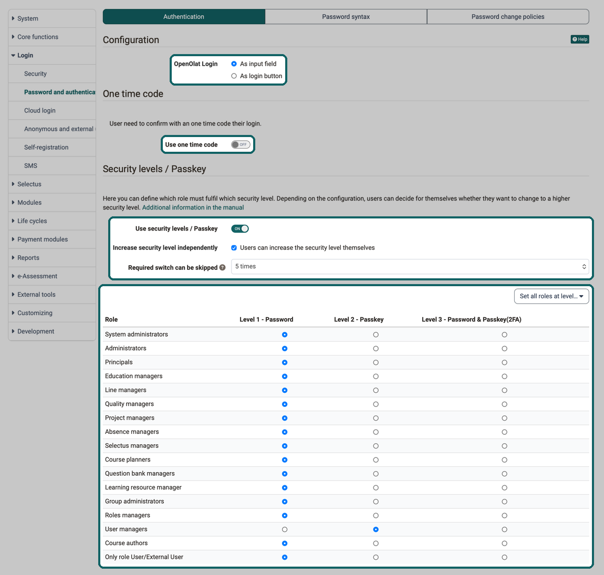
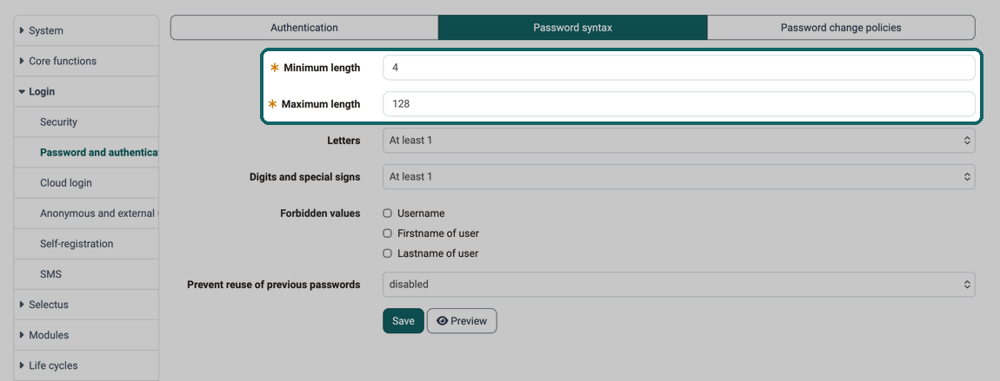
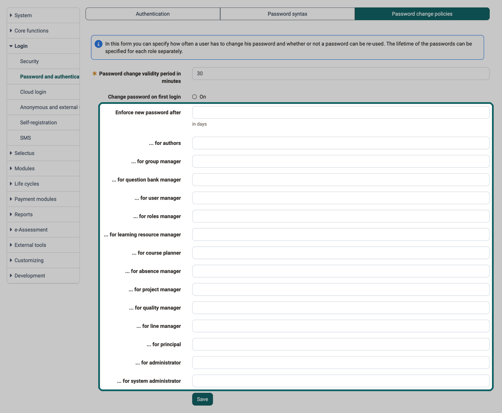

# Password and Authentication {: #password_and_authentication}

Administrators and system administrators define here how account holders log in to OpenOlat, which rules a password must meet and when it has to be changed. The settings are located in the system administration under: 
`Administration > Login > Password and authentication`

## Tab "Authentication" [:octicons-tag-16:{ title="from Release 18.1.2 (OO-7418)" }](https://track.frentix.com/issue/OO-7418) {: #tab-authentication}

In the "Authentication" tab you determine how the login page offers the OpenOlat login and with which second factor account holders additionally identify themselves. The tab is divided into the sections "Configuration", "One time code" and "Security levels / Passkey". Every change in this tab takes effect immediately, there is no button for saving.

{ class="shadow lightbox" title="Authentication tab in the Administration · 2026.10.02" }

### Configuration [:octicons-tag-16:{ title="from Release 18.1.2 (OO-7394)" }](https://track.frentix.com/issue/OO-7394) {: #configuration}

#### OpenOlat Login {: #openolat_login}

With the options "As input field" and "As login button" you define how the login page displays the OpenOlat login. With "As login button", a **button** is displayed on the login page **instead of the input field** for the user name, with which the input field can be called up.

**Purpose:** 
If the primary login method is not the OpenOlat login, then the input field for the OpenOlat login should often not be displayed directly and prominently. An input field invites input, and users immediately enter their (incorrect) login name instead of considering the other login methods. 
With a button next to other buttons (other login methods), the decision for a specific login method is more considered.

{ class="shadow lightbox" title="OpenOlat login page" }

### One time code [:octicons-tag-16:{ title="from Release 21.0 (OO-9509)" }](https://track.frentix.com/issue/OO-9509) {: #one_time_code}

#### Use one time code {: #use_one_time_code}

With the "Use one time code" option, you activate an additional second security level by e-mail. After entering their username and password, account holders receive an 8-digit confirmation code by e-mail and complete the login with this code on a validation page.

Without an active passkey, the one time code is the second security level for all local logins. If Passkey is also activated, the one time code serves as a fallback for account holders without a stored passkey.

A valid e-mail address on the account and a functioning e-mail dispatch configured in OpenOlat are required so that the code can be delivered.

### Security levels / Passkey [:octicons-tag-16:{ title="from Release 18.1 (OO-7180)" }](https://track.frentix.com/issue/OO-7180) {: #security_levels_passkey}

You protect accounts with far-reaching rights better if you require a higher security level for their role. OpenOlat has a three-stage security concept: 
**Level 1 - Password** 
**Level 2 - Passkey** 
**Level 3 - Password & Passkey (2FA)**

How account holders change their security level is described on the page [Security Levels](../../manual_user/login_registration/Security_levels.md).

#### Use security levels / Passkey {: #use_security_levels_passkey}

Switching on activates the option for level 2 and 3. Only then does the section show the settings "Increase security level independently" and "Required switch can be skipped", the menu "Set all roles at level…" and the table of roles.

If account holders log in with a passkey only (level 2), OpenOlat asks for a confirmation in the "Disable passkey" dialog when you switch off. These accounts can no longer log in afterwards.

#### Increase security level independently {: #increase_security_level_independently}

With the "Users can increase the security level themselves" option, account holders can decide for themselves whether they want to switch to a higher security level. It is not possible to downgrade below the minimum level set by the administrator.

#### Required switch can be skipped {: #required_switch_can_be_skipped}

If the security level has been increased by an administrator, the persons concerned will be asked to set up a passkey when they log in. This setting determines how often the persons concerned can skip this prompt: "Never", "5 times", "10 times" or "Unlimited".

#### Set all roles at level… {: #set_all_roles_at_level}

The menu sets all roles of the table to the selected level in one step: "Level 1 - Password", "Level 2 - Passkey" or "Level 3 - Password & Passkey (2FA)". You then adjust individual roles in the table.

#### Role {: #role}

The table lists each role in a row and the three security levels as columns. The selected level defines the **minimum requirement** for the respective role.

## Tab "Password syntax" {: #tab-password-syntax}

As the administrator, you define here which criteria a password must fulfill. A minimum and maximum length must be defined. The rules apply as soon as you click "Save".

{ class="shadow lightbox" title="Password syntax tab in the Administration · 2026.10.02" }

#### Minimum length {: #minimum_length}

Required field. The smallest number of characters a password must have.

#### Maximum length {: #maximum_length}

Required field. The largest number of characters a password may have.

#### Letters {: #letters}

Defines how many letters a password must contain: "Permitted", "At least 1", "At least 2", "At least 3" or "Forbidden". With "Separat definition of uppercase and lowercase letters", the fields "Uppercase letters" and "Lowercase letters" appear with the same values.

#### Digits and special signs {: #digits_and_special_signs}

Defines how many digits or special signs a password must contain, with the same values as for "Letters". With "Separat definition of digits and special signs", the fields "Digits" and "Special signs" appear.

#### Forbidden values {: #forbidden_values}

A password must not contain the ticked value: "Username", "Firstname of user" or "Lastname of user" of the account. Upper and lower case do not matter.

#### Prevent reuse of previous passwords {: #prevent_reuse_of_previous_passwords}

Defines from how many earlier passwords a new password must differ: "disabled" or "for 1 changes" up to "for 15 changes".

#### Preview {: #preview}

The button opens the "Validation of password syntax" dialog. There you check a sample password with "Validate" against the rules set in the form, also before saving.

## Tab "Password change policies" {: #tab-password-change-policy}

Here you can define how often users have to change their password. The lifetime of the password can be defined for each role. Whether an earlier password can be reused is defined by the "Prevent reuse of previous passwords" field in the "Password syntax" tab, even though the hint above the form mentions reuse here.

The policy concerns the OpenOlat password. Accounts that also log in via LDAP, Shibboleth or a cloud login are exempt from it.

{ class="shadow lightbox" title="Password change policies tab in the Administration · 2026.10.02" }

#### Password change validity period in minutes {: #password_change_validity_period}

Required field. Defines for how many minutes the confirmation code remains valid that OpenOlat sends by e-mail in the "Forgot password?" wizard.

#### Change password on first login {: #change_password_on_first_login}

With "On", account holders must change a password that has never been changed since it was created when they log in.

#### Enforce new password after {: #enforce_new_password_after}

The number of days after which all accounts must set a new password. An empty field requires no change. Below it you enter a separate period for individual roles, from "... for authors" to "... for system administrator". If an account has several roles, the shortest period entered applies.

## Further information {: #further_information}

**Mentioned on this page** 
[Security Levels >](../../manual_user/login_registration/Security_levels.md)

**Further reading** 
[One Time Code >](../../manual_user/login_registration/One_Time_Code.md) 
[Passkey >](../../manual_user/login_registration/Passkey.md) 
[Login: Overview >](Login.md) 
[Email Settings >](E-Mail_Settings.md)

[To the top of the page ^](#password_and_authentication)
