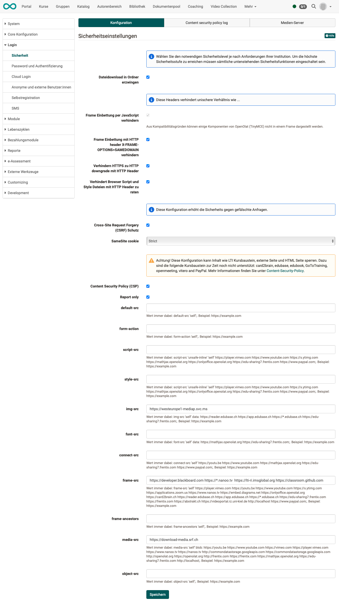
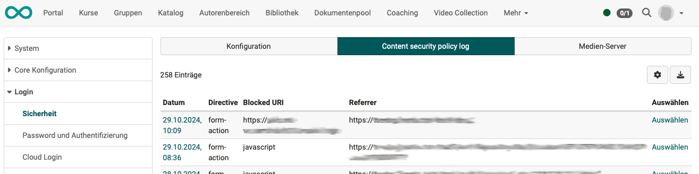
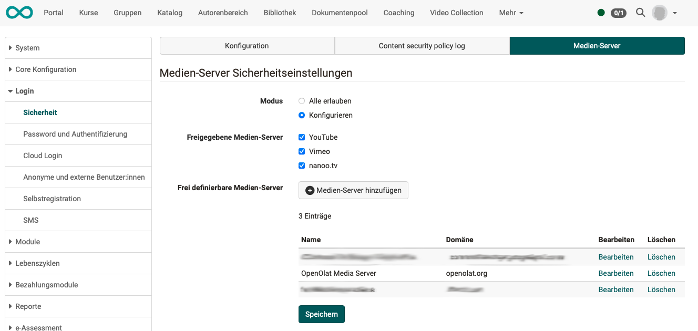

# Sicherheit {: #security}

Die Anforderungen an die Sicherheit können je nach Institution variieren. In
den **systemweiten Sicherheitseinstellungen** können Sie daher den notwendigen Level an
Sicherheit unter Berücksichtigung der damit eingegangenen Risiken einstellen.

## Tab Konfiguration {: #tab_config}

{ class="shadow lightbox" }

**Dateidownload in Ordner erzwingen**: Wählen Sie diese Sicherheitsfunktion,
um in der Ordnerkomponente Dateien immer herunterzuladen und nie direkt im
Browser zu öffnen. Damit werden allfällige Cross-Site-Scripting (XSS) Attacken
verhindert. Ist diese Funktion eingeschaltet werden auch in Ordnern abgelegte
HTML-Seiten als Dateien heruntergeladen und nicht mehr direkt im Browser
geöffnet. Der Kursbaustein "HTML-Seite" ist von diesem Mechanismus nicht
betroffen.

**Frame Einbettung verhindern**: Wählen Sie diese Sicherheitsfunktion, um das
Laden von OpenOlat in einem Frame oder iFrame zu verhindern. Damit werden
allfällige Cross-Frame-Scripting Attacken verhindert (XFS). Ist diese Funktion
eingeschaltet können Sie OpenOlat nicht in eine bestehende Webseite mittels
Frames einbetten.

  
[Zum Seitenanfang ^](#security)
  

## Tab Content security policy log {: #tab_csp-log}

{ class="shadow lightbox" }

[Zum Seitenanfang ^](#security)
  

## Tab Medien-Server {: #tab_mediaserver}

Hier können die für OpenOlat freigegebenen Medien-Server bestimmt werden.

{ class="shadow lightbox" }

[Zum Seitenanfang ^](#security)
  
