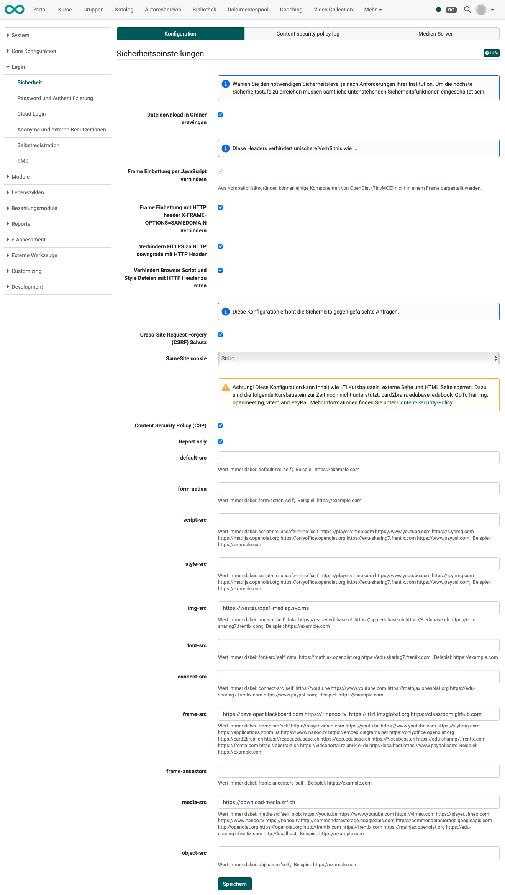
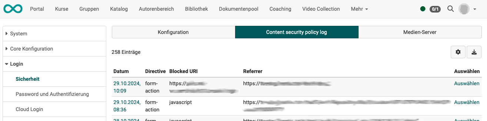
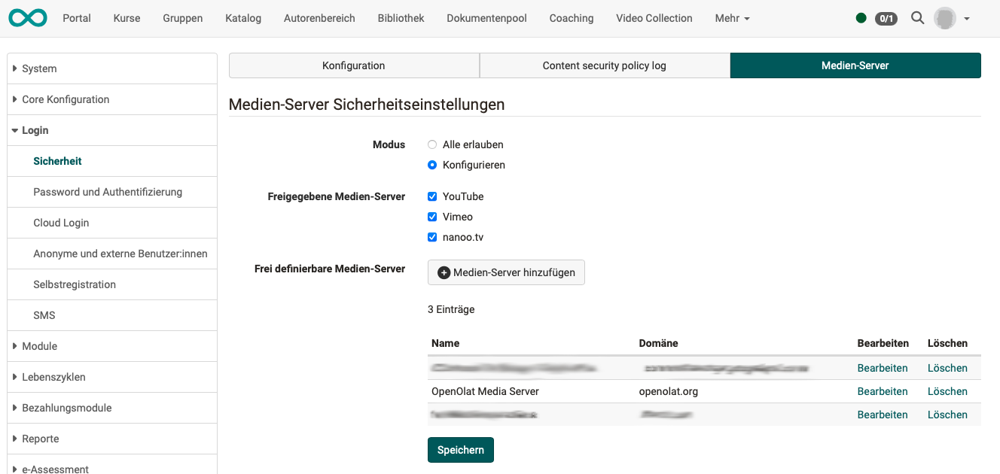

# Security {: #security}

The security requirements may vary depending on the institution. In the **system-wide security settings** you can therefore set the required level of security, taking into account the risks involved. You reach the highest level of security when all security functions are switched on.

## Configuration tab {: #tab_config}

{ class="shadow lightbox" }

### Files in folders {: #files}

**Force file download in folders**: Select this security function to always download files in the folder component and never open them directly in the browser. This prevents any cross-site scripting (XSS) attacks. If this function is activated, HTML pages stored in folders are also downloaded as files and no longer opened directly in the browser. The course element “HTML page” is not affected by this mechanism.

### HTTP headers {: #headers}

**Prevent embedding in frames using JavaScript code**: This function is permanently switched on and cannot be changed in the form. Due to compatibility reasons, the rich text component (TinyMCE) of OpenOlat cannot be embedded in a frame.

**Prevent embedding in frames by sending HTTP header X-FRAME-OPTIONS=SAMEDOMAIN**: Select this security function to prevent OpenOlat from loading in a frame or iFrame. This prevents any cross-frame scripting attacks (XFS). If this function is activated, you cannot embed OpenOlat in an existing website using frames.

**Prevent downgrade of HTTPS to HTTP with HTTP header**: The browser only calls the platform via HTTPS, even if a link points to HTTP. OpenOlat sends the `Strict-Transport-Security` header for this, valid for one year and including subdomains.

**Prevent browser to guess script and style content with HTTP header**: The browser keeps to the file type reported by the server instead of guessing it from the content. OpenOlat sends the header `X-Content-Type-Options: nosniff` for this.

### Protection against forged requests {: #csrf}

**Cross-Site Request Forgery (CSRF) protection**: This configuration increases security against forged requests that are sent from an external website in the name of a logged-in person.

**SameSite cookie**: Determines for which calls from other websites the session cookie is sent along. The options are `Strict`, `Lax` and `None`, with `Strict` being the most restrictive setting.

### Content Security Policy {: #csp}

**Content Security Policy (CSP)**: Defines the sources from which the browser may load content for OpenOlat.

!!! warning "Effect on content"
    This configuration can block content such as the LTI course element, the external page and the HTML page. The course elements card2brain, edubase, edubook, GoToTraining, openmeeting, vitero and PayPal are currently not supported.

If the Content Security Policy is switched on, the **Report only** setting and the input fields of the individual directives appear in addition. With **Report only**, violations are only logged and not blocked; you will find the messages in the *Content security policy log* tab.

??? info "The individual directives"
    You can store your own sources for each directive, each as an address in the form `https://example.com`. Below the input field, OpenOlat shows the value that is always included and that your entry supplements.

    | Directive | Applies to |
    |---|---|
    | `default-src` | all content types without their own directive |
    | `form-action` | targets to which forms are sent |
    | `script-src` | JavaScript |
    | `style-src` | stylesheets |
    | `img-src` | images |
    | `font-src` | fonts |
    | `connect-src` | connections from the browser, for example for retrieving data in the background |
    | `frame-src` | pages that OpenOlat embeds in a frame |
    | `frame-ancestors` | pages that are allowed to embed OpenOlat themselves |
    | `media-src` | audio and video |
    | `object-src` | embedded objects |

[To the top of the page ^](#security)

## Tab Content security policy log {: #tab_csp-log}

This tab appears as soon as the Content Security Policy is switched on. It lists the reported violations.

{ class="shadow lightbox" }

[To the top of the page ^](#security)

## Tab Media Server {: #tab_mediaserver}

The media servers released for OpenOlat can be defined here.

{ class="shadow lightbox" }

[To the top of the page ^](#security)
