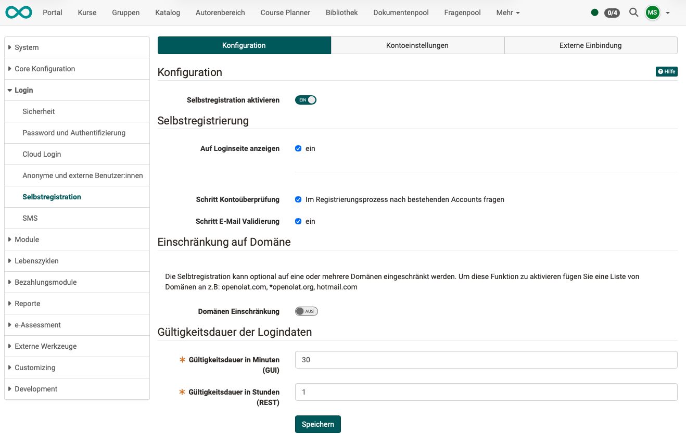
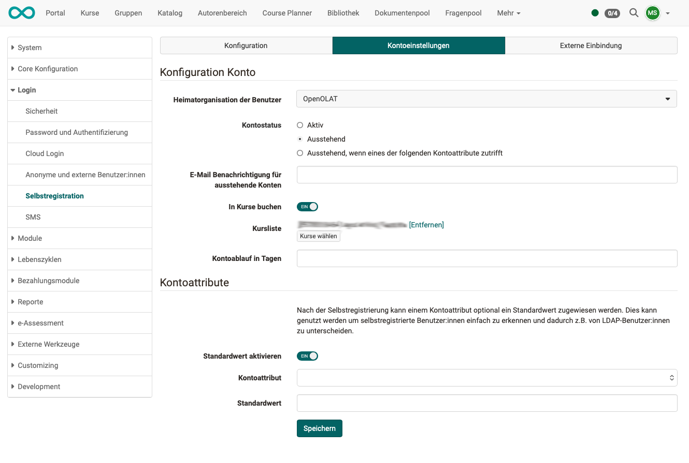
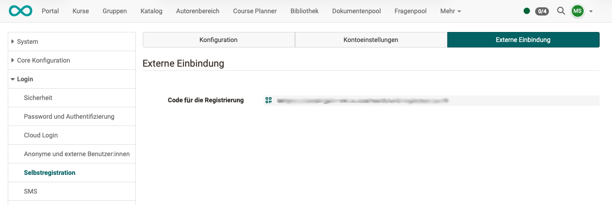

# Self-registration  {: #self-registration}

## Tab Configuration {: #tab_configuration}

{ class="shadow lightbox" }

### Section "Configuration"

The toggle button basically allows self-registration.

### Section "Self registration"

#### Show on login page {: #show_on_login_page }

The option for self-registration can already be offered on the login page.
If the option is not displayed there, self-registration can be carried out, for example, after selecting a corresponding offer in the catalog.

#### Step Account verification {: #account_check_step }

In an optional step, starting with :octicons-tag-24: Release 20, it is possible to check whether users already have an OpenOlat account. Users who already have an account should be able to continue using their old account if they wish. 
If administrators select the verification option, users who are already known will be asked for an existing account and a support form will be provided.

#### Step E-Mail Validation {: #email_validation_step }

E-mail addresses entered during self-registration are checked for validity. 
Alternative: Validation can also be controlled through the organization module.

### Section "Restriction to domain"
The domains are defined in the organization module. 
See [Module Organisations >](../administration/Modules_Organisations.md)

### Section "Validity period of login data"
The validity period of the login data can be specified separately for the GUI and the REST API.

The validity period applies to self-registration and to the invitation link to set login credentials that administrators send in user management in the "Password" tab. After expiry, the link leads nowhere. See [Configure User](../usermanagement/Configure_User.md). [:octicons-tag-16:{ title="from Release 20.3.0 (OO-9139)" }](https://track.frentix.com/issue/OO-9139)

[To the top of the page ^](#self-registration)

---

## Tab Account settings {: #tab_account_settings}

{ class="shadow lightbox" }

### Section "Account Configuration"

The configurations entered here will be applied to new accounts:

#### Users' home organization {: #home_organisation }

New users are automatically assigned to the organization specified here. Further assignments can be made later in user management.

#### Account status {: #account_status }

**Active:** After self-registration, OpenOlat is immediately available. 
**Pending:** An administrator or user manager must activate the account after self-registration. 
**Pending if one of the following account attributes applies:**  If one of the conditions applies, the account is created with the status "Pending." If none of the conditions apply, the account status "Active" is assigned.

#### Pending user creation notification mail {: #pending_account_notification }

The email address of a responsible person (preferably an administrator or user administrator) can be specified for checking and activating accounts with "pending" status.

#### Book courses {: #book_into_courses }

If this option is enabled, people who register themselves can automatically be made members of the specified courses. 

#### Course list {: #course_list }

The option to specify multiple courses refers to the "Book courses" option.

#### Account expiration in days {: #account_expiration_days }

The information provided here corresponds to the information in user management. The information is transferred there during self-registration.

### Section "Account attributes"
After self-registration, a default value can optionally be assigned to an account attribute. This can be used to easily identify self-registered users and thus distinguish them from LDAP users, for example.

#### Activate user property mapping {: #enable_default_value }

If this option is enabled, the selected user property is automatically assigned the specified default value.

#### User property name {: #account_attribute }

User property that receives the default value.

#### User property value {: #default_value }

Value assigned to the selected user property during self-registration.

[To the top of the page ^](#self-registration)

---

## Tab external integration {: #tab_external_integration}

{ class="shadow lightbox" }

### Section "External integration"

#### Code for the registration {: #registration_code }

The call for self-registration can be accessed directly using the URL provided here.

Use case: 
If you do not want the "Self-registration" option to be displayed on the start page, potential users can be invited to self-register using the URL provided here.

[To the top of the page ^](#self-registration)

---

## Further information {: #further_information}

**Mentioned on this page** 
[Module Organisations >](Modules_Organisations.md) 
[Configure User >](../usermanagement/Configure_User.md)

[To the top of the page ^](#self-registration)

