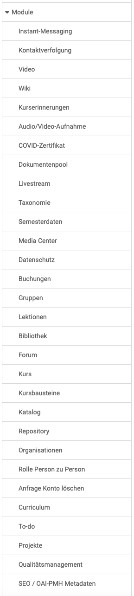

# Module: Übersicht {: #modules}

{ class="shadow lightbox aside-left-lg" }

In diesem Bereich haben Administrator:innen Zugriff auf die Module:

## Instant-Messaging {: #instant_messaging}

Hier können Chat und Kurznachrichten aktiviert und konfiguriert werden.

[Zu den Details >](Instant_Messaging.de.md) 
[Zum Seitenanfang ^](#modules)

## Kontaktverfolgung {: #contact_tracing}

Dieses Modul wurde während der COVID-Pandemie erstellt. Aktivieren Sie das Modul, wenn Sie über physische Orte verfügen, an denen sich Menschen treffen und Sie aufgrund von Vorschriften im Bereich der öffentlichen Gesundheit (z.B. COVID19) den Behörden Informationen zur Kontaktverfolgung zur Verfügung stellen müssen.

[Zu den Details >](Modules_Contact_Tracing.de.md) 
[Zum Seitenanfang ^](#modules)

## Video {: #video}

Hier können die Lernressource Video und der Kursbaustein Video aktiviert werden. Auch Angaben zur Transkodierung, sowie die Standardauflösung können definiert werden. 

[Zu den Details >](Modules_Video.de.md) 
[Zum Seitenanfang ^](#modules)

##  Wiki {: #wiki}

Hier können Sie die Wikiressource systemweit ein- oder ausschalten". Die Wiki Komponente ist
zurzeit noch anfällig für Cross-Site-Scripting Attacken (XSS). Daher kann
zusätzlich der XSS-Scanner aktiviert werden. Dies kann zu Beeinträchtigungen
in der Wiki-Funktionalität in OpenOlat führen. Bei ausgeschaltetem XSS-Scanner
kann das Wiki mit dem Risiko einer XSS Attacke verwendet werden. Allerdings
verfügt die Wiki Komponente über eine automatische Versionierung, die es
Angreifern schwierig macht, unerkannt zu bleiben. 

[Zum Seitenanfang ^](#modules)

## Kurserinnerungen {: #course_reminders}

Sind die Kurserinnerungen hier aktiviert, werden zu den hier bestimmbaren Zeitpunkten die Versandbedingungen überprüft und die fälligen Mails verschickt.

[Zum Seitenanfang ^](#modules)

## Audio/Video-Aufnahme {: #audio_video_recording}

Hier wird die an verschiedenen Stellen in OpenOlat vorhandene Möglichkeit für Audio- und Videoaufnahmen ein- oder ausgeschaltet.
Die aufgezeichneten Audio- und Videodaten werden automatisch im Hintergrund von einem externen Dienst in ein Format konvertiert, das mit den meisten Browsern kompatibel ist. Auch ein lokales Transcoding kann aktiviert werden.

[Zu den Details >](Modules_Audio_Video_Recording.de.md) 
[Zum Seitenanfang ^](#modules)

## Covid-Zertifikat {: #covid_certificate}

Während der COVID-Pandemie wurde hier die Aktivierung des COVID-Zertifikats mit weiteren Einstellungen wie Gültigkeitsdauer, Erinnerungseinstellungen, Scan-Einstellungen für das Zertifikat implementiert.

[Zum Seitenanfang ^](#modules)

## Dokumentenpool {: #documentpool}

Der Dokumentenpool stellt eine Dokumentenbibliothek bereit, mit automatischer Strukturierung auf Basis einer Taxonomie und Kompetenzen.

[Zu den Details >](Modules_Document_pool.de.md) 
[Zum Seitenanfang ^](#modules)

## Livestream {: #livestream}

Hier kann der Kursbaustein "Livestream" verfügbar gemacht und konfiguriert werden (Paella Player).

[Zum Seitenanfang ^](#modules)

## Taxonomie {: #taxonomy}

Hier können mehrere Taxonomien für unterschiedliche Bereiche in OpenOlat erstellt und editiert werden.

[Zu den Details >](Modules_Taxonomy.de.md) 
[Zum Seitenanfang ^](#modules)

## Semesterdaten {: #semester_terms}

Erstellen und verwalten Sie Semesterdaten, um bei Kurslaufzeiten auf eine
Semesterbezeichnung anstelle eines Datums verweisen zu können. Die hier
erstellten Semesterdaten können bei der Konfiguration des
Durchführungszeitraumes eines Kurses in der Lernressourcenverwaltung verwendet
werden. Als Bezeichnung könnten z.B. "SoSe23" und als Name "Sommersemester
2023" verwendet werden.

[Zum Seitenanfang ^](#modules)

## Media Center {: #media_center}

Medien im Media Center können für andere freigeben werden. Hier können Sie definieren, welche Freigabemöglichkeiten die jeweiligen Rollen besitzen.

Ausserdem kann definiert werden, ob bzw. welche Taxonomie mit dem Media Center verbunden werden sollen.

[Zu den Details >](Modules_Media_Center.de.md) 
[Zum Seitenanfang ^](#modules)

## Datenschutz {: #data_privacy}

Sie können festlegen, welche Systemrollen, die administrativen Benutzer:innen-Properties z.B. bei der Kontensuche oder in Listen sehen dürfen. Welche Benutzer:innen-Properties als administrativ gelten, wird bei den Benutzer:innen-Properties konfiguriert. 

Ebenso kann bestimmt werden, welche Systemrollen den letzten Besuch der Benutzer:innen sehen dürfen.

Der Kursbaustein "Externe Seite" kann im HTTP Header der Anfrage Daten zum aktuellen Konto an das externe System übermitteln um gewisse Lernszenarien umzusetzen (Anmeldename, E-Mail, Vorname, Nachname, aktuelle IP-Adresse der Benutzer*innen). Definieren Sie hier ob diese Daten übermittelt werden sollen oder nicht.

[Zum Seitenanfang ^](#modules)

## Buchungen {: #bookings}

Hier können Sie für eine bestimmte Buchungsnummer alle Buchungen in einem bestimmten Zeitraum anzeigen lassen.

[Zum Seitenanfang ^](#modules)

## Gruppen {: #groups}

Hier kann definiert werden, ob Kursautor:innen und Lernende neue Gruppen erstellen
dürfen. Auch mögliche Rechte für Gruppenverwalter:innen und Lernressourcenverwalter:innen
im Gruppenkontext können definiert werden. 

Um den Datenschutzanforderungen gerecht zu werden, kann festgelegt werden, ob bei einer Einladung von
Benutzer:innen in Kurse und Gruppen eine E-Mail versendet werden muss, ob die
Einladung eine direkte Mitgliedschaft zur Folge hat oder erst durch den
eingeladenen Benutzer bestätigt werden muss.

Administrator:innen können hier auch Kurs- und Gruppenmitglieder bereinigen.

[Zum Seitenanfang ^](#modules)

## Lektionen {: #lectures}

Wird hier das Lektionen- und Absenzenmanagement eingeschaltet, kann es mit einer Vielzahl an Optionen konfiguriert werden. 

[Zu den Details >](Lecture_and_roll_call_management.de.md) 
[Zum Seitenanfang ^](#modules)

## Bibliothek {: #library}

Hier nehmen Sie die Aktivierung des Menüs "Bibliothek" und Wahl des zugehörigen Ressourcenordners vor.

[Zum Seitenanfang ^](#modules)

## Forum {: #forum}

Administrator:innen können hier definieren, ob pseudonymisierte Forenbeiträge
erlaubt sind und auch die passende Standardkonfiguration für Foren festlegen.

[Zum Seitenanfang ^](#modules)

## Kurs {: #course}

Wenn Autor:innen neue Kurse erstellen, finden Sie Voreinstellungen vor, die durch Administrator:innen hier festgelegt werden.

* Im Tab "Einstellungen" kann der Standardtyp für die OpenOlat Kurse, Lernpfad
oder herkömmlicher Kurs, festgelegt werden. Auch Einstellungen für bewertbare
Kursbausteine können hier vorgenommen werden. 
* Im Tab "Durchführungsformate" können neue didaktische Typen definiert und vorhandene bearbeitet oder
gelöscht werden. 
* Auch Kategorien für Farbkategorien mit CSS-Klassen und Stil der Bilder können in diesem Menü hinzugefügt werden.

[Zum Seitenanfang ^](#modules)

## Kursbausteine {: #course_elements}

Hier wird festgelegt, welche Kursbaustein-Typen OpenOlat-Autor:innen für ihre Kurserstellung zur Verfügung haben.

[Zum Seitenanfang ^](#modules)

## Katalog {: #catalog}

Hier kann die Verwendung eines Katalogs ein- oder ausgeschaltet und konfiguriert werden.

[Zu den Details >](Modules_Catalog_2.0.de.md) 
[Zum Seitenanfang ^](#modules)

## Repository {: #repository}

Hier nehmen Sie Einstellungen im Repository vor.

[Zu den Details >](Modules_Repository.de.md) 
[Zum Seitenanfang ^](#modules)

## Organisationen {: #organisations}

Mit aktiviertem Modul "Organisationen" können Organisationsstrukturen in OpenOlat abgebildet werden. Damit können dann Rollen oder Zugriffsberechtigungen auf bestimmte Organisationseinheiten beschränkt werden.

[Zu den Details >](Modules_Organisations.de.md) 
[Zum Seitenanfang ^](#modules)

## Rolle Person zu Person {: #role_user_to_user}

Nach Aktivierung von "Person zu Person" können OpenOlat-Rollen durch einen (definierbaren) Beziehungstyp verbunden werden, z.B. Vorgesetzter und Mitarbeiter oder Lehrer und Schüler.

[Zum Seitenanfang ^](#modules)

## Anfrage Konto löschen {: #request_account_deletion}

Hier können Anfragen zum Löschen des Kontos erlaubt werden. Für die Löschanfrage kann eine E-Mailadresse angegeben werden.

[Zum Seitenanfang ^](#modules)

## Curriculum {: #curriculum}

Wird das Modul "Curriculum" hier aktiviert, können Curriculumtypen angelegt und Einstellungen dazu gemacht werden. 

[Zu den Details >](Modules_Curriculum.de.md) 
[Zum Seitenanfang ^](#modules)

## To-do {: #to-do}

Bei aktiviertem Modul kann definiert werden, wer To-dos erstellen, zuweisen oder delegieren darf.

[Zum Seitenanfang ^](#modules)

## Projekte {: #projects}

Hier wird das in OpenOlat vorhandene Projekt-Tool aktiviert.

[Zu den Details >](Modules_Projects.de.md) 
[Zum Seitenanfang ^](#modules)

## Qualitätsmanagement {: #quality_management}

Hier finden Sie die Aktivierung des Qualitätsmanagements und die dafür erforderliche Definition von speziellen E-Mailadressen, z.B. für Verbesserungsvorschläge. 

[Zu den Details >](Modules_Quality_Management.de.md) 
[Zum Seitenanfang ^](#modules)

## SEO / OAI-PMH Metadaten {: #OAI-PMH}

Hier können Sie ermöglichen und konfigurieren, dass andere Service Provider die Metadaten von Lernressourcen sammeln oder an Suchmaschinen-Anbieter weiterleiten können.

[Zu den Details >](Modules_OAI.de.md) 
[Zum Seitenanfang ^](#modules)

