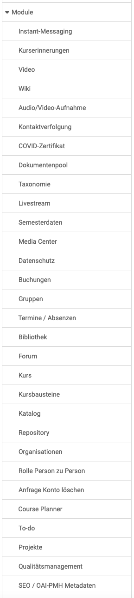

# Modules: Overview {: #modules}

{ class="shadow lightbox aside-left-lg" }

Administrators have access to the modules in this area:

## Instant Messaging {: #instant_messaging}

Chat and short messages can be activated and configured here.

[See the details >](Instant_Messaging.md) 
[To the top of the page ^](#modules)

## Course reminders {: #course_reminders}

If the price reminders are activated here, the dispatch conditions are checked at the times specified here and the mails due are sent.

[To the top of the page ^](#modules)

## Video {: #video}

The video learning resource and the video course element can be activated here. Information on transcoding and the standard resolution can also be defined.   

[See the details >](Modules_Video.md) 
[To the top of the page ^](#modules)

## Wiki {: #wiki}

Here you can switch the wiki resource on or off system-wide. The wiki component is currently still vulnerable to cross-site scripting attacks (XSS). The XSS scanner can therefore also be activated. This can lead to impairments in the wiki functionality in OpenOlat. If the XSS scanner is switched off, the wiki can be used with the risk of an XSS attack. However, the wiki component has automatic versioning, which makes it difficult for attackers to remain undetected. 

[To the top of the page ^](#modules)

## Audio/Video recording {: #audio_video_recording}

The option for audio and video recordings available at various points in OpenOlat is activated or deactivated here.
The recorded audio and video data is automatically converted in the background by an external service into a format that is compatible with most browsers. Local transcoding can also be activated.

[See the details >](Modules_Audio_Video_Recording.md) 
[To the top of the page ^](#modules)

## Contact Tracing {: #contact_tracing}

This module was created during the COVID pandemic. Activate the module if you have physical locations where people meet and you need to provide contact tracing information to the authorities due to public health regulations (e.g. COVID19).

[See the details >](Modules_Contact_Tracing.md) 
[To the top of the page ^](#modules)

## Covid certificate {: #covid_certificate}

During the COVID pandemic, the activation of the COVID certificate with further settings such as validity period, reminder settings, scan settings for the certificate was implemented here.

[To the top of the page ^](#modules)

## Document pool {: #documentpool}

Der Dokumentenpool stellt eine Dokumentenbibliothek bereit, mit automatischer Strukturierung auf Basis einer Taxonomie und Kompetenzen.

[See the details >](Modules_Document_pool.md) 
[To the top of the page ^](#modules)

## Taxonomy {: #taxonomy}

Several taxonomies can be created and edited for different areas in OpenOlat.

[See the details >](Modules_Taxonomy.md) 
[To the top of the page ^](#modules)

## Livestream {: #livestream}

The course element "Livestream" can be made available and configured here (Paella Player).

[To the top of the page ^](#modules)

## Semester terms {: #semester_terms}

Create and manage semester dates to be able to refer to a semester designation
instead of a date for course durations. The semester data created here can be
used when configuring the execution period of a course in learning resource
management. For example, "SuSe23" could be used as the designation and "Summer
semester 2023" as the name.

[To the top of the page ^](#modules)

## Media Center {: #media_center}

Media in the Media Center can be shared with others. Here you can define which sharing options the respective roles have.

You can also define whether or which taxonomy should be connected to the Media Center

[See the details >](Modules_Media_Center.md) 
[To the top of the page ^](#modules)

## Data privacy {: #data_privacy}

You can define which system roles are allowed to see the administrative user properties, e.g. in the account search or in lists. Which user properties are considered administrative is configured in the user properties. 

You can also determine which system roles are allowed to see the user's last visit.

The course element "External page" can transmit data about the current account to the external system in the HTTP header of the request in order to implement certain learning scenarios (login name, e-mail, first name, last name, current IP address of the user). Define here whether this data should be transmitted or not.

[To the top of the page ^](#modules)

## Bookings {: #bookings}

Here you can display all bookings for a specific booking number in a specific period.

[To the top of the page ^](#modules)

## Groups {: #groups}

Here you can define if course authors and learners are allowed to create new groups. Possible rights for group administrators and learning resource administrators in the group context can also be defined.

In order to meet data protection requirements, it can be defined whether an e-mail must be sent when inviting users to courses and groups and whether the invitation results in direct membership or must first be confirmed by the invited user.

Administrators can also purge course and group members here.

[To the top of the page ^](#modules)

## Events / Absences (up to release 19: Lessons) {: #lectures}

If event and absence management (before release 20: lesson and absence management) is activated here, it can be configured with a variety of options.  

[See the details of "Events / Absences" >](Modules_Events_and_Absences.md) 
[See the details of "Lessons" >](Lecture_and_roll_call_management.md) 
[To the top of the page ^](#modules)

## Library {: #library}

Here you can activate the "Library" menu and select the corresponding resource folder.

[To the top of the page ^](#modules)

## Forum {: #forum}

Administrators can define here whether pseudonymized forum posts are permitted and also specify the appropriate default configuration for forums.

[To the top of the page ^](#modules)

## Course {: #course}

When authors create new courses, they will find default settings that are defined here by administrators.

* The default type for OpenOlat courses, learning path or conventional course, can be defined in the "Settings" tab. Settings for assessable course elements can also be made here.
* In the "Implementation formats" tab, new didactic types can be defined and existing ones edited or deleted.
* Categories for color categories with CSS classes and style of images can also be added in this menu.

[See the details >](Modules_Course.md) 
[To the top of the page ^](#modules)

## Course elements {: #course_elements}

Here you can define which course element types OpenOlat authors have available for their course creation.

[To the top of the page ^](#modules)

## Catalog {: #catalog}

The use of a catalog can be switched on or off and configured here.

[See the details >](Modules_Catalog_2.0.md) 
[To the top of the page ^](#modules)

## Repository {: #repository}

Here you make settings in the repository.

[See the details >](Modules_Repository.md) 
[To the top of the page ^](#modules)

## Organisations {: #organisations}

With the "Organizations" module activated, organisational structures can be mapped in OpenOlat. This allows roles or access permissions to be restricted to specific organizational units.

[See the details >](Modules_Organisations.md) 
[To the top of the page ^](#modules)

## Role person to person {: #role_user_to_user}

After activating "Person to person", OpenOlat roles can be linked by a (definable) relationship type, e.g. coach and employee or teacher and student.

[To the top of the page ^](#modules)

## Request account deletion {: #request_account_deletion}

Requests to delete the account can be permitted here. An e-mail address can be entered for the deletion request.

[To the top of the page ^](#modules)

## Course Planner (up to release 19: Curriculum) {: #curriculum}

If the "Course Planner" module (before release 20: module "Curriculum") is activated here, element types (before release 20: curriculum types) can be created and settings made for them.

[See the details of the Course Planner >](Modules_Course_Planner.md) 
[See the details of module Curriculum >](Modules_Curriculum.md) 
[To the top of the page ^](#modules)

## To-do {: #to-do}

If the module is activated, you can define who can create, assign or delegate to-dos.

[See the details >](Modules_ToDo.md) 
[To the top of the page ^](#modules)

## Projects {: #projects}

The project tool available in OpenOlat is activated here.

[See the details >](Modules_Projects.md) 
[To the top of the page ^](#modules)

## Quality management {: #quality_management}

Here you will find the activation of quality management and the necessary definition of special e-mail addresses, e.g. for suggestions for improvement. 

[See the details >](Modules_Quality_Management.md) 
[To the top of the page ^](#modules)

## SEO / OATI-PMH metadata {: #OAI-PMH}

Here you can enable and configure that other service providers can collect the metadata of learning resources or forward it to search engine providers.

[See the details >](Modules_OAI.md) 
[To the top of the page ^](#modules)