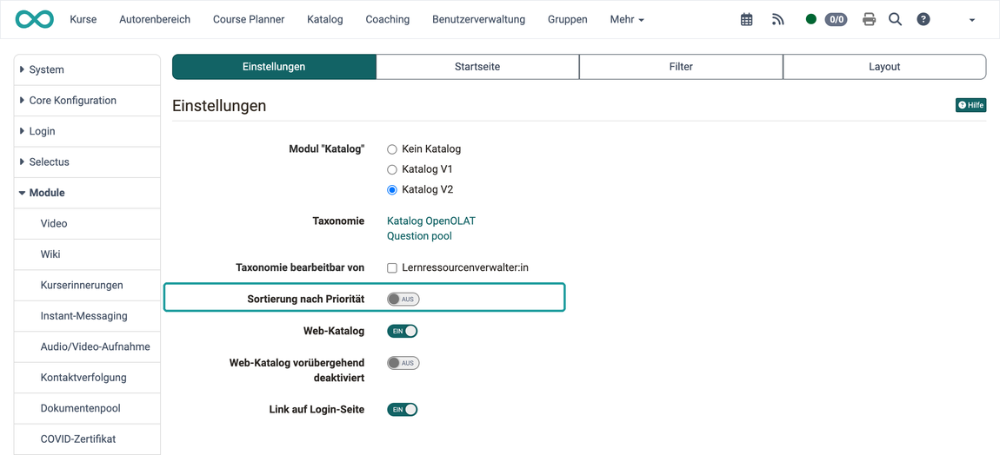

# Modul Katalog {: #modul_catalog}

## Tab Einstellungen [:octicons-tag-16:{ title="ab Release 17.0 (OO-6145)" }](https://track.frentix.com/issue/OO-6145) {: #tab_settings}

Administrator:innen legen hier fest, ob Benutzer:innen einen Katalog sehen und welchen. Sie finden die Einstellung in der System-Administration unter: 
`Administration > Module > Katalog > Tab "Einstellungen"`

Unter Modul "Katalog" stehen drei Optionen zur Wahl: "Kein Katalog", "Katalog V1" und "Katalog V2". Je nach Wahl erscheinen unterschiedliche weitere Tabs.

Bei einer neuen Installation ist der Katalog V2 voreingestellt, der Katalog V1 samt seiner Katalogverwaltung ist ausgeschaltet. Bei einem Update aus einer älteren Version bleibt die vorhandene Einstellung bestehen. [:octicons-tag-16:{ title="ab Release 21.0 (OO-9562)" }](https://track.frentix.com/issue/OO-9562)

Ist der [Katalog V2](#config_catalog_v2) aktiviert, erscheinen zusätzliche Einstellungen: die Auswahl der [Taxonomie](Modules_Taxonomy.de.md) für den Katalog, die Option "Taxonomie bearbeitbar von" mit der Rolle Lernressourcenverwalter:in, der Schalter "Sortierung nach Priorität" und der Schalter [Web-Katalog](#config_web-catalog).

Der Schalter "Sortierung nach Priorität" blendet in den Auflistungen des Katalogs einen Sortier-Button ein. Sein Standardkriterium "Relevanz" ordnet die Angebote zuerst nach ihrer Priorität, dann nach Beginndatum, Enddatum und Titel. Die Wirkung beschreibt die Seite [Katalog 2.0: Sortierung/Reihenfolge](../../manual_user/area_modules/catalog2.0_sort_offers.de.md#sorting_microsites_by_priority). [:octicons-tag-16:{ title="ab Release 20.2 (OO-9039)" }](https://track.frentix.com/issue/OO-9039)

{ class="shadow lightbox" }

### Migration von Katalog V1 zu V2 [:octicons-tag-16:{ title="ab Release 17.0 (OO-6148)" }](https://track.frentix.com/issue/OO-6148) {: #migration_v1_v2}

Wer vom Katalog V1 auf den Katalog V2 umstellt, muss die bestehende Katalogstruktur nicht neu aufbauen. Solange die Migration noch nicht gelaufen ist, zeigt der Tab "Einstellungen" bei aktivem Katalog V2 unterhalb der Einstellungen einen zweiten Abschnitt mit dem Titel "Migration". Er besteht aus einem Erklärtext, der die zu überführenden Objekte aufzählt, und dem Button "Migration starten".

Der Button öffnet den Bestätigungsdialog "Katalog 2.0 Migration" mit der Frage "Wollen Sie die Migration wirklich starten?" und den Buttons "Ja" und "Nein". Nach "Ja" überführt OpenOlat im Hintergrund:

- Die Katalogstruktur wird zu einer neuen Taxonomie: Titel, Kurztitel und Beschreibung des Katalogs werden zur Taxonomie, jede Kategorie zu einer Taxonomieebene. Die Taxonomie erscheint danach im Tab "Einstellungen" unter "Taxonomie" und in der Administration unter Fachbereiche/Katalog.
- Titel, Kurztitel und Beschreibungen der Unterkategorien stehen auf den neu gestalteten Unterseiten.
- Katalogbilder werden als rechteckige Kacheln im Format 2:1 dargestellt; die Form lässt sich im Tab "Layout" ändern.
- Das Bild der obersten Katalogebene wird zum Hintergrundbild des Headers der Startseite.
- Auf der Startseite entstehen Launcher: ein Launcher "Taxonomieebene" für die neue Taxonomie, ein Launcher "Statischer Text" mit der Beschreibung der obersten Katalogebene und, falls Lernressourcen direkt auf der obersten Ebene lagen, ein Launcher "Ausgewählte Lernressourcen" mit diesen Lernressourcen.
- Im Tab "Filter" wird der Filter für die Taxonomieebenen angelegt, falls er noch fehlt.

Während die Migration läuft, ersetzt der Hinweis "Die Migration wurde gestartet." den Button. Nach Abschluss verschwindet der Abschnitt "Migration" dauerhaft; die Migration lässt sich nur einmal ausführen.

[Zum Seitenanfang ^](#modul_catalog)

---

## Konfiguration des Katalogs V1 {: #config_catalog_v1}

Wenn Sie den Katalog V1 einschalten, erscheint der Tab "Konfiguration" und Sie können weitere Einstellungen vornehmen.

{ class="shadow lightbox" }

[Zum Seitenanfang ^](#modul_catalog)

---

## Konfiguration des Katalogs V2 {: #config_catalog_v2}

### Tab Startseite {: #tab_start_page}

Auf der Startseite kann man sogenannte **"Launcher"** hinzufügen. Launcher sind die konfigurierbaren Abschnitte der Startseite. 

Die in einem Launcher angezeigten Inhalte werden automatisch je nach gewähltem Launchertyp ausgewählt. Die verfügbaren Launchertypen sind nachstehend beschrieben. Standardmässig ist ein Launcher vom Typ "Zuletzt veröffentlicht" aktiviert. 

Allen Launchern kann ein Name in verschiedenen Sprachen gegeben werden. Der Name erscheint dann als Kopfzeile über den Kacheln. Launcher können auch nur für spezifische Organisationen freigegeben werden. Wählen Sie dazu "Einschränkung auf Organisation". Ausserdem kann separat bestimmt werden, ob ein Launcher im internen und/oder externen Katalog angezeigt wird.

{ class="shadow lightbox" }

#### Launchertyp "Statischer Text"

In diesem Launcher kann manuell statischer Text hinzufügt werden.

#### Launchertyp "Beliebte Kurse"

Die Reihenfolge der Angebote in diesem Launcher wird durch die Anzahl der Klicks auf Kursbausteine während den letzten 28 Tage bestimmt. Dabei werden nur Kurse mit Status "Publiziert" berücksichtigt.

#### Launchertyp "Zuletzt veröffentlicht"

Die Angebote sind nach Veröffentlichungsdatum geordnet.

#### Launchertyp "Zufallsgenerator"

In diesem Launcher angezeigte Angebote werden in zufälliger Reihenfolge angezeigt.

#### Launchertyp "Taxonomieebene"

Taxonomie-Launcher nutzen die Fachbereiche des Katalogs, um die verschiedenen Taxonomieebenen anzuzeigen. In einem Taxonomie-Launcher werden keine Kurse und Lernressourcen direkt angezeigt, die angezeigten Taxonomieebenen entsprechen vielmehr Ordnern, in denen dann erst die Lernressourcen zu finden sind.

Klickt man in einem Taxonomie-Launcher auf eine der angezeigten Kategorien (Taxonomieebene), gelangt man auf eine Microsite. Hier werden alle Kurse angezeigt, die unter dieser Taxonomieebene eingeordnet wurden. Hat die Taxonomie darunter weitere Ebenen, werden auch diese angezeigt.

Die Angebote werden entsprechend der definierten Taxonomieebene automatisch ausgewählt und dann alphabetisch geordnet angezeigt.

Beim Konfigurieren dieses Launchers wählen Sie über das Feld **Typ** [:octicons-tag-16:{ title="ab Release 21.0 (OO-9431)" }](https://track.frentix.com/issue/OO-9431){:target="_blank"}, worauf sich der Launcher bezieht:

* **Taxonomie:** Auswahl einer Taxonomie aus den für den Katalog verfügbaren Taxonomien.
* **Taxonomieebene:** Auswahl einer bestimmten Taxonomieebene.

#### Launchertyp "Ausgewählte Lernressourcen"

Die manuell hinzugefügten Lernressourcen können durch Klick auf Doppelpfeile vor den Einträgen geordnet werden.

#### Launchertyp "Ausgewählte Durchführungen"

Die manuell hinzugefügten Durchführungen können durch Klick auf Doppelpfeile vor den Einträgen geordnet werden.

[Zum Seitenanfang ^](#modul_catalog)

---

### Tab Filter {: #tab_filter}

Man kann die Kursliste weiter durch Filter oder Suche verfeinern. Dieser Tab steuert, welche Filter auf den Microsites und der Suchergebnisseite verfügbar sind und von den Benutzer:innen genutzt werden können. Filter können z.B. Fachbereiche, Taxonomieebene, Angebotsart, Durchführungsformat, Semester, Lizenz, Hauptsprache, Lernressourcentyp, Autor usw. sein.

### Tab Layout {: #tab_layout}

Dieser Tab beinhaltet alles, was das Erscheinungsbild des Katalogs V2 angeht. Man kann den Anzeigetitel des Katalogs anpassen und ein Hintergrundbild für den Header der Startseite auswählen.

Unter **Kacheln Taxonomieebenen Launcher**, kann man die Form der Kacheln der Microsites wählen.

Die **Angezeigten Informationen in Karte** sind Texte aus den Metadaten, die auf den Karten der Startseite angezeigt werden. Die Metadaten müssen in der jeweiligen Lernressource unter `Einstellungen > Metadaten` ausgefüllt werden.

{ class="shadow lightbox" }

[Zum Seitenanfang ^](#modul_catalog)

---

### Verwalten des Kataloges [:octicons-tag-16:{ title="ab Release 17.1 (OO-6201)" }](https://track.frentix.com/issue/OO-6201) {: #v2_admin}

Der Katalog V2 wird aus der Taxonomie der Fachbereiche gespeist. Benutzer:innen mit der Rolle [Lernressourcenverwalter:in](../../manual_user/basic_concepts/Roles_Rights.de.md) und Administrator:innen können die Verschlagwortung über das Menü verwalten. Bei Klick gelangt man auf die Fachbereiche. Dort kann man die aktuelle Taxonomie auswählen, Neue Taxonomieebenen erstellen und importieren und auch Ebenen löschen.

Das Löschen der Ebenen löscht nur die Verschlagwortung, keine verknüpften Lernressourcen. Ist diese gelöscht, taucht eine Lernressource nicht mehr im Katalog auf.

!!! warning "Achtung"

    Die Fachbereiche, Verschlagwortung, Taxonomie die man als Lernressourcenverwalter:in bearbeiten kann, kann auch andere Bereiche betreffen, in denen die Taxonomie benutzt wird. Diese können sein: ePortfolio Einträge, Curriculum Einträge, Dokumentenpool.

{ class="shadow lightbox" }

Das Recht zur Verwaltung eines Katalog- bzw. Fachbereichteils kann verschiedenen Personen gegeben werden. Initial vergeben Administrator:innen dieses Recht. Wählen Sie den gewünschten (Teil-)Fachbereich und dann den Tab "Verwaltung". [:octicons-tag-16:{ title="ab Release 20.1 (OO-8544)" }](https://track.frentix.com/issue/OO-8544)

{ class="shadow lightbox" }

Für Benutzer:innen mit diesem Recht gilt:

- **Bearbeiten:** Sie können Elemente innerhalb der Taxonomieebenen bearbeiten, verschieben, löschen oder neue Unterebenen erstellen.
- **Vererbung:** Wer auf einer höheren Ebene Rechte hat (z. B. auf Institutsebene), darf automatisch auch die darunter liegenden Ebenen (z.B. Studiengänge) bearbeiten.
- **Weitergabe:** Diese Rechte können von oben nach unten weitergegeben werden. 
Beispiel: Eine Administrator:in gibt einer Person die Rechte für eine Taxonomieebene darunter (z.B. Fakultät). Diese Person kann dann selbst anderen innerhalb dieser Fakultät ähnliche Rechte geben: auch für untergeordnete Bereiche.

Benutzer:innen mit diesem Recht können nicht:

- Taxonomien erstellen / bearbeiten / löschen
- Ebenentypen erstellen / bearbeiten / löschen
- Ziel-, Kredit- und Dozentenkompetenzen erstellen / bearbeiten / löschen

[Zum Seitenanfang ^](#modul_catalog)

---

### Erstellung von passendem Bildmaterial für den Katalog {: #pictures_for_the_catalog}

Im Katalog werden Bilder für unterschiedliche illustrative Zwecke benutzt. Dies ist eine Auflistung der Bildgrössen und des Verhaltens bei unterschiedlichen Dimensionen. Die unten angebotenen Schemata kann man sich als Richtlinie im Grafikprogramm über das aktuelle Bild legen, um den passenden Ausschnitt zu wählen.

#### Hintergrundbilder

Für die Hintergründe der Taxonomieunterseiten, sowie der Startseite werden Bilddimensionen von **1324 x 240 px** empfohlen, die maximale Dateigrösse für den Upload beträgt **2.0 MB**. Ist das Bild höher als 240px wird ein passender Ausschnitt aus der Mitte heraus genommen. Taxonomieebenen-Hintergründe lassen sich im Tab "Taxonomie" anpassen. Das Hintergrundbild für die Startseite finden Sie im Tab "Layout".

So wählt OpenOlat den Ausschnitt bei kleineren Bildgrössen:

{ class="shadow lightbox" }

**Hintergrund für den Start**

{ class="shadow lightbox" }

**Hintergrund für die Taxonomieebenen**

{ class="shadow lightbox" }

#### Taxonomie-Launcher-Bilder

Je nach Einstellung haben wir es hier mit quadratischen oder rechteckigen Bildern zu tun. Die rechteckigen Bilder besitzen ein Seitenverhältnis von **16:9** mit empfohlener Anzeige von **640 x 360 px**. Der Textbalken darunter verdeckt ca. 80px.

**Rechteckig**

{ class="shadow lightbox" }

**Quadratisch**

{ class="shadow lightbox" }

#### Kursbilder

Können direkt im Kurs eingestellt werden und sollten die Dimensionen 570x380 px nicht überschreiten. Ansonsten wird hier auch ein passender Ausschnitt aus der Mitte genommen.

{ class="shadow lightbox" }

[Zum Seitenanfang ^](#modul_catalog)

---

## Konfiguration des Web-Katalogs [:octicons-tag-16:{ title="ab Release 20.0 (OO-8002)" }](https://track.frentix.com/issue/OO-8002) {: #config_web-catalog}

Wurde im Tab "Einstellungen" der Katalog V2 gewählt, steht als weitere Option die Aktivierung des Web-Katalogs zur Auswahl.

Der Web-Katalog ist ein nach aussen gespiegelter Katalog, auf den auch Personen zugreifen können, die noch nicht in OpenOlat registriert sind. Deshalb kann auch ein Link auf der Login-Seite eingerichtet werden, so dass der Web-Katalog ohne Login aufgerufen werden kann. Erst bei Buchung eines Kurses werden die Besucher:innen dann durch den Registrierungsprozess geführt.

Der Web-Katalog kann auch vorübergehend deaktiviert werden.

{ class="shadow lightbox" }

[Zum Seitenanfang ^](#modul_catalog)

---

## Weiterführende Informationen {: #further_information}

**Auf dieser Seite erwähnt** 
[Modul Taxonomie](Modules_Taxonomy.de.md) 
[Katalog 2.0: Sortierung/Reihenfolge](../../manual_user/area_modules/catalog2.0_sort_offers.de.md) 
[Rollen und Rechte: Übersicht](../../manual_user/basic_concepts/Roles_Rights.de.md)

**Weiterführend** 
[Katalog 2.0: Übersicht](../../manual_user/area_modules/catalog2.0.de.md) 
[Modul Lernressource](Modules_Learning_Resource.de.md)

[Zum Seitenanfang ^](#modul_catalog)

