# Modul Katalog {: #modul_catalog}

## Tab Einstellungen {: #tab_settings}

Hier können Administrator:innen das Modul des Kataloges einschalten. Man kann den Katalog V1 oder V2 aktivieren oder ihn komplett deaktivieren. Je nachdem welche Option Sie wählen, erscheinen unterschiedliche weitere Tabs.

Ist der [Katalog V2](#config_catalog_v2) aktiviert, kann zusätzlich der [Web-Katalog](#config_web-catalog) aktiviert werden.

Ausserdem kann eine [Taxonomie](Modules_Taxonomy.de.md) für den Katalog gewählt werden.

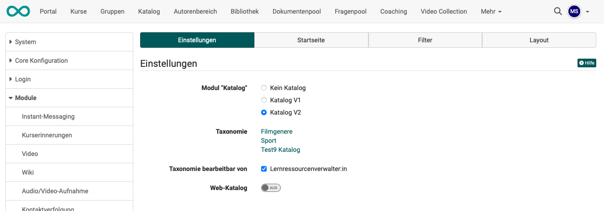{ class="shadow lightbox" }

[Zum Seitenanfang ^](#modul_catalog)

---

## Konfiguration des Katalogs V1 {: #config_catalog_v1}

Wenn Sie den Katalog V1 einschalten, erscheint der Tab "Konfiguration" und Sie können weitere Einstellungen vornehmen.

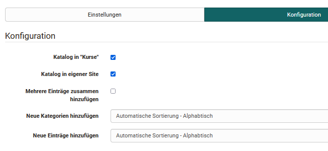{ class="shadow lightbox" }

[Zum Seitenanfang ^](#modul_catalog)

---

## Konfiguration des Katalogs V2 {: #config_catalog_v2}

### Tab Startseite {: #tab_start_page}

Auf der Startseite kann man sogenannte **"Launcher"** hinzufügen. Launcher sind die konfigurierbaren Abschnitte der Startseite. 

Die in einem Launcher angezeigten Inhalte werden automatisch je nach gewähltem Launchertyp ausgewählt. Die verfügbaren Launchertypen sind nachstehend beschrieben. Standardmässig ist ein Launcher vom Typ "Zuletzt veröffentlicht" aktiviert. 

Allen Launchern kann ein Name in verschiedenen Sprachen gegeben werden. Der Name erscheint dann als Kopfzeile über den Kacheln. Launcher können auch nur für spezifische Organisationen freigegeben werden. Wählen Sie dazu "Einschränkung auf Organisation". Ausserdem kann separat bestimmt werden, ob ein Launcher im internen und/oder externen Katalog angezeigt wird.

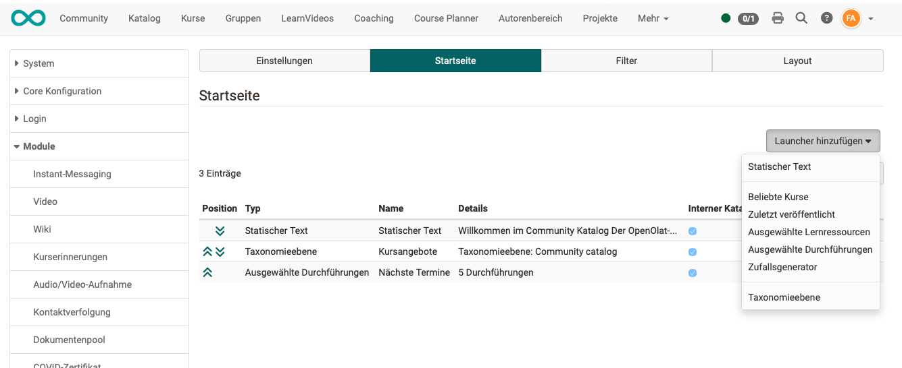{ class="shadow lightbox" }

#### Launchertyp "Statischer Text"

In diesem Launcher kann manuell statischer Text hinzufügt werden.

#### Launchertyp "Beliebte Kurse"

Die Reihenfolge der Angebote in diesem Launcher wird durch die Anzahl der Klicks auf Kursbausteine während den letzten 28 Tage bestimmt. Dabei werden nur Kurse mit Status "Publiziert" berücksichtigt.

#### Launchertyp "Zuletzt veröffentlicht"

Die Angebote sind nach Veröffentlichungsdatum geordnet.

#### Launchertyp "Zufallsgenerator"

In diesem Lauchner angezeigte Angebote werden in zufälliger Reihenfolge angezeigt.

#### Launchertyp "Taxonomieebene"

Taxonomie-Launcher nutzen die Katalogfachbereichsstruktur, um die verschiedenen Taxonomielevel anzuzeigen. In einem Launcher vom Typ "Taxonomie" werden keine Kurse und Lernressourcen direkt angezeigt, die angezeigten Taxonomielevel entsprechen vielmehr Ordnern, in denen dann erst die Lernressourcen zu finden sind.

Klickt man in einem Taxonomie-Launcher auf eine der angezeigten Kategorien (Taxonomie-Level), gelangt man auf eine Microsite. Hier werden alle Kurse angezeigt, die unter diesem Level eingeordnet wurden. Hat die Fachbereichstaxonomie mehrere Level in diesem Strang werden die weiteren Level angezeigt.

Die Angebote werden entsprechend dem definierten Taxonomielevel automatisch ausgewählt und dann alphabetisch geordnet angezeigt.

Beim Konfigurieren dieses Launchers wählen Sie über das Feld **Typ** [:octicons-tag-16:{ title="ab Release 21.0 (OO-9431)" }](https://track.frentix.com/issue/OO-9431){:target="_blank"}, worauf sich der Launcher bezieht:

* **Taxonomie:** Auswahl einer Taxonomie aus den für den Katalog verfügbaren Taxonomien.
* **Taxonomieebene:** Auswahl einer bestimmten Taxonomieebene.

#### Launchertyp "Ausgewählte Lernressourcen"

Die manuell hinzugefügten Lernressourcen können durch Klick auf Doppelpfeile vor den Einträgen geordnet werden.  

#### Launchertyp "Ausgewählte Durchführungen"

Die manuell hinzugefügten Durchführungen können durch Klick auf Doppelpfeile vor den Einträgen geordnet werden.

[Zum Seitenanfang ^](#modul_catalog)

---

### Tab Filter {: #tab_filter}

Man kann die Kursliste weiter durch Filter oder Suche verfeinern.
Dieser Tab steuert, welche Filter auf den Microseiten und der Suchergebnisseite verfügbar sind und vom User genutzt werden können. Filter können z.B. Fachbereiche, Taxonomieebene, Angebotsart, Durchführungsformat, Semester, Lizenz, Hauptsprache, Lernressourcentyp, Autor usw. sein. 

### Tab Layout {: #tab_layout}

Dieser Tab beinhaltet alles, was das Erscheinungsbild des Katalogs V2 angeht. Man kann den Anzeigetitel des Katalogs anpassen und ein Hintergrundbild für den Header der Startseite auswählen.

Unter **Kacheln Taxonomieebenen Launcher**, kann man die Form der Kacheln der Microsites wählen.

Die **Angezeigten Informationen in Karte** sind Texte aus den Metadaten, die auf den Karten der Startseite angezeigt werden. Die Metadaten müssen in der jeweiligen Lernressource unter `Einstellungen > Metadaten` ausgefüllt werden.

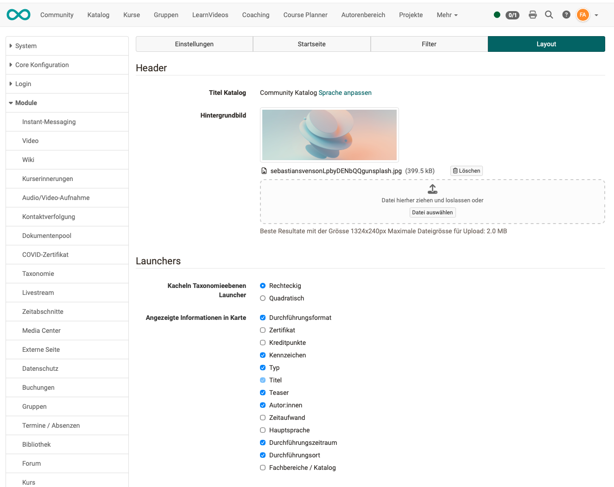{ class="shadow lightbox" }

[Zum Seitenanfang ^](#modul_catalog)

---

### Verwalten des Kataloges {: #v2_admin}

Der Katalog V2 wird aus der Fachbereichs-Taxonomie gespeist. Benutzer mit der Rolle [Lernressourcenverwalter](../../manual_user/basic_concepts/Roles_Rights.de.md) und Administratoren können die Verschlagwortung über das Menü verwalten.
Bei Klick gelangt man auf die Fachbereiche. Dort kann man die aktuelle Taxonomie auswählen, Neue Taxonomieebenen erstellen und importieren und auch Ebenen löschen.

Das Löschen der Ebenen löscht nur die Verschlagwortung, keine verknüpften Lernressourcen. Ist diese gelöscht, taucht eine Lernressource nicht mehr im Katalog auf.

!!! warning "Achtung"

    Die Fachbereiche, Verschlagwortung, Taxonomie die man als Lernressourcenverwalter bearbeiten kann, kann auch andere Bereiche betreffen, in denen die Taxonomie benutzt wird. Diese können sein: ePortfolio Einträge, Curriculum Einträge, Dokumentenpool.

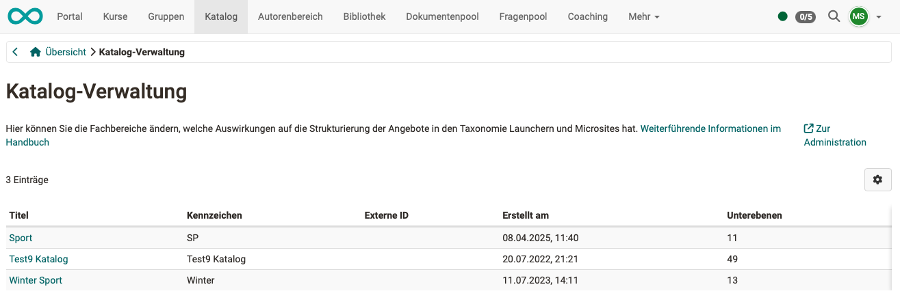{ class="shadow lightbox" }

Das Recht zur Verwaltung eines Katalog- bzw. Fachbereichteils kann verschiedenen Personen gegeben werden. (Initial wird dieses Recht von Administrator:innen vergeben.) Wählen Sie den gewünschten (Teil-)Fachbereich und dann den Tab "Verwaltung".

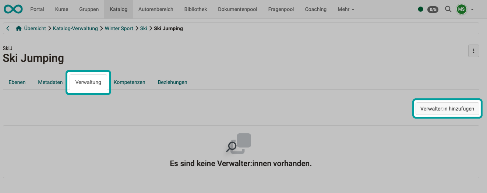{ class="shadow lightbox" }

Für Benutzer:innen mit diesem Recht gilt: 

- **Bearbeiten:** Sie können Elemente innerhalb der Taxonomieebenen bearbeiten, verschieben, löschen oder neue Unterebenen erstellen.
- **Vererbung:** Wer auf einer höheren Ebene Rechte hat (z. B. auf Institutsebene), darf automatisch auch die darunter liegenden Ebenen (z.B. Studiengänge) bearbeiten.
- **Unterdelegation:** Diese Rechte können von oben nach unten weitergegeben werden.  
Beispiel: Ein Administrator gibt einer Person die Rechte für eine Taxonomieebene darunter (z.B. Fakultät). Diese Person kann dann selbst anderen innerhalb dieser Fakultät ähnliche Rechte geben: auch für untergeordnete Bereiche.

Benutzer mit diesem Recht können nicht:

- Taxonomien erstellen / bearbeiten / löschen
- Ebenentypen erstellen / bearbeiten / löschen
- Ziel-, Kredit- und Dozentenkompetenzen erstellen / bearbeiten / löschen

[Zum Seitenanfang ^](#modul_catalog)

---

### Erstellung von passendem Bildmaterial für den Katalog {: #pictures_for_the_catalog}

Im Katalog werden Bilder für unterschiedliche illustrative Zwecke benutzt. Dies ist eine Auflistung der Bildgrössen und des Verhaltens bei unterschiedlichen Dimensionen. Die unten angebotenen Schemata kann man sich als Richtlinie im Grafikprogramm über das aktuelle Bild legen, um den passenden Auschnitt zu wählen.

#### Hintergrundbilder

Für die Hintergründe der Taxonomieunterseiten, sowie der Startseite werden Bilddimensionen von **1324 x 240 px** empfohlen, die maximale Dateigrösse für den Upload beträgt **2.0 MB**. Ist das Bild höher als 240px wird ein passender Ausschnitt aus der Mitte heraus genommen.
Taxonomieebenen-Hintergründe lassen sich im Tab "Taxonomie" anpassen.
Das Hintergrundbild für die Startseite finet man unter Layout.

Das Anschnitt (Cropping) Verhalten bei kleineren Bildgrössen illustriert:
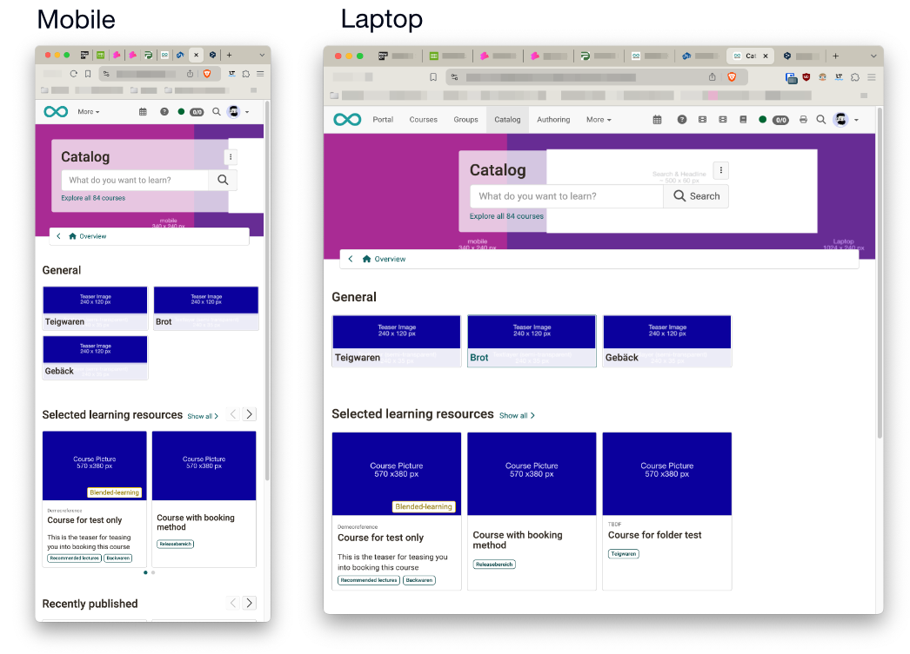{ class="shadow lightbox" }

Hintergrund für den Start
{ class="shadow lightbox" }

Hintergrund für die Taxonomyebenen
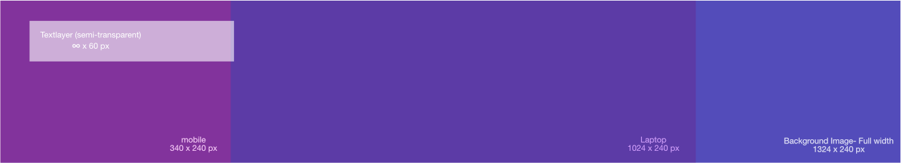{ class="shadow lightbox" }

#### Taxonomie-Launcher-Bilder
Je nach Einstellung haben wir es hier mit quadratischen oder rechteckigen Bildern zu tun.
Die Rechteckigen Bilder besitzen eine Aspect Ratio von **16:9** mit empfohlener Anzeige von **640 x 360 px**. Der Textbalken darunter verdeckt ca. 80px.

Rechteckig

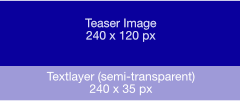{ class="shadow lightbox" }

Quadratisch

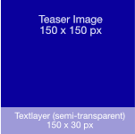{ class="shadow lightbox" }

#### Kursbilder

Können direkt im Kurs eingestellt werden und sollten die Dimensionen 570x380 px nicht überschreiten. Ansonsten wird hier auch ein passender Ausschnitt aus der Mitte genommen. Siehe hier

{ class="shadow lightbox" }

[Zum Seitenanfang ^](#modul_catalog)

---

## Konfiguration des Web-Katalogs {: #config_web-catalog}

Wurde im Tab "Einstellungen" der Katalog V2 gewählt, steht als weitere Option die Aktivierung des Web-Katalogs zur Auswahl.

Der Web-Katalog ist ein nach aussen gespiegelter Katalog, auf den auch Personen zugreifen können, die noch nicht in OpenOlat registriert sind. Deshalb kann auch ein Link auf der Login-Seite eingerichtet werden, so dass der Web-Katalog ohne Login aufgerufen werden kann. Erst bei Buchung eines Kurses werden die Besucher:innen dann durch den Registrierungsprozess geführt.

Der Web-Katalog kann auch vorübergehend deaktiviert werden.

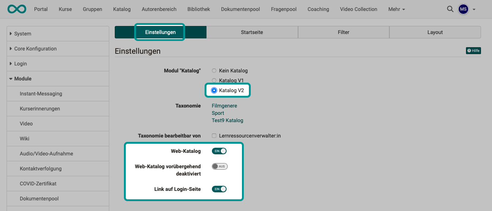{ class="shadow lightbox" }

[Zum Seitenanfang ^](#modul_catalog)

---

## Weiterführende Informationen {: #further_information}

**Auf dieser Seite erwähnt** 
[Modul Taxonomie](Modules_Taxonomy.de.md) 
[Rollen und Rechte: Übersicht](../../manual_user/basic_concepts/Roles_Rights.de.md)

**Weiterführend** 
[Katalog 2.0: Übersicht](../../manual_user/area_modules/catalog2.0.de.md) 
[Modul Lernressource](Modules_Learning_Resource.de.md)

[Zum Seitenanfang ^](#modul_catalog)

